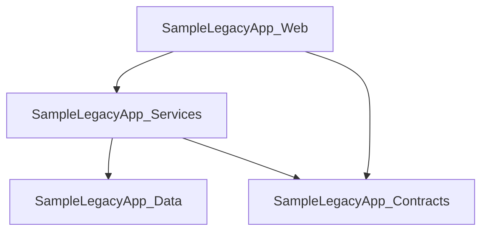

# LegacyLens.NET

LegacyLens.NET is a static discovery tool for unfamiliar, legacy, and modern .NET codebases.

It helps developers quickly understand the structure of a .NET solution by scanning solution files, project files, C# source files, configuration files, and selected legacy ASP.NET artifacts, then reporting useful information such as solutions, projects, target frameworks, project references, assembly references, package references, WCF endpoint configuration, WCF binding, security, timeout, message size, buffer, transfer mode, reader quota, service behaviour, endpoint behaviour, metadata publishing, debug, throttling, and REST-style `webHttp` behaviour details, WCF service contracts, service-related configuration, legacy ASP.NET artifact and source-level ASP.NET MVC usage, ASP.NET Web API usage, ASP.NET MVC and Web API startup registration usage, general configuration file usage, evidence-backed modernisation hints, and a prioritised modernisation review summary.

The aim is to help a developer who is new to a codebase answer questions such as:

- What projects exist in this solution?
- Which target frameworks are being used?
- Which projects depend on each other?
- Which framework assembly references are used by each project?
- Which NuGet packages are referenced?
- Are there signs of legacy technologies such as WCF?
- Are there signs of classic ASP.NET artifacts such as WebForms pages, ASMX web services, HTTP handlers, MVC controllers, MVC actions, MVC route attributes, MVC action attributes, MVC area registrations, Web API controllers, Web API actions, Web API routes, route configuration, MVC or Web API startup registration, bundle configuration, filter configuration, or `Global.asax`?
- Which WCF endpoints are configured?
- Which WCF binding configurations, security modes, timeout settings, message size limits, buffer limits, transfer modes, or reader quotas are configured?
- Which WCF service behaviours or endpoint behaviours are configured?
- Which WCF service contracts and operations are defined in the source code?
- What configuration files, settings, connection strings, or custom sections exist?
- What modernisation risks or review areas should be looked at first?
- Which discovered file, project, package, assembly reference, artifact, configuration entry, WCF endpoint, WCF behaviour, or WCF service contract supports each modernisation hint?
- Which modernisation review areas should be prioritised first based on severity and hint counts?
- What diagrams or reports can help explain the system to others?

LegacyLens.NET is designed to work through static analysis, meaning it can provide useful information even when the target solution cannot currently be built.

---

## Current Status

LegacyLens.NET is currently in late MVP development and is focused on hardening the first usable discovery baseline.

The current MVP already produces a static discovery report with solution structure, project dependencies, package and assembly references, WCF configuration, WCF service contracts, selected legacy ASP.NET and ASP.NET MVC/Web API signals, evidence-backed modernisation hints, and a prioritised modernisation review summary.

The current implementation can scan a folder containing .NET solutions and projects and discover:

- `.sln` files
- solution names
- C# project file paths referenced by solution files
- `.csproj` files
- project names
- target frameworks
- project-to-project references
- assembly references from `<Reference />` entries in `.csproj` files
- NuGet package references from SDK-style `<PackageReference />` entries in `.csproj` files
- NuGet package references from legacy `packages.config` files located alongside project files
- WCF endpoints from `app.config` and `web.config` files
- WCF endpoint binding configuration names, behaviour configuration names, security modes, transport credential types, message credential types, timeout settings, message size limits, buffer limits, transfer modes, reader quota settings, and metadata exchange endpoint indicators
- WCF service behaviours from `app.config` and `web.config` files
- WCF endpoint behaviours from `app.config` and `web.config` files
- WCF service metadata settings such as `httpGetEnabled` and `httpsGetEnabled`
- WCF service debug settings such as `includeExceptionDetailInFaults`
- WCF service throttling settings such as `maxConcurrentCalls`, `maxConcurrentSessions`, and `maxConcurrentInstances`
- WCF endpoint `webHttp` behaviour indicators
- configuration files from `app.config` and `web.config`
- `appSettings` entry counts
- `connectionStrings` entry counts
- custom configuration section counts from `configSections`
- WCF service contracts from C# source files
- WCF operations marked with `[OperationContract]`, scoped to the containing `[ServiceContract]` interface
- legacy ASP.NET artifacts from files such as `.aspx`, `.ascx`, `.master`, `.asmx`, `.ashx`, and `Global.asax`
- WebForms pages
- WebForms user controls
- WebForms master pages
- ASMX web services
- ASP.NET HTTP handlers
- `Global.asax` application files
- ASP.NET MVC controllers from C# source files
- ASP.NET MVC action methods from C# source files
- ASP.NET MVC route attributes such as `[Route]` and `[RoutePrefix]`
- ASP.NET MVC action, filter, and security-related attributes such as `[HttpGet]`, `[HttpPost]`, `[Authorize]`, `[AllowAnonymous]`, `[ValidateAntiForgeryToken]`, and `[OutputCache]`
- ASP.NET Web API controllers from C# source files
- ASP.NET Web API action methods from C# source files
- ASP.NET Web API route attributes such as `[Route]` and `[RoutePrefix]`
- ASP.NET Web API action, filter, and security-related attributes such as `[HttpGet]`, `[HttpPost]`, `[HttpPut]`, `[HttpDelete]`, `[HttpPatch]`, `[AcceptVerbs]`, `[Authorize]`, and `[AllowAnonymous]`
- ASP.NET MVC area registration classes from C# source files
- ASP.NET route configuration files such as `RouteConfig.cs`
- ASP.NET MVC application startup methods such as `Application_Start`
- ASP.NET MVC startup registration calls such as `AreaRegistration.RegisterAllAreas()`, `RouteConfig.RegisterRoutes(...)`, `BundleConfig.RegisterBundles(...)`, and `FilterConfig.RegisterGlobalFilters(...)`
- ASP.NET Web API configuration files such as `WebApiConfig.cs`
- ASP.NET Web API route registration calls such as `MapHttpRoute(...)`
- ASP.NET Web API startup registration calls such as `GlobalConfiguration.Configure(...)` and `WebApiConfig.Register(...)`
- ASP.NET MVC bundle configuration files such as `BundleConfig.cs`
- ASP.NET MVC filter configuration files such as `FilterConfig.cs`
- ASP.NET MVC dependency resolver registration calls such as `DependencyResolver.SetResolver(...)`
- ASP.NET MVC custom controller factory registration calls such as `ControllerBuilder.Current.SetControllerFactory(...)`
- ASP.NET MVC global filter registrations such as `GlobalFilters.Filters.Add(...)`
- ASP.NET MVC model binder registrations such as `ModelBinders.Binders`
- ASP.NET MVC value provider factory registrations such as `ValueProviderFactories.Factories`
- ASP.NET Web API dependency resolver configuration
- ASP.NET Web API formatter configuration
- ASP.NET Web API message handler registration
- ASP.NET Web API filter registration
- ASP.NET Web API CORS registration
- evidence-backed modernisation hints for legacy target frameworks, WCF usage, selected packages, legacy ASP.NET / `System.Web` usage, discovered legacy ASP.NET artifacts, ASP.NET MVC controllers, ASP.NET MVC actions, ASP.NET MVC route attributes, ASP.NET MVC action attributes, ASP.NET MVC area registrations, ASP.NET route configuration, ASP.NET MVC startup registration, ASP.NET MVC bundle configuration, ASP.NET MVC filter configuration, ASP.NET Web API controllers, ASP.NET Web API actions, ASP.NET Web API route attributes, ASP.NET Web API action attributes, ASP.NET Web API configuration, ASP.NET Web API route registration, ASP.NET Web API startup registration, higher project coupling, selected WCF binding types, WCF security-related endpoint details, WCF timeout settings, WCF message size and buffer limits, WCF transfer modes, WCF reader quotas, metadata exchange endpoints, WCF service behaviours, WCF endpoint behaviours, WCF metadata publishing settings, WCF debug settings, WCF throttling settings, WCF REST-style `webHttp` endpoint behaviours, and configuration-heavy applications
- modernisation hint evidence metadata, including evidence kind, evidence name, source path, and confidence
- a prioritised modernisation review summary that groups detailed modernisation hints into higher-level review areas such as WCF migration, legacy ASP.NET migration, routing review, startup and request pipeline review, configuration review, dependency review, target framework review, and project dependency review

Package discovery behaviour is covered by tests for `<PackageReference />`, `packages.config`, duplicate package handling, and invalid `packages.config` handling.

It can also generate a Markdown discovery report at:

```text
output/discovery-report.md
```

The generated report currently includes:

- a summary of discovered solutions, projects, project references, assembly references, package references, WCF endpoints, WCF service contracts, WCF behaviours, and legacy ASP.NET artifacts
- a solution table
- a project table
- a target framework summary showing how many projects use each discovered target framework
- a package reference summary showing how many projects reference each discovered package
- a Mermaid project dependency diagram
- project reference information
- assembly reference information
- package reference information
- WCF endpoint information, including binding configuration, security mode, transport credential type, message credential type, and metadata exchange indicators
- WCF binding detail information, including timeout settings, message size limits, buffer limits, and transfer mode
- WCF reader quota information, including max depth, max string content length, max array length, max bytes per read, and max name table character count
- WCF behaviour information, including service behaviours, endpoint behaviours, metadata publishing flags, debug flags, throttling values, and `webHttp` endpoint behaviour indicators
- WCF service contract and operation information
- legacy ASP.NET artifact information, including file-based artifacts, MVC controllers, MVC actions, MVC route attributes, MVC action attributes, MVC area registrations, route configuration, MVC and Web API startup registration, bundle configuration, filter configuration, dependency resolver setup, controller factory setup, model binder setup, value provider setup, Web API controllers, Web API actions, Web API route attributes, Web API action attributes, Web API configuration, Web API formatter configuration, Web API message handler registration, Web API filter registration, Web API CORS registration, artifact kind, name, and file path
- configuration file information, including `appSettings`, `connectionStrings`, and custom configuration section counts
- a modernisation review summary that ranks higher-level review areas by highest severity and hint counts
- modernisation hints with severity, area, finding, evidence, confidence, source, and reason, including Legacy ASP.NET hints when `System.Web` assembly references or legacy ASP.NET artifacts are found

The following sample output is illustrative. Exact counts and findings may change as the sample application evolves.

Example console output:

```text
Projects discovered:
- SampleLegacyApp.Contracts
  Target framework: net48

- SampleLegacyApp.Data
  Target framework: net48
  Package reference: Dapper
  Package reference: EntityFramework

- SampleLegacyApp.Services
  Target framework: net48
  Project reference: ..\SampleLegacyApp.Data\SampleLegacyApp.Data.csproj
  Project reference: ..\SampleLegacyApp.Contracts\SampleLegacyApp.Contracts.csproj

- SampleLegacyApp.Web
  Target framework: net48
  Project reference: ..\SampleLegacyApp.Services\SampleLegacyApp.Services.csproj
  Project reference: ..\SampleLegacyApp.Contracts\SampleLegacyApp.Contracts.csproj
  Assembly reference: System.Web
  Assembly reference: System.Web.Mvc
  Package reference: System.ServiceModel.Http
  Package reference: Newtonsoft.Json

WCF endpoints discovered:
- SampleLegacyApp.Services.CustomerService
  Address:
  Binding: basicHttpBinding
  Contract: SampleLegacyApp.Contracts.ICustomerService
  Config file: C:\Path\To\LegacyLens.Net\samples\SampleLegacyApp\SampleLegacyApp.Web\Web.config

WCF service contracts discovered:
- ICustomerService
  Source file: C:\Path\To\LegacyLens.Net\samples\SampleLegacyApp\SampleLegacyApp.Contracts\CustomerContracts.cs
  Operation: GetCustomer

WCF behaviours discovered:
- ServiceBehaviour: CustomerServiceBehaviour
  Config file: C:\Path\To\LegacyLens.Net\samples\SampleLegacyApp\SampleLegacyApp.Web\Web.config
  Service metadata: True
  HTTP metadata enabled: true
  HTTPS metadata enabled: false
  Service debug: True
  Include exception detail in faults: true
  Service throttling: True
  Max concurrent calls: 100
  Max concurrent sessions: 50
  Max concurrent instances: 25
- EndpointBehaviour: JsonEndpointBehaviour
  Config file: C:\Path\To\LegacyLens.Net\samples\SampleLegacyApp\SampleLegacyApp.Web\Web.config
  Web HTTP: True

Configuration files discovered:
- C:\Path\To\LegacyLens.Net\samples\SampleLegacyApp\SampleLegacyApp.Web\Web.config
  App settings: 0
  Connection strings: 0
  Custom sections: 0

Legacy ASP.NET artifacts discovered:
- WebFormsPage: Default.aspx
  File: C:\Path\To\LegacyLens.Net\samples\SampleLegacyApp\SampleLegacyApp.Web\Default.aspx
- WebFormsUserControl: CustomerSummary.ascx
  File: C:\Path\To\LegacyLens.Net\samples\SampleLegacyApp\SampleLegacyApp.Web\CustomerSummary.ascx
- MasterPage: Site.master
  File: C:\Path\To\LegacyLens.Net\samples\SampleLegacyApp\SampleLegacyApp.Web\Site.master
- AsmxWebService: CustomerService.asmx
  File: C:\Path\To\LegacyLens.Net\samples\SampleLegacyApp\SampleLegacyApp.Web\CustomerService.asmx
- HttpHandler: Download.ashx
  File: C:\Path\To\LegacyLens.Net\samples\SampleLegacyApp\SampleLegacyApp.Web\Download.ashx
- GlobalAsax: Global.asax
  File: C:\Path\To\LegacyLens.Net\samples\SampleLegacyApp\SampleLegacyApp.Web\Global.asax
- MvcController: HomeController
  File: C:\Path\To\LegacyLens.Net\samples\SampleLegacyApp\SampleLegacyApp.Web\Controllers\HomeController.cs
- MvcAction: HomeController.Index
  File: C:\Path\To\LegacyLens.Net\samples\SampleLegacyApp\SampleLegacyApp.Web\Controllers\HomeController.cs
- MvcAction: HomeController.Save
  File: C:\Path\To\LegacyLens.Net\samples\SampleLegacyApp\SampleLegacyApp.Web\Controllers\HomeController.cs
- MvcAction: HomeController.Summary
  File: C:\Path\To\LegacyLens.Net\samples\SampleLegacyApp\SampleLegacyApp.Web\Controllers\HomeController.cs
- MvcRouteAttribute: HomeController [RoutePrefix]
  File: C:\Path\To\LegacyLens.Net\samples\SampleLegacyApp\SampleLegacyApp.Web\Controllers\HomeController.cs
- MvcRouteAttribute: HomeController.Index [Route]
  File: C:\Path\To\LegacyLens.Net\samples\SampleLegacyApp\SampleLegacyApp.Web\Controllers\HomeController.cs
- MvcRouteAttribute: HomeController.Save [Route]
  File: C:\Path\To\LegacyLens.Net\samples\SampleLegacyApp\SampleLegacyApp.Web\Controllers\HomeController.cs
- MvcRouteAttribute: HomeController.Summary [Route]
  File: C:\Path\To\LegacyLens.Net\samples\SampleLegacyApp\SampleLegacyApp.Web\Controllers\HomeController.cs
- MvcActionAttribute: HomeController.Index [HttpGet]
  File: C:\Path\To\LegacyLens.Net\samples\SampleLegacyApp\SampleLegacyApp.Web\Controllers\HomeController.cs
- MvcActionAttribute: HomeController.Save [HttpPost]
  File: C:\Path\To\LegacyLens.Net\samples\SampleLegacyApp\SampleLegacyApp.Web\Controllers\HomeController.cs
- MvcActionAttribute: HomeController.Save [ValidateAntiForgeryToken]
  File: C:\Path\To\LegacyLens.Net\samples\SampleLegacyApp\SampleLegacyApp.Web\Controllers\HomeController.cs
- MvcActionAttribute: HomeController.Summary [AllowAnonymous]
  File: C:\Path\To\LegacyLens.Net\samples\SampleLegacyApp\SampleLegacyApp.Web\Controllers\HomeController.cs
- RouteConfig: RouteConfig.cs
  File: C:\Path\To\LegacyLens.Net\samples\SampleLegacyApp\SampleLegacyApp.Web\App_Start\RouteConfig.cs
- AreaRegistration: AdminAreaRegistration
  File: C:\Path\To\LegacyLens.Net\samples\SampleLegacyApp\SampleLegacyApp.Web\Areas\Admin\AdminAreaRegistration.cs
- MvcApplicationStartup: Global.asax.cs Application_Start
  File: C:\Path\To\LegacyLens.Net\samples\SampleLegacyApp\SampleLegacyApp.Web\Global.asax.cs
- MvcAreaRegistrationCall: AreaRegistration.RegisterAllAreas
  File: C:\Path\To\LegacyLens.Net\samples\SampleLegacyApp\SampleLegacyApp.Web\Global.asax.cs
- MvcRouteRegistrationCall: RouteConfig.RegisterRoutes
  File: C:\Path\To\LegacyLens.Net\samples\SampleLegacyApp\SampleLegacyApp.Web\Global.asax.cs
- MvcBundleRegistrationCall: BundleConfig.RegisterBundles
  File: C:\Path\To\LegacyLens.Net\samples\SampleLegacyApp\SampleLegacyApp.Web\Global.asax.cs
- MvcFilterRegistrationCall: FilterConfig.RegisterGlobalFilters
  File: C:\Path\To\LegacyLens.Net\samples\SampleLegacyApp\SampleLegacyApp.Web\Global.asax.cs
- MvcBundleConfig: BundleConfig.cs
  File: C:\Path\To\LegacyLens.Net\samples\SampleLegacyApp\SampleLegacyApp.Web\App_Start\BundleConfig.cs
- MvcFilterConfig: FilterConfig.cs
  File: C:\Path\To\LegacyLens.Net\samples\SampleLegacyApp\SampleLegacyApp.Web\App_Start\FilterConfig.cs
- WebApiController: CustomersApiController
  File: C:\Path\To\LegacyLens.Net\samples\SampleLegacyApp\SampleLegacyApp.Web\Controllers\CustomersApiController.cs
- WebApiAction: CustomersApiController.Get
  File: C:\Path\To\LegacyLens.Net\samples\SampleLegacyApp\SampleLegacyApp.Web\Controllers\CustomersApiController.cs
- WebApiAction: CustomersApiController.Create
  File: C:\Path\To\LegacyLens.Net\samples\SampleLegacyApp\SampleLegacyApp.Web\Controllers\CustomersApiController.cs
- WebApiConfig: WebApiConfig.cs
  File: C:\Path\To\LegacyLens.Net\samples\SampleLegacyApp\SampleLegacyApp.Web\App_Start\WebApiConfig.cs
- WebApiRouteRegistrationCall: MapHttpRoute
  File: C:\Path\To\LegacyLens.Net\samples\SampleLegacyApp\SampleLegacyApp.Web\App_Start\WebApiConfig.cs
- WebApiGlobalConfigurationCall: GlobalConfiguration.Configure
  File: C:\Path\To\LegacyLens.Net\samples\SampleLegacyApp\SampleLegacyApp.Web\Global.asax.cs

Modernisation hints discovered:
- [Risk] Target Framework: SampleLegacyApp.Contracts targets net48
- [Risk] Target Framework: SampleLegacyApp.Data targets net48
- [Risk] Target Framework: SampleLegacyApp.Services targets net48
- [Risk] Target Framework: SampleLegacyApp.Web targets net48
- [Warning] Packages: SampleLegacyApp.Data references EntityFramework
- [Risk] Packages: SampleLegacyApp.Web references System.ServiceModel.Http
- [Info] Packages: SampleLegacyApp.Web references Newtonsoft.Json
- [Risk] WCF: 1 WCF endpoint(s) discovered
- [Warning] WCF Binding: basicHttpBinding endpoint discovered for SampleLegacyApp.Services.CustomerService
- [Risk] WCF: 1 WCF service contract(s) discovered
- [Risk] Legacy ASP.NET: SampleLegacyApp.Web references System.Web
- [Warning] Legacy ASP.NET: SampleLegacyApp.Web references System.Web.Mvc
- [Risk] Legacy ASP.NET: Default.aspx is a WebForms page
- [Warning] Legacy ASP.NET: CustomerSummary.ascx is a WebForms user control
- [Warning] Legacy ASP.NET: Site.master is a WebForms master page
- [Risk] Legacy ASP.NET: CustomerService.asmx is an ASMX web service
- [Warning] Legacy ASP.NET: Download.ashx is an ASP.NET HTTP handler
- [Info] Legacy ASP.NET: Global.asax is a Global.asax application file
- [Warning] Legacy ASP.NET: HomeController is an ASP.NET MVC controller
- [Info] Legacy ASP.NET: HomeController.Index is an ASP.NET MVC action
- [Info] Legacy ASP.NET: HomeController.Save is an ASP.NET MVC action
- [Info] Legacy ASP.NET: HomeController.Summary is an ASP.NET MVC action
- [Info] Legacy ASP.NET Routing: HomeController [RoutePrefix] uses ASP.NET MVC attribute routing
- [Info] Legacy ASP.NET Routing: HomeController.Index [Route] uses ASP.NET MVC attribute routing
- [Info] Legacy ASP.NET Routing: HomeController.Save [Route] uses ASP.NET MVC attribute routing
- [Info] Legacy ASP.NET Routing: HomeController.Summary [Route] uses ASP.NET MVC attribute routing
- [Warning] Legacy ASP.NET MVC Attributes: HomeController.Index [HttpGet] uses an ASP.NET MVC action attribute
- [Warning] Legacy ASP.NET MVC Attributes: HomeController.Save [HttpPost] uses an ASP.NET MVC action attribute
- [Warning] Legacy ASP.NET MVC Attributes: HomeController.Save [ValidateAntiForgeryToken] uses an ASP.NET MVC action attribute
- [Warning] Legacy ASP.NET MVC Attributes: HomeController.Summary [AllowAnonymous] uses an ASP.NET MVC action attribute
- [Info] Legacy ASP.NET: RouteConfig.cs is an ASP.NET route configuration file
- [Info] Legacy ASP.NET: AdminAreaRegistration is an ASP.NET MVC area registration
- [Info] Legacy ASP.NET Startup: Global.asax.cs Application_Start contains ASP.NET application startup code
- [Info] Legacy ASP.NET Startup: AreaRegistration.RegisterAllAreas registers ASP.NET MVC areas
- [Info] Legacy ASP.NET Routing: RouteConfig.RegisterRoutes registers ASP.NET routes
- [Warning] Legacy ASP.NET Bundling: BundleConfig.cs is an ASP.NET MVC bundle configuration file
- [Warning] Legacy ASP.NET Bundling: BundleConfig.RegisterBundles registers ASP.NET MVC bundles
- [Warning] Legacy ASP.NET Filters: FilterConfig.cs is an ASP.NET MVC filter configuration file
- [Warning] Legacy ASP.NET Filters: FilterConfig.RegisterGlobalFilters registers ASP.NET MVC global filters
- [Warning] Legacy ASP.NET Web API: CustomersApiController is an ASP.NET Web API controller
- [Info] Legacy ASP.NET Web API: CustomersApiController.Get is an ASP.NET Web API action
- [Info] Legacy ASP.NET Web API: CustomersApiController.Create is an ASP.NET Web API action
- [Info] Legacy ASP.NET Web API Routing: CustomersApiController [RoutePrefix] uses ASP.NET Web API attribute routing
- [Info] Legacy ASP.NET Web API Routing: CustomersApiController.Get [Route] uses ASP.NET Web API attribute routing
- [Info] Legacy ASP.NET Web API Routing: CustomersApiController.Create [Route] uses ASP.NET Web API attribute routing
- [Warning] Legacy ASP.NET Web API Attributes: CustomersApiController.Get [HttpGet] uses an ASP.NET Web API action attribute
- [Warning] Legacy ASP.NET Web API Attributes: CustomersApiController.Create [HttpPost] uses an ASP.NET Web API action attribute
- [Info] Legacy ASP.NET Web API: WebApiConfig.cs is an ASP.NET Web API configuration file
- [Info] Legacy ASP.NET Web API Routing: MapHttpRoute registers ASP.NET Web API routes
- [Info] Legacy ASP.NET Web API Startup: GlobalConfiguration.Configure registers ASP.NET Web API startup configuration

Modernisation review summary:
- 1. WCF migration
  Highest severity: Risk
  Risks: 2
  Warnings: 4
  Info: 5
  Summary: 2 risk, 4 warning, 5 info hint(s). Review service boundaries, bindings, security, timeout, payload, metadata, contract, and WCF package usage before choosing a migration approach.
- 2. Legacy ASP.NET migration
  Highest severity: Risk
  Risks: 3
  Warnings: 6
  Info: 6
  Summary: 3 risk, 6 warning, 6 info hint(s). Review classic ASP.NET, System.Web, WebForms, ASMX, handlers, MVC, or Web API usage before planning an ASP.NET Core migration.

Solutions discovered:
- SampleLegacyApp
  Solution file: C:\Path\To\LegacyLens.Net\samples\SampleLegacyApp\SampleLegacyApp.sln
  Projects: 4

Markdown report generated: C:\Path\To\LegacyLens.Net\output\discovery-report.md
```

If no solutions, WCF endpoints, WCF service contracts, WCF behaviours, configuration files, legacy ASP.NET artifacts, or modernisation hints are found, the console output shows:

```text
WCF endpoints discovered:
- None

WCF service contracts discovered:
- None

WCF behaviours discovered:
- None

Configuration files discovered:
- None

Legacy ASP.NET artifacts discovered:
- None

Modernisation hints discovered:
- None

Modernisation review summary:
- None

Solutions discovered:
- None
```

---

## Why LegacyLens.NET?

Legacy .NET systems are often difficult to understand because the original developers may no longer be available, documentation may be missing, and the solution may not build cleanly on a modern machine.

LegacyLens.NET aims to make that first investigation easier by producing clear, structured information from the source code itself.

It is especially useful for:

- developers joining an unfamiliar codebase
- contractors starting a legacy .NET assignment
- teams planning modernisation work
- architects reviewing project dependencies
- developers preparing documentation or diagrams
- codebase discovery before refactoring or migration

---

## What LegacyLens.NET Can Do Without Building the Solution

LegacyLens.NET is designed to inspect source files directly.

Even if the solution does not build, it can still discover useful information from files such as:

- `.sln`
- solution-level project membership
- `.csproj`
- `packages.config`
- `app.config`
- `web.config`
- configuration file structure
- `appSettings` entries
- `connectionStrings` entries
- custom configuration sections
- C# source files
- `.aspx` WebForms pages
- `.ascx` WebForms user controls
- `.master` WebForms master pages
- `.asmx` ASMX web services
- `.ashx` ASP.NET HTTP handlers
- `Global.asax` application files
- ASP.NET MVC controller classes inheriting from `Controller` or `System.Web.Mvc.Controller`
- ASP.NET MVC action methods returning common MVC result types such as `ActionResult`, `ViewResult`, `JsonResult`, `PartialViewResult`, `RedirectResult`, `RedirectToRouteResult`, `FileResult`, `ContentResult`, and `HttpStatusCodeResult`
- ASP.NET MVC route attributes such as `[Route]` and `[RoutePrefix]`
- ASP.NET MVC action, filter, and security-related attributes such as `[HttpGet]`, `[HttpPost]`, `[HttpPut]`, `[HttpDelete]`, `[HttpPatch]`, `[AcceptVerbs]`, `[Authorize]`, `[AllowAnonymous]`, `[ValidateAntiForgeryToken]`, and `[OutputCache]`
- ASP.NET Web API controller classes inheriting from `ApiController` or `System.Web.Http.ApiController`
- ASP.NET Web API action methods returning common Web API result types such as `IHttpActionResult` and `HttpResponseMessage`
- ASP.NET Web API route attributes such as `[Route]` and `[RoutePrefix]`
- ASP.NET Web API action, filter, and security-related attributes such as `[HttpGet]`, `[HttpPost]`, `[HttpPut]`, `[HttpDelete]`, `[HttpPatch]`, `[AcceptVerbs]`, `[Authorize]`, and `[AllowAnonymous]`
- ASP.NET MVC area registration classes inheriting from `AreaRegistration` or `System.Web.Mvc.AreaRegistration`
- ASP.NET route configuration files such as `RouteConfig.cs`
- ASP.NET MVC application startup methods such as `Application_Start`
- ASP.NET MVC startup registration calls such as `AreaRegistration.RegisterAllAreas()`, `RouteConfig.RegisterRoutes(...)`, `BundleConfig.RegisterBundles(...)`, and `FilterConfig.RegisterGlobalFilters(...)`
- ASP.NET Web API configuration files such as `WebApiConfig.cs`
- ASP.NET Web API route registration calls such as `MapHttpRoute(...)`
- ASP.NET Web API startup registration calls such as `GlobalConfiguration.Configure(...)` and `WebApiConfig.Register(...)`
- ASP.NET MVC bundle configuration files such as `BundleConfig.cs`
- ASP.NET MVC filter configuration files such as `FilterConfig.cs`
- ASP.NET MVC dependency resolver registration calls such as `DependencyResolver.SetResolver(...)`
- ASP.NET MVC custom controller factory registration calls such as `ControllerBuilder.Current.SetControllerFactory(...)`
- ASP.NET MVC global filter registrations such as `GlobalFilters.Filters.Add(...)`
- ASP.NET MVC model binder registrations such as `ModelBinders.Binders`
- ASP.NET MVC value provider factory registrations such as `ValueProviderFactories.Factories`
- ASP.NET Web API dependency resolver configuration
- ASP.NET Web API formatter configuration
- ASP.NET Web API message handler registration
- ASP.NET Web API filter registration
- ASP.NET Web API CORS registration
- WCF configuration files
- WCF endpoint binding configuration names
- WCF endpoint security modes and credential types
- WCF endpoint timeout settings
- WCF endpoint message size and buffer limits
- WCF endpoint transfer modes
- WCF endpoint reader quota settings
- WCF metadata exchange endpoint indicators
- WCF service behaviours from configuration files
- WCF endpoint behaviours from configuration files
- WCF service metadata settings from `<serviceMetadata>`
- WCF service debug settings from `<serviceDebug>`
- WCF service throttling settings from `<serviceThrottling>`
- WCF endpoint `webHttp` behaviour indicators
- WCF `[ServiceContract]` interfaces
- WCF `[OperationContract]` methods scoped to their containing service contract interface
- project references
- assembly references
- package references
- prioritised modernisation review areas derived from discovered hints

This makes it useful for old or broken solutions where restoring packages, installing SDKs, or compiling the code may not be possible immediately.

> Note: package reference discovery currently supports both SDK-style `<PackageReference />` entries in `.csproj` files and legacy `packages.config` files located alongside project files. Invalid or unreadable `packages.config` files are ignored so discovery can continue.

> Note: assembly reference discovery currently supports `<Reference Include="..." />` entries in `.csproj` files. Version metadata is removed so references such as `System.Web.Mvc, Version=5.2.9.0` are reported as `System.Web.Mvc`.

> Note: configuration file discovery currently supports `app.config` and `web.config` files. Invalid or unreadable configuration files are ignored so discovery can continue.

> Note: WCF endpoint discovery currently reads configured service endpoints from `app.config` and `web.config` files. Where endpoints reference named binding configurations, LegacyLens.NET also attempts to resolve related security mode, transport credential type, message credential type, timeout, message size, buffer, transfer mode, and reader quota details from the matching binding configuration.

> Note: WCF behaviour discovery currently reads selected service behaviour and endpoint behaviour settings from `app.config` and `web.config` files, including service metadata, service debug, service throttling, and endpoint `webHttp` behaviour indicators. The codebase uses the British spelling `Behaviour` for model and report names, while WCF XML uses the standard WCF element names `<behaviors>`, `<serviceBehaviors>`, `<endpointBehaviors>`, and `<behavior>`.

> Note: legacy ASP.NET artifact discovery currently detects file-based classic ASP.NET artifacts such as `.aspx`, `.ascx`, `.master`, `.asmx`, `.ashx`, and `Global.asax`, as well as selected source-level ASP.NET MVC and Web API indicators such as MVC controllers, MVC action methods, MVC route attributes, MVC action attributes, MVC area registrations, Web API controllers, Web API action methods, Web API route attributes, Web API action attributes, `RouteConfig.cs`, `WebApiConfig.cs`, `Application_Start`, MVC startup registration calls, Web API startup registration calls, `BundleConfig.cs`, and `FilterConfig.cs`. These are static discovery signals and do not require the application to build or run.

> Note: modernisation review summary generation groups the detailed modernisation hints into higher-level review areas. This is intended to help developers quickly identify where to look first while still preserving the detailed hint table as supporting evidence.

> Note: modernisation hints include evidence metadata where a clear source can be identified. Evidence may point to a project, package reference, assembly reference, WCF endpoint, WCF service contract, WCF behaviour, legacy ASP.NET artifact, configuration file, or analysis summary. The generated report includes the evidence kind, evidence name, confidence, source path where available, and the reason for the hint. Legacy ASP.NET artifact evidence prefers the most specific matching artifact name so, for example, an action attribute hint can point to `HomeController.Index [HttpGet]` rather than only `HomeController`.

> Note: solution discovery currently supports `.sln` files and extracts referenced C# project paths from project entries. Non-C# project entries and solution folders are ignored.

---

## Solution Discovery

LegacyLens.NET can discover Visual Studio solution files and the C# projects referenced by them.

Current solution discovery supports:

- finding `.sln` files under the scanned folder
- reading the solution name from the `.sln` file name
- extracting referenced `.csproj` paths from solution project entries
- resolving project paths relative to the solution file location
- ignoring solution folders and non-C# project entries
- removing duplicate project paths case-insensitively

Example solution project entry:

```text
Project("{FAE04EC0-301F-11D3-BF4B-00C04F79EFBC}") = "SampleLegacyApp.Web", "SampleLegacyApp.Web\SampleLegacyApp.Web.csproj", "{11111111-1111-1111-1111-111111111111}"
EndProject
```

Example report output:

```markdown
## Solutions

| Solution | Projects | Solution File |
|---|---:|---|
| SampleLegacyApp | 4 | `...\SampleLegacyApp.sln` |
```

This helps identify the solution-level structure of a codebase before looking at individual project dependencies.

---

## Package Reference Discovery

LegacyLens.NET can discover NuGet package references from both modern and legacy project styles.

Current package discovery supports:

- SDK-style `<PackageReference />` entries inside `.csproj` files
- legacy `packages.config` files located in the same folder as the project file

Example SDK-style package reference:

```xml
<ItemGroup>
  <PackageReference Include="Dapper" Version="2.1.66" />
</ItemGroup>
```

Example legacy `packages.config` file:

```xml
<?xml version="1.0" encoding="utf-8"?>
<packages>
  <package id="EntityFramework" version="6.4.4" targetFramework="net48" />
  <package id="Newtonsoft.Json" version="13.0.3" targetFramework="net48" />
</packages>
```

Package names discovered from both sources are merged into the project package reference list. Duplicate package names are removed case-insensitively.

This helps LegacyLens.NET identify important legacy dependencies even when older .NET Framework projects do not use SDK-style package references.

---

## Assembly Reference Discovery

LegacyLens.NET can discover framework assembly references from `.csproj` files.

This is useful for older .NET Framework projects where important dependencies may appear as assembly references rather than NuGet package references.

Current assembly reference discovery supports:

- `<Reference Include="..." />` entries inside `.csproj` files
- assembly reference names with version metadata, normalised to the assembly name
- duplicate assembly references removed case-insensitively

Example assembly references:

```xml
<ItemGroup>
  <Reference Include="System.Web" />
  <Reference Include="System.Web.Mvc, Version=5.2.9.0, Culture=neutral, PublicKeyToken=31bf3856ad364e35" />
</ItemGroup>
```

These are discovered as:

```text
System.Web
System.Web.Mvc
```

This helps LegacyLens.NET identify legacy ASP.NET indicators that may not appear as NuGet package references.

---

## Configuration File Discovery

LegacyLens.NET can discover useful configuration information from `app.config` and `web.config` files.

This is useful for legacy .NET Framework applications where important behaviour, environment-specific settings, and external dependencies may be defined in configuration rather than code.

Current configuration discovery supports:

- counting `appSettings` entries
- counting `connectionStrings` entries
- counting custom configuration sections from `configSections`
- ignoring invalid or unreadable configuration files so discovery can continue

Example configuration:

```xml
<configuration>
  <configSections>
    <section name="customSettings" type="Legacy.CustomSettingsSection, Legacy" />
  </configSections>

  <appSettings>
    <add key="FeatureToggle" value="true" />
    <add key="LegacyMode" value="enabled" />
  </appSettings>

  <connectionStrings>
    <add name="MainDatabase" connectionString="Server=.;Database=Legacy;" />
  </connectionStrings>
</configuration>
```

These values are reported in the generated Markdown report:

```markdown
## Configuration Files

| Config File | App Settings | Connection Strings | Custom Sections |
|---|---:|---:|---:|
| `...\SampleLegacyApp.Web\Web.config` | 2 | 1 | 1 |
```

This helps identify applications where important runtime behaviour or migration concerns may be hidden in configuration files.

---

## Legacy ASP.NET Artifact Discovery

LegacyLens.NET can detect selected classic ASP.NET artifacts from source folders without building or running the application.

This is useful for older .NET Framework web applications where important migration work may be hidden in WebForms pages, user controls, master pages, ASMX services, custom handlers, MVC controllers, MVC area registrations, Web API controllers, route configuration, Web API configuration, MVC startup registration, Web API startup registration, bundle configuration, filter configuration, or application lifecycle files.

Current legacy ASP.NET artifact discovery supports:

- `.aspx` WebForms pages
- `.ascx` WebForms user controls
- `.master` WebForms master pages
- `.asmx` ASMX web services
- `.ashx` ASP.NET HTTP handlers
- `Global.asax` application files
- ASP.NET MVC controllers from C# source files
- ASP.NET Web API controllers from C# source files
- ASP.NET Web API action methods from C# source files
- ASP.NET Web API route attributes such as `[Route]` and `[RoutePrefix]`
- ASP.NET Web API action, filter, and security-related attributes such as `[HttpGet]`, `[HttpPost]`, `[HttpPut]`, `[HttpDelete]`, `[HttpPatch]`, `[AcceptVerbs]`, `[Authorize]`, and `[AllowAnonymous]`
- ASP.NET MVC area registration classes from C# source files
- ASP.NET route configuration files such as `RouteConfig.cs`
- ASP.NET MVC application startup methods such as `Application_Start`
- ASP.NET MVC startup registration calls such as `AreaRegistration.RegisterAllAreas()`, `RouteConfig.RegisterRoutes(...)`, `BundleConfig.RegisterBundles(...)`, and `FilterConfig.RegisterGlobalFilters(...)`
- ASP.NET Web API configuration files such as `WebApiConfig.cs`
- ASP.NET Web API route registration calls such as `MapHttpRoute(...)`
- ASP.NET Web API startup registration calls such as `GlobalConfiguration.Configure(...)` and `WebApiConfig.Register(...)`
- ASP.NET MVC bundle configuration files such as `BundleConfig.cs`
- ASP.NET MVC filter configuration files such as `FilterConfig.cs`
- ASP.NET MVC dependency resolver registration calls such as `DependencyResolver.SetResolver(...)`
- ASP.NET MVC custom controller factory registration calls such as `ControllerBuilder.Current.SetControllerFactory(...)`
- ASP.NET MVC global filter registrations such as `GlobalFilters.Filters.Add(...)`
- ASP.NET MVC model binder registrations such as `ModelBinders.Binders`
- ASP.NET MVC value provider factory registrations such as `ValueProviderFactories.Factories`
- ASP.NET Web API dependency resolver configuration
- ASP.NET Web API formatter configuration
- ASP.NET Web API message handler registration
- ASP.NET Web API filter registration
- ASP.NET Web API CORS registration

Example files:

```text
SampleLegacyApp.Web/
├── App_Start/
│   ├── BundleConfig.cs
│   ├── FilterConfig.cs
│   ├── RouteConfig.cs
│   └── WebApiConfig.cs
├── Areas/
│   └── Admin/
│       └── AdminAreaRegistration.cs
├── Controllers/
│   ├── HomeController.cs
│   └── CustomersApiController.cs
├── Default.aspx
├── CustomerSummary.ascx
├── Site.master
├── CustomerService.asmx
├── Download.ashx
├── Global.asax
└── Global.asax.cs
```

Example MVC controller:

```csharp
using System.Web.Mvc;

namespace SampleLegacyApp.Web.Controllers;

[RoutePrefix("home")]
public class HomeController : Controller
{
    [HttpGet]
    [Route("")]
    public ActionResult Index()
    {
        return View();
    }

    [HttpPost]
    [ValidateAntiForgeryToken]
    [Route("save")]
    public ActionResult Save()
    {
        return RedirectToAction(nameof(Index));
    }

    [AllowAnonymous]
    [Route("summary")]
    public JsonResult Summary()
    {
        return Json(
            new
            {
                Message = "Sample legacy MVC JSON endpoint"
            },
            JsonRequestBehavior.AllowGet);
    }
}
```

Example Web API controller:

```csharp
using System.Web.Http;

namespace SampleLegacyApp.Web.Controllers;

[RoutePrefix("api/customers")]
public class CustomersApiController : ApiController
{
    [HttpGet]
    [Route("{id}")]
    public IHttpActionResult Get(int id)
    {
        return Ok(new
        {
            Id = id,
            Name = "Sample customer"
        });
    }

    [HttpPost]
    [Route("")]
    public IHttpActionResult Create(CustomerRequest request)
    {
        return Ok(new
        {
            request.Name
        });
    }
}

public sealed class CustomerRequest
{
    public string? Name { get; init; }
}
```

Example MVC area registration:

```csharp
using System.Web.Mvc;

namespace SampleLegacyApp.Web.Areas.Admin;

public class AdminAreaRegistration : AreaRegistration
{
    public override string AreaName => "Admin";

    public override void RegisterArea(AreaRegistrationContext context)
    {
        context.MapRoute(
            name: "Admin_default",
            url: "Admin/{controller}/{action}/{id}",
            defaults: new
            {
                action = "Index",
                id = UrlParameter.Optional
            });
    }
}
```

Example route configuration:

```csharp
using System.Web.Mvc;
using System.Web.Routing;

namespace SampleLegacyApp.Web;

public static class RouteConfig
{
    public static void RegisterRoutes(RouteCollection routes)
    {
        routes.IgnoreRoute("{resource}.axd/{*pathInfo}");

        routes.MapRoute(
            name: "Default",
            url: "{controller}/{action}/{id}",
            defaults: new
            {
                controller = "Home",
                action = "Index",
                id = UrlParameter.Optional
            });
    }
}
```

Example Web API configuration:

```csharp
using System.Web.Http;

namespace SampleLegacyApp.Web;

public static class WebApiConfig
{
    public static void Register(HttpConfiguration config)
    {
        config.MapHttpAttributeRoutes();

        config.Routes.MapHttpRoute(
            name: "DefaultApi",
            routeTemplate: "api/{controller}/{id}",
            defaults: new
            {
                id = RouteParameter.Optional
            });
    }
}
```

Example MVC and Web API application startup:

```csharp
using System.Web;
using System.Web.Http;
using System.Web.Mvc;
using System.Web.Routing;

namespace SampleLegacyApp.Web;

public class MvcApplication : HttpApplication
{
    protected void Application_Start()
    {
        AreaRegistration.RegisterAllAreas();
        GlobalConfiguration.Configure(WebApiConfig.Register);
        FilterConfig.RegisterGlobalFilters(GlobalFilters.Filters);
        RouteConfig.RegisterRoutes(RouteTable.Routes);
        BundleConfig.RegisterBundles(null);
    }
}
```

Example bundle configuration:

```csharp
namespace SampleLegacyApp.Web;

public static class BundleConfig
{
    public static void RegisterBundles(object? bundles)
    {
    }
}
```

Example filter configuration:

```csharp
using System.Web.Mvc;

namespace SampleLegacyApp.Web;

public static class FilterConfig
{
    public static void RegisterGlobalFilters(GlobalFilterCollection filters)
    {
        filters.Add(new HandleErrorAttribute());
    }
}
```

These are reported in the generated Markdown report:

```markdown
## Legacy ASP.NET Artifacts

| Kind | Name | File |
|---|---|---|
| WebFormsPage | Default.aspx | `...\SampleLegacyApp.Web\Default.aspx` |
| WebFormsUserControl | CustomerSummary.ascx | `...\SampleLegacyApp.Web\CustomerSummary.ascx` |
| MasterPage | Site.master | `...\SampleLegacyApp.Web\Site.master` |
| AsmxWebService | CustomerService.asmx | `...\SampleLegacyApp.Web\CustomerService.asmx` |
| HttpHandler | Download.ashx | `...\SampleLegacyApp.Web\Download.ashx` |
| GlobalAsax | Global.asax | `...\SampleLegacyApp.Web\Global.asax` |
| MvcController | HomeController | `...\SampleLegacyApp.Web\Controllers\HomeController.cs` |
| MvcAction | HomeController.Index | `...\SampleLegacyApp.Web\Controllers\HomeController.cs` |
| MvcAction | HomeController.Save | `...\SampleLegacyApp.Web\Controllers\HomeController.cs` |
| MvcAction | HomeController.Summary | `...\SampleLegacyApp.Web\Controllers\HomeController.cs` |
| MvcRouteAttribute | HomeController [RoutePrefix] | `...\SampleLegacyApp.Web\Controllers\HomeController.cs` |
| MvcRouteAttribute | HomeController.Index [Route] | `...\SampleLegacyApp.Web\Controllers\HomeController.cs` |
| MvcRouteAttribute | HomeController.Save [Route] | `...\SampleLegacyApp.Web\Controllers\HomeController.cs` |
| MvcRouteAttribute | HomeController.Summary [Route] | `...\SampleLegacyApp.Web\Controllers\HomeController.cs` |
| MvcActionAttribute | HomeController.Index [HttpGet] | `...\SampleLegacyApp.Web\Controllers\HomeController.cs` |
| MvcActionAttribute | HomeController.Save [HttpPost] | `...\SampleLegacyApp.Web\Controllers\HomeController.cs` |
| MvcActionAttribute | HomeController.Save [ValidateAntiForgeryToken] | `...\SampleLegacyApp.Web\Controllers\HomeController.cs` |
| MvcActionAttribute | HomeController.Summary [AllowAnonymous] | `...\SampleLegacyApp.Web\Controllers\HomeController.cs` |
| WebApiController | CustomersApiController | `...\SampleLegacyApp.Web\Controllers\CustomersApiController.cs` |
| WebApiAction | CustomersApiController.Get | `...\SampleLegacyApp.Web\Controllers\CustomersApiController.cs` |
| WebApiAction | CustomersApiController.Create | `...\SampleLegacyApp.Web\Controllers\CustomersApiController.cs` |
| WebApiRouteAttribute | CustomersApiController [RoutePrefix] | `...\SampleLegacyApp.Web\Controllers\CustomersApiController.cs` |
| WebApiRouteAttribute | CustomersApiController.Get [Route] | `...\SampleLegacyApp.Web\Controllers\CustomersApiController.cs` |
| WebApiRouteAttribute | CustomersApiController.Create [Route] | `...\SampleLegacyApp.Web\Controllers\CustomersApiController.cs` |
| WebApiActionAttribute | CustomersApiController.Get [HttpGet] | `...\SampleLegacyApp.Web\Controllers\CustomersApiController.cs` |
| WebApiActionAttribute | CustomersApiController.Create [HttpPost] | `...\SampleLegacyApp.Web\Controllers\CustomersApiController.cs` |
| RouteConfig | RouteConfig.cs | `...\SampleLegacyApp.Web\App_Start\RouteConfig.cs` |
| WebApiConfig | WebApiConfig.cs | `...\SampleLegacyApp.Web\App_Start\WebApiConfig.cs` |
| WebApiRouteRegistrationCall | MapHttpRoute | `...\SampleLegacyApp.Web\App_Start\WebApiConfig.cs` |
| WebApiGlobalConfigurationCall | GlobalConfiguration.Configure | `...\SampleLegacyApp.Web\Global.asax.cs` |
| AreaRegistration | AdminAreaRegistration | `...\SampleLegacyApp.Web\Areas\Admin\AdminAreaRegistration.cs` |
| MvcApplicationStartup | Global.asax.cs Application_Start | `...\SampleLegacyApp.Web\Global.asax.cs` |
| MvcAreaRegistrationCall | AreaRegistration.RegisterAllAreas | `...\SampleLegacyApp.Web\Global.asax.cs` |
| MvcRouteRegistrationCall | RouteConfig.RegisterRoutes | `...\SampleLegacyApp.Web\Global.asax.cs` |
| MvcBundleRegistrationCall | BundleConfig.RegisterBundles | `...\SampleLegacyApp.Web\Global.asax.cs` |
| MvcFilterRegistrationCall | FilterConfig.RegisterGlobalFilters | `...\SampleLegacyApp.Web\Global.asax.cs` |
| MvcBundleConfig | BundleConfig.cs | `...\SampleLegacyApp.Web\App_Start\BundleConfig.cs` |
| MvcFilterConfig | FilterConfig.cs | `...\SampleLegacyApp.Web\App_Start\FilterConfig.cs` |
```

These artifacts are also used as modernisation hint inputs. For example, WebForms pages and ASMX web services are treated as higher-risk migration indicators because they usually need redesign, replacement, or compatibility planning when moving to modern ASP.NET. MVC controllers are treated as warning-level review items because they may contain routing, action filters, model binding, authentication, or `System.Web`-specific behaviour. MVC action methods are treated as informational review items because they identify request-handling behaviour that may need controller, endpoint, result-shape, model-binding, or filter review during migration. MVC route attributes are treated as informational routing review items because they may define URL patterns that need mapping to ASP.NET Core endpoint routing. MVC action attributes are treated as warning-level review items because HTTP verb, authorization, anonymous access, anti-forgery, output caching, and related attributes can materially affect migrated endpoint behaviour. MVC area registrations and route configuration files are treated as informational review items because they may define area-specific routes, URL patterns, defaults, constraints, ignored routes, or feature boundaries that need mapping to ASP.NET Core endpoint routing. MVC application startup methods and startup registration calls are treated as informational review items because they show where classic ASP.NET MVC routing, areas, filters, bundles, dependency injection, error handling, or lifecycle behaviour may be wired into the application. Bundle configuration and bundle registration are treated as warning-level review items because ASP.NET MVC bundling and minification usually need replacement with a modern static asset, build, or bundling strategy. Filter configuration and global filter registration are treated as warning-level review items because global filters can affect authorization, error handling, caching, model binding, and other cross-cutting request behaviour. ASP.NET Web API controllers are treated as warning-level review items because they may contain HTTP API routing, model binding, filters, authentication, serialization, or `System.Web` hosting assumptions. Web API actions and route attributes are treated as informational endpoint review items because they identify HTTP API behaviour and URL patterns that may need mapping to ASP.NET Core controllers, minimal APIs, or endpoint routing. Web API action attributes are treated as warning-level review items because HTTP verb, authorization, anonymous access, and accept verbs attributes can materially affect migrated API behaviour. `WebApiConfig.cs`, `MapHttpRoute(...)`, and `GlobalConfiguration.Configure(...)` are treated as informational startup and routing review items because they may define conventional API routes, attribute routing, formatters, filters, dependency resolution, or other Web API configuration that needs explicit ASP.NET Core equivalents.

Current legacy ASP.NET artifact discovery is intentionally static and lightweight. It combines file-based discovery with selected source-level ASP.NET MVC and Web API signals and does not require the target solution to build or run.

---

## Repository Structure

```text
LegacyLens.Net/
├── artifacts/
├── docs/
│   └── mvp.md
├── output/
├── reports/
├── samples/
│   └── SampleLegacyApp/
├── src/
│   ├── LegacyLens.Cli/
│   ├── LegacyLens.Core/
│   └── LegacyLens.Reporting/
└── tests/
```

---

## Main Projects

| Project | Purpose |
|---|---|
| `LegacyLens.Cli` | Command-line entry point for running scans |
| `LegacyLens.Core` | Core discovery and analysis logic |
| `LegacyLens.Reporting` | Report generation functionality |
| `SampleLegacyApp` | Sample legacy-style .NET application used for testing discovery features |

---

## LegacyLens.Core Structure

The core project is organised around discovery and analysis concepts.

```text
LegacyLens.Core/
├── Abstractions/
├── Analysis/
├── Configuration/
├── Dependencies/
├── Discovery/
├── LegacyAspNet/
├── Models/
└── Wcf/
```

### Abstractions

Contains shared interfaces used by the core discovery and reporting components.

Examples:

- `IScanner`
- `IReportWriter`

### Analysis

Responsible for turning discovered facts into basic review and modernisation hints.

Current analysis work includes:

- modelling modernisation hints
- modelling modernisation hint evidence, source path, and confidence metadata
- classifying hints by severity: `Info`, `Warning`, and `Risk`
- grouping detailed modernisation hints into prioritised review areas
- ranking review areas by highest discovered severity and hint counts
- summarising review areas such as WCF migration, legacy ASP.NET migration, routing review, startup and request pipeline review, configuration review, dependency review, target framework review, and project dependency review
- identifying old .NET Framework target frameworks such as `net48`
- identifying missing target framework declarations
- identifying WCF-related package usage such as `System.ServiceModel.*`
- identifying classic Entity Framework package usage
- identifying `Newtonsoft.Json` usage as an informational review item
- identifying legacy ASP.NET indicators from `System.Web` assembly references
- identifying `System.Web.*` assembly references as legacy ASP.NET review items
- identifying WebForms pages as legacy ASP.NET migration risk indicators
- identifying ASMX web services as legacy ASP.NET migration risk indicators
- identifying WebForms user controls, master pages, and HTTP handlers as legacy ASP.NET review items
- identifying `Global.asax` application files as ASP.NET lifecycle and startup review items
- identifying ASP.NET MVC controllers as legacy ASP.NET review items
- identifying ASP.NET MVC action methods as request-handling review items
- identifying ASP.NET MVC route attributes as endpoint routing review items
- identifying ASP.NET MVC action, filter, and security-related attributes as behaviour migration review items
- identifying ASP.NET MVC area registration classes as ASP.NET routing and feature-boundary review items
- identifying ASP.NET route configuration files as ASP.NET routing migration review items
- identifying ASP.NET MVC application startup methods as ASP.NET startup and hosting review items
- identifying ASP.NET MVC startup registration calls such as area, route, bundle, and filter registration
- identifying ASP.NET MVC bundle configuration and bundle registration as static asset migration review items
- identifying ASP.NET MVC filter configuration and global filter registration as cross-cutting request behaviour review items
- identifying ASP.NET Web API controllers as HTTP API migration review items
- identifying ASP.NET Web API actions as endpoint behaviour review items
- identifying ASP.NET Web API route attributes as endpoint routing review items
- identifying ASP.NET Web API action, filter, and security-related attributes as behaviour migration review items
- identifying ASP.NET Web API configuration files as API startup and routing review items
- identifying ASP.NET Web API route registration calls as conventional API routing review items
- identifying ASP.NET Web API startup registration calls as API startup and hosting review items
- highlighting projects with several direct project references
- highlighting discovered WCF endpoints
- highlighting selected WCF binding types such as `basicHttpBinding`, `netTcpBinding`, `wsHttpBinding`, and `netMsmqBinding`
- highlighting WCF endpoints with missing binding information
- highlighting WCF endpoints that use named binding configurations
- highlighting WCF endpoint security modes
- highlighting WCF transport credential types
- highlighting WCF timeout settings
- highlighting WCF message size and buffer limits
- highlighting WCF transfer modes, including streaming transfer modes
- highlighting WCF reader quota settings
- highlighting WCF metadata exchange endpoints
- highlighting discovered WCF service contracts
- highlighting discovered WCF service behaviours
- highlighting discovered WCF endpoint behaviours
- highlighting WCF service metadata publishing settings
- highlighting WCF debug exception detail settings
- highlighting WCF service throttling settings
- highlighting WCF REST-style `webHttp` endpoint behaviours
- identifying configuration-heavy applications from `app.config` and `web.config`
- identifying large `appSettings` usage
- identifying connection strings as external data dependency indicators
- identifying custom configuration sections as migration review items
- enriching modernisation hints with evidence metadata where a clear source can be matched
- mapping package hints to `PackageReference` evidence and project files
- mapping assembly-reference hints to `AssemblyReference` evidence and project files
- mapping project-level hints to `Project` evidence and project files
- mapping WCF endpoint hints to `WcfEndpoint` evidence and configuration files
- mapping WCF service contract hints to `WcfServiceContract` evidence and source files
- mapping WCF behaviour hints to `WcfBehaviour` evidence and configuration files
- mapping legacy ASP.NET artifact hints to `LegacyAspNetArtifact` evidence and source or artifact files
- mapping configuration hints to `ConfigurationFile` evidence and configuration files

### Configuration

Responsible for detecting useful information from `.config` files.

Current configuration work includes:

- scanning `app.config` and `web.config` files
- counting `appSettings` entries
- counting `connectionStrings` entries
- counting custom configuration sections from `configSections`
- modelling discovered configuration file details such as file path, app setting count, connection string count, and custom section count

### Discovery

Responsible for finding projects, solutions, and source files.

Current discovery work includes:

- solution discovery from `.sln` files
- discovered solution modelling
- project discovery from `.csproj` files
- source file discovery
- discovered project modelling
- package reference discovery from `<PackageReference />` entries
- package reference discovery from legacy `packages.config` files
- assembly reference discovery from `<Reference />` entries

### LegacyAspNet

Responsible for detecting selected classic ASP.NET artifacts from the source tree.

Current legacy ASP.NET artifact discovery work includes:

- modelling discovered legacy ASP.NET artifacts
- classifying artifact kinds such as WebForms pages, WebForms user controls, master pages, ASMX web services, HTTP handlers, `Global.asax`, MVC controllers, MVC actions, MVC route attributes, MVC action attributes, MVC area registrations, route configuration, MVC application startup, MVC startup registration calls, MVC bundle configuration, MVC filter configuration, MVC dependency resolver registration, MVC controller factory registration, MVC global filter registration, MVC model binder registration, MVC value provider factory registration, Web API controllers, Web API actions, Web API route attributes, Web API action attributes, Web API configuration, Web API route registration calls, Web API startup registration calls, Web API dependency resolver configuration, Web API formatter configuration, Web API message handler registration, Web API filter registration, and Web API CORS registration
- scanning files such as `.aspx`, `.ascx`, `.master`, `.asmx`, `.ashx`, and `Global.asax`
- scanning C# source files for ASP.NET MVC controller classes inheriting from `Controller` or `System.Web.Mvc.Controller`
- scanning C# source files for ASP.NET MVC action methods returning common MVC result types
- scanning C# source files for ASP.NET MVC route attributes such as `[Route]` and `[RoutePrefix]`
- scanning C# source files for ASP.NET MVC action, filter, and security-related attributes such as `[HttpGet]`, `[HttpPost]`, `[Authorize]`, `[AllowAnonymous]`, `[ValidateAntiForgeryToken]`, and `[OutputCache]`
- scanning C# source files for ASP.NET Web API controller classes inheriting from `ApiController` or `System.Web.Http.ApiController`
- scanning C# source files for ASP.NET Web API action methods returning common Web API result types such as `IHttpActionResult` and `HttpResponseMessage`
- scanning C# source files for ASP.NET Web API route attributes such as `[Route]` and `[RoutePrefix]`
- scanning C# source files for ASP.NET Web API action, filter, and security-related attributes such as `[HttpGet]`, `[HttpPost]`, `[Authorize]`, and `[AllowAnonymous]`
- scanning C# source files for ASP.NET MVC area registration classes inheriting from `AreaRegistration` or `System.Web.Mvc.AreaRegistration`
- detecting ASP.NET route configuration files such as `RouteConfig.cs`
- detecting ASP.NET MVC application startup methods such as `Application_Start`
- detecting ASP.NET MVC startup registration calls such as `AreaRegistration.RegisterAllAreas()`, `RouteConfig.RegisterRoutes(...)`, `BundleConfig.RegisterBundles(...)`, and `FilterConfig.RegisterGlobalFilters(...)`
- detecting ASP.NET Web API configuration files such as `WebApiConfig.cs`
- detecting ASP.NET Web API route registration calls such as `MapHttpRoute(...)`
- detecting ASP.NET Web API startup registration calls such as `GlobalConfiguration.Configure(...)` and `WebApiConfig.Register(...)`
- detecting ASP.NET MVC bundle configuration files such as `BundleConfig.cs`
- detecting ASP.NET MVC filter configuration files such as `FilterConfig.cs`
- detecting ASP.NET MVC dependency resolver registration calls such as `DependencyResolver.SetResolver(...)`
- detecting ASP.NET MVC custom controller factory registration calls such as `ControllerBuilder.Current.SetControllerFactory(...)`
- detecting ASP.NET MVC global filter registrations such as `GlobalFilters.Filters.Add(...)`
- detecting ASP.NET MVC model binder registrations such as `ModelBinders.Binders`
- detecting ASP.NET MVC value provider factory registrations such as `ValueProviderFactories.Factories`
- detecting ASP.NET Web API dependency resolver configuration
- detecting ASP.NET Web API formatter configuration
- detecting ASP.NET Web API message handler registration
- detecting ASP.NET Web API filter registration
- detecting ASP.NET Web API CORS registration
- reporting discovered legacy ASP.NET artifacts in the Markdown discovery report
- feeding discovered legacy ASP.NET artifacts into modernisation hint analysis

### Dependencies

Responsible for scanning dependency information.

Current dependency work includes:

- project reference scanning
- package reference scanning
- assembly reference scanning

### Models

Contains shared models used to represent scan results, projects, solutions, and dependencies.

### WCF

Responsible for detecting WCF-related code and configuration.

Current WCF work includes:

- scanning `app.config` and `web.config` files
- detecting `<system.serviceModel>` configuration
- extracting configured WCF endpoints
- modelling WCF endpoint details such as service name, address, binding, binding configuration, behaviour configuration, security mode, transport credential type, message credential type, timeout settings, message size limits, buffer limits, transfer mode, reader quota settings, metadata exchange endpoint indicator, contract, and config file path
- scanning WCF service behaviours from `<serviceBehaviors>`
- scanning WCF endpoint behaviours from `<endpointBehaviors>`
- modelling WCF behaviour details such as behaviour kind, name, metadata publishing flags, debug flags, throttling values, `webHttp` indicator, and config file path
- detecting service metadata settings such as `httpGetEnabled` and `httpsGetEnabled`
- detecting service debug settings such as `includeExceptionDetailInFaults`
- detecting service throttling settings such as `maxConcurrentCalls`, `maxConcurrentSessions`, and `maxConcurrentInstances`
- detecting endpoint `webHttp` behaviour indicators
- scanning C# source files for WCF service contracts
- detecting interfaces marked with `[ServiceContract]`, `[ServiceContract(...)]`, or `[ServiceContractAttribute]`
- detecting operations marked with `[OperationContract]`, `[OperationContract(...)]`, or `[OperationContractAttribute]`
- scoping discovered operations to their containing service contract interface
- modelling WCF service contract details such as contract name, source file path, and operation names

Post-MVP WCF discovery ideas include:

- deeper WCF endpoint and behaviour analysis beyond the currently detected endpoint, binding, security, credential, timeout, size, transfer mode, reader quota, metadata exchange, service behaviour, endpoint behaviour, metadata publishing, debug, throttling, and `webHttp` hints
- optional discovery of WCF diagnostics, custom bindings, client endpoint configuration, hosting activation details, credential behaviours, authorization behaviours, message inspectors, and custom behaviour extension details
- service contract parsing improvements beyond the current static interface and operation contract patterns where real-world samples justify the extra complexity

---

## LegacyLens.Reporting Structure

The reporting project is responsible for producing human-readable output from discovered codebase information.

Current reporting work includes:

```text
LegacyLens.Reporting/
├── Html/
├── Markdown/
└── Mermaid/
```

### Markdown

Currently implemented.

Generates:

```text
output/discovery-report.md
```

The Markdown report currently includes:

- summary counts
- discovered solutions
- discovered projects
- target frameworks
- target framework summary grouped by discovered target framework
- package reference summary grouped by discovered package
- project dependency diagram
- project references
- assembly references
- package references
- WCF endpoint details, including binding configuration, security mode, transport credential type, message credential type, metadata exchange indicator, contract, and config file path
- WCF binding details, including timeout settings, message size limits, buffer limits, and transfer mode
- WCF reader quota details
- WCF behaviour details, including service behaviours, endpoint behaviours, metadata publishing flags, debug flags, throttling values, and `webHttp` indicators
- WCF service contract details
- WCF operation names
- legacy ASP.NET artifact details, including file-based artifacts, MVC controllers, MVC actions, MVC route attributes, MVC action attributes, MVC area registrations, Web API controllers, Web API actions, Web API route attributes, Web API action attributes, Web API configuration, route configuration, startup registration, artifact kind, name, and file path
- configuration file details
- `appSettings`, `connectionStrings`, and custom configuration section counts
- modernisation review summary
- modernisation hints with severity, area, finding, evidence, confidence, source, and reason

### Mermaid

Currently implemented.

Generates a Mermaid project dependency diagram from discovered project references and includes it in the Markdown discovery report.

The diagram is generated from `<ProjectReference />` entries found in `.csproj` files.

Example:



Project names are sanitized for Mermaid output by replacing characters such as `.`, `-`, and spaces with `_`.

### HTML

Planned.

This may later be used to generate richer browser-based reports.

---

## Running the Tool

From the repository root, run:

```powershell
dotnet run --project src/LegacyLens.Cli -- .\samples\SampleLegacyApp\
```

Example:

```powershell
PS C:\Users\YourName\RiderProjects\LegacyLens.Net> dotnet run --project src/LegacyLens.Cli -- .\samples\SampleLegacyApp\
```

This scans the sample application, prints discovered solution, project, assembly reference, WCF, configuration file, legacy ASP.NET artifact, modernisation hint, and modernisation review summary information to the console, and generates a Markdown report at:

```text
output/discovery-report.md
```

Example final console line:

```text
Markdown report generated: C:\Path\To\LegacyLens.Net\output\discovery-report.md
```

---

## Sample Console Output

The following sample output is illustrative. Exact counts and findings may change as the sample application evolves.

```text
Projects discovered:
- SampleLegacyApp.Contracts
  Target framework: net48

- SampleLegacyApp.Data
  Target framework: net48
  Package reference: Dapper
  Package reference: EntityFramework

- SampleLegacyApp.Services
  Target framework: net48
  Project reference: ..\SampleLegacyApp.Data\SampleLegacyApp.Data.csproj
  Project reference: ..\SampleLegacyApp.Contracts\SampleLegacyApp.Contracts.csproj

- SampleLegacyApp.Web
  Target framework: net48
  Project reference: ..\SampleLegacyApp.Services\SampleLegacyApp.Services.csproj
  Project reference: ..\SampleLegacyApp.Contracts\SampleLegacyApp.Contracts.csproj
  Assembly reference: System.Web
  Assembly reference: System.Web.Mvc
  Package reference: System.ServiceModel.Http
  Package reference: Newtonsoft.Json

WCF endpoints discovered:
- SampleLegacyApp.Services.CustomerService
  Address:
  Binding: basicHttpBinding
  Contract: SampleLegacyApp.Contracts.ICustomerService
  Config file: C:\Path\To\LegacyLens.Net\samples\SampleLegacyApp\SampleLegacyApp.Web\Web.config

WCF service contracts discovered:
- ICustomerService
  Source file: C:\Path\To\LegacyLens.Net\samples\SampleLegacyApp\SampleLegacyApp.Contracts\CustomerContracts.cs
  Operation: GetCustomer

WCF behaviours discovered:
- ServiceBehaviour: CustomerServiceBehaviour
  Config file: C:\Path\To\LegacyLens.Net\samples\SampleLegacyApp\SampleLegacyApp.Web\Web.config
  Service metadata: True
  HTTP metadata enabled: true
  HTTPS metadata enabled: false
  Service debug: True
  Include exception detail in faults: true
  Service throttling: True
  Max concurrent calls: 100
  Max concurrent sessions: 50
  Max concurrent instances: 25
- EndpointBehaviour: JsonEndpointBehaviour
  Config file: C:\Path\To\LegacyLens.Net\samples\SampleLegacyApp\SampleLegacyApp.Web\Web.config
  Web HTTP: True

Configuration files discovered:
- C:\Path\To\LegacyLens.Net\samples\SampleLegacyApp\SampleLegacyApp.Web\Web.config
  App settings: 0
  Connection strings: 0
  Custom sections: 0

Legacy ASP.NET artifacts discovered:
- WebFormsPage: Default.aspx
  File: C:\Path\To\LegacyLens.Net\samples\SampleLegacyApp\SampleLegacyApp.Web\Default.aspx
- WebFormsUserControl: CustomerSummary.ascx
  File: C:\Path\To\LegacyLens.Net\samples\SampleLegacyApp\SampleLegacyApp.Web\CustomerSummary.ascx
- MasterPage: Site.master
  File: C:\Path\To\LegacyLens.Net\samples\SampleLegacyApp\SampleLegacyApp.Web\Site.master
- AsmxWebService: CustomerService.asmx
  File: C:\Path\To\LegacyLens.Net\samples\SampleLegacyApp\SampleLegacyApp.Web\CustomerService.asmx
- HttpHandler: Download.ashx
  File: C:\Path\To\LegacyLens.Net\samples\SampleLegacyApp\SampleLegacyApp.Web\Download.ashx
- GlobalAsax: Global.asax
  File: C:\Path\To\LegacyLens.Net\samples\SampleLegacyApp\SampleLegacyApp.Web\Global.asax
- MvcController: HomeController
  File: C:\Path\To\LegacyLens.Net\samples\SampleLegacyApp\SampleLegacyApp.Web\Controllers\HomeController.cs
- MvcAction: HomeController.Index
  File: C:\Path\To\LegacyLens.Net\samples\SampleLegacyApp\SampleLegacyApp.Web\Controllers\HomeController.cs
- MvcAction: HomeController.Save
  File: C:\Path\To\LegacyLens.Net\samples\SampleLegacyApp\SampleLegacyApp.Web\Controllers\HomeController.cs
- MvcAction: HomeController.Summary
  File: C:\Path\To\LegacyLens.Net\samples\SampleLegacyApp\SampleLegacyApp.Web\Controllers\HomeController.cs
- MvcRouteAttribute: HomeController [RoutePrefix]
  File: C:\Path\To\LegacyLens.Net\samples\SampleLegacyApp\SampleLegacyApp.Web\Controllers\HomeController.cs
- MvcRouteAttribute: HomeController.Index [Route]
  File: C:\Path\To\LegacyLens.Net\samples\SampleLegacyApp\SampleLegacyApp.Web\Controllers\HomeController.cs
- MvcRouteAttribute: HomeController.Save [Route]
  File: C:\Path\To\LegacyLens.Net\samples\SampleLegacyApp\SampleLegacyApp.Web\Controllers\HomeController.cs
- MvcRouteAttribute: HomeController.Summary [Route]
  File: C:\Path\To\LegacyLens.Net\samples\SampleLegacyApp\SampleLegacyApp.Web\Controllers\HomeController.cs
- MvcActionAttribute: HomeController.Index [HttpGet]
  File: C:\Path\To\LegacyLens.Net\samples\SampleLegacyApp\SampleLegacyApp.Web\Controllers\HomeController.cs
- MvcActionAttribute: HomeController.Save [HttpPost]
  File: C:\Path\To\LegacyLens.Net\samples\SampleLegacyApp\SampleLegacyApp.Web\Controllers\HomeController.cs
- MvcActionAttribute: HomeController.Save [ValidateAntiForgeryToken]
  File: C:\Path\To\LegacyLens.Net\samples\SampleLegacyApp\SampleLegacyApp.Web\Controllers\HomeController.cs
- MvcActionAttribute: HomeController.Summary [AllowAnonymous]
  File: C:\Path\To\LegacyLens.Net\samples\SampleLegacyApp\SampleLegacyApp.Web\Controllers\HomeController.cs
- RouteConfig: RouteConfig.cs
  File: C:\Path\To\LegacyLens.Net\samples\SampleLegacyApp\SampleLegacyApp.Web\App_Start\RouteConfig.cs
- AreaRegistration: AdminAreaRegistration
  File: C:\Path\To\LegacyLens.Net\samples\SampleLegacyApp\SampleLegacyApp.Web\Areas\Admin\AdminAreaRegistration.cs
- MvcApplicationStartup: Global.asax.cs Application_Start
  File: C:\Path\To\LegacyLens.Net\samples\SampleLegacyApp\SampleLegacyApp.Web\Global.asax.cs
- MvcAreaRegistrationCall: AreaRegistration.RegisterAllAreas
  File: C:\Path\To\LegacyLens.Net\samples\SampleLegacyApp\SampleLegacyApp.Web\Global.asax.cs
- MvcRouteRegistrationCall: RouteConfig.RegisterRoutes
  File: C:\Path\To\LegacyLens.Net\samples\SampleLegacyApp\SampleLegacyApp.Web\Global.asax.cs
- MvcBundleRegistrationCall: BundleConfig.RegisterBundles
  File: C:\Path\To\LegacyLens.Net\samples\SampleLegacyApp\SampleLegacyApp.Web\Global.asax.cs
- MvcFilterRegistrationCall: FilterConfig.RegisterGlobalFilters
  File: C:\Path\To\LegacyLens.Net\samples\SampleLegacyApp\SampleLegacyApp.Web\Global.asax.cs
- MvcBundleConfig: BundleConfig.cs
  File: C:\Path\To\LegacyLens.Net\samples\SampleLegacyApp\SampleLegacyApp.Web\App_Start\BundleConfig.cs
- MvcFilterConfig: FilterConfig.cs
  File: C:\Path\To\LegacyLens.Net\samples\SampleLegacyApp\SampleLegacyApp.Web\App_Start\FilterConfig.cs

Modernisation hints discovered:
- [Risk] Target Framework: SampleLegacyApp.Contracts targets net48
- [Risk] Target Framework: SampleLegacyApp.Data targets net48
- [Risk] Target Framework: SampleLegacyApp.Services targets net48
- [Risk] Target Framework: SampleLegacyApp.Web targets net48
- [Warning] Packages: SampleLegacyApp.Data references EntityFramework
- [Risk] Packages: SampleLegacyApp.Web references System.ServiceModel.Http
- [Info] Packages: SampleLegacyApp.Web references Newtonsoft.Json
- [Risk] WCF: 1 WCF endpoint(s) discovered
- [Warning] WCF Binding: basicHttpBinding endpoint discovered for SampleLegacyApp.Services.CustomerService
- [Risk] WCF: 1 WCF service contract(s) discovered
- [Risk] Legacy ASP.NET: SampleLegacyApp.Web references System.Web
- [Warning] Legacy ASP.NET: SampleLegacyApp.Web references System.Web.Mvc
- [Risk] Legacy ASP.NET: Default.aspx is a WebForms page
- [Warning] Legacy ASP.NET: CustomerSummary.ascx is a WebForms user control
- [Warning] Legacy ASP.NET: Site.master is a WebForms master page
- [Risk] Legacy ASP.NET: CustomerService.asmx is an ASMX web service
- [Warning] Legacy ASP.NET: Download.ashx is an ASP.NET HTTP handler
- [Info] Legacy ASP.NET: Global.asax is a Global.asax application file
- [Warning] Legacy ASP.NET: HomeController is an ASP.NET MVC controller
- [Info] Legacy ASP.NET: HomeController.Index is an ASP.NET MVC action
- [Info] Legacy ASP.NET: HomeController.Save is an ASP.NET MVC action
- [Info] Legacy ASP.NET: HomeController.Summary is an ASP.NET MVC action
- [Info] Legacy ASP.NET Routing: HomeController [RoutePrefix] uses ASP.NET MVC attribute routing
- [Info] Legacy ASP.NET Routing: HomeController.Index [Route] uses ASP.NET MVC attribute routing
- [Info] Legacy ASP.NET Routing: HomeController.Save [Route] uses ASP.NET MVC attribute routing
- [Info] Legacy ASP.NET Routing: HomeController.Summary [Route] uses ASP.NET MVC attribute routing
- [Warning] Legacy ASP.NET MVC Attributes: HomeController.Index [HttpGet] uses an ASP.NET MVC action attribute
- [Warning] Legacy ASP.NET MVC Attributes: HomeController.Save [HttpPost] uses an ASP.NET MVC action attribute
- [Warning] Legacy ASP.NET MVC Attributes: HomeController.Save [ValidateAntiForgeryToken] uses an ASP.NET MVC action attribute
- [Warning] Legacy ASP.NET MVC Attributes: HomeController.Summary [AllowAnonymous] uses an ASP.NET MVC action attribute
- [Info] Legacy ASP.NET: RouteConfig.cs is an ASP.NET route configuration file
- [Info] Legacy ASP.NET: AdminAreaRegistration is an ASP.NET MVC area registration
- [Info] Legacy ASP.NET Startup: Global.asax.cs Application_Start contains ASP.NET application startup code
- [Info] Legacy ASP.NET Startup: AreaRegistration.RegisterAllAreas registers ASP.NET MVC areas
- [Info] Legacy ASP.NET Routing: RouteConfig.RegisterRoutes registers ASP.NET routes
- [Warning] Legacy ASP.NET Bundling: BundleConfig.cs is an ASP.NET MVC bundle configuration file
- [Warning] Legacy ASP.NET Bundling: BundleConfig.RegisterBundles registers ASP.NET MVC bundles
- [Warning] Legacy ASP.NET Filters: FilterConfig.cs is an ASP.NET MVC filter configuration file
- [Warning] Legacy ASP.NET Filters: FilterConfig.RegisterGlobalFilters registers ASP.NET MVC global filters

Solutions discovered:
- SampleLegacyApp
  Solution file: C:\Path\To\LegacyLens.Net\samples\SampleLegacyApp\SampleLegacyApp.sln
  Projects: 4

Markdown report generated: C:\Path\To\LegacyLens.Net\output\discovery-report.md
```

---

## Generated Report Output

LegacyLens.NET currently generates a Markdown report at:

```text
output/discovery-report.md
```

The following generated report excerpt is illustrative. Exact counts and findings may change as the sample application evolves.

The current report sections include:

- Summary
- Solutions
- Projects
- Target Framework Summary
- Package Reference Summary
- Project Dependency Diagram
- Project References
- Assembly References
- Package References
- WCF Endpoints
- WCF Binding Details
- WCF Reader Quotas
- WCF Behaviours
- WCF Service Contracts
- Legacy ASP.NET Artifacts
- Configuration Files
- Modernisation Review Summary
- Modernisation Hints, including evidence, confidence, source, and reason

Representative excerpt:

````markdown
# LegacyLens.NET Discovery Report

## Summary

- Solutions discovered: 1
- Projects discovered: 4
- Project references discovered: 4
- Package references discovered: 5
- WCF endpoints discovered: 3
- WCF service contracts discovered: 1
- WCF behaviours discovered: 2
- Legacy ASP.NET artifacts discovered: 46
- Assembly references discovered: 2

## WCF Endpoints

| Service | Address | Binding | Binding Configuration | Metadata Exchange | Contract | Config File |
|---|---|---|---|---|---|---|
| SampleLegacyApp.Services.CustomerService | mex | mexHttpBinding |  | True | IMetadataExchange | `...\SampleLegacyApp.Web\Web.config` |
| SampleLegacyApp.Services.CustomerService |  | basicHttpBinding |  | False | SampleLegacyApp.Contracts.ICustomerContract | `...\SampleLegacyApp.Web\Web.config` |
| SampleLegacyApp.Services.CustomerService |  | basicHttpBinding | CustomerBinding | False | SampleLegacyApp.Contracts.ICustomerService | `...\SampleLegacyApp.Web\Web.config` |

## Legacy ASP.NET Artifacts

| Kind | Name | File |
|---|---|---|
| WebFormsPage | Default.aspx | `...\SampleLegacyApp.Web\Default.aspx` |
| AsmxWebService | CustomerService.asmx | `...\SampleLegacyApp.Web\CustomerService.asmx` |
| MvcController | HomeController | `...\SampleLegacyApp.Web\Controllers\HomeController.cs` |
| MvcDependencyResolverRegistration | DependencyResolver.SetResolver | `...\SampleLegacyApp.Web\Global.asax.cs` |
| MvcControllerFactoryRegistration | ControllerBuilder.Current.SetControllerFactory | `...\SampleLegacyApp.Web\Global.asax.cs` |
| MvcModelBinderRegistration | ModelBinders.Binders | `...\SampleLegacyApp.Web\Global.asax.cs` |
| MvcValueProviderFactoryRegistration | ValueProviderFactories.Factories | `...\SampleLegacyApp.Web\Global.asax.cs` |
| WebApiFormatterConfiguration | config.Formatters | `...\SampleLegacyApp.Web\App_Start\WebApiConfig.cs` |
| WebApiMessageHandlerRegistration | config.MessageHandlers.Add | `...\SampleLegacyApp.Web\App_Start\WebApiConfig.cs` |
| WebApiCorsRegistration | config.EnableCors | `...\SampleLegacyApp.Web\App_Start\WebApiConfig.cs` |

## Modernisation Review Summary

| Priority | Review Area | Highest Severity | Risks | Warnings | Info | Summary |
|---:|---|---|---:|---:|---:|---|
| 1 | Target framework review | Risk | 4 | 0 | 0 | 4 risk, 0 warning, 0 info hint(s). Review target frameworks to understand upgrade paths, .NET Framework dependencies, and modern .NET migration constraints. |
| 2 | WCF migration | Risk | 3 | 7 | 8 | 3 risk, 7 warning, 8 info hint(s). Review service boundaries, bindings, security, timeout, payload, metadata, contract, and WCF package usage before choosing a migration approach. |
| 3 | Legacy ASP.NET migration | Risk | 2 | 3 | 8 | 2 risk, 3 warning, 8 info hint(s). Review classic ASP.NET, System.Web, WebForms, ASMX, handlers, MVC, or Web API usage before planning an ASP.NET Core migration. |
| 4 | Startup and request pipeline review | Warning | 0 | 20 | 3 | 0 risk, 20 warning, 3 info hint(s). Review application startup, dependency resolver setup, controller factories, global filters, action attributes, formatters, message handlers, CORS, model binding, value providers, bundling, and cross-cutting request behaviour that may need ASP.NET Core equivalents. |

## Modernisation Hints

| Severity | Area | Finding | Evidence | Confidence | Source | Reason |
|---|---|---|---|---|---|---|
| Risk | Legacy ASP.NET | CustomerService.asmx is an ASMX web service | LegacyAspNetArtifact: CustomerService.asmx | High | `...\SampleLegacyApp.Web\CustomerService.asmx` | ASMX web services are legacy SOAP-style ASP.NET endpoints that usually need replacement or compatibility planning during modernisation. |
| Warning | Legacy ASP.NET Dependency Resolution | DependencyResolver.SetResolver configures ASP.NET MVC dependency resolution | LegacyAspNetArtifact: DependencyResolver.SetResolver | High | `...\SampleLegacyApp.Web\Global.asax.cs` | MVC dependency resolver registration can affect controller activation, service lifetimes, filters, model binders, and other application services that need explicit mapping during ASP.NET Core migration. |
| Warning | Legacy ASP.NET Web API Pipeline | config.EnableCors enables ASP.NET Web API CORS configuration | LegacyAspNetArtifact: config.EnableCors | High | `...\SampleLegacyApp.Web\App_Start\WebApiConfig.cs` | CORS configuration affects browser clients and cross-origin API access and should be mapped explicitly when migrating to ASP.NET Core. |
| Risk | WCF | 3 WCF endpoint(s) discovered | WcfEndpointSummary: 3 WCF endpoint(s) | Medium | None | Configured WCF endpoints usually represent service boundaries or integration points that need migration assessment. |
````

The full generated report may contain additional rows depending on the scanned solution and sample application content.

The generated report is intended to be readable in source control, Markdown preview tools, and documentation systems.

---

## Mermaid Dependency Diagram

LegacyLens.NET includes a Mermaid project dependency diagram in the generated Markdown report.

The diagram is created from discovered project-to-project references and is intended to make the structure of the solution easier to understand visually.

Example:


This makes it easier to visually understand project-to-project relationships.

---

## WCF Endpoint Discovery

LegacyLens.NET can detect WCF endpoint configuration from `app.config` and `web.config` files, including endpoint-level details and selected binding configuration details.

The current WCF scanner looks for `<system.serviceModel>` configuration, extracts endpoint details from configured services, and attempts to resolve selected details from named binding configurations, including security settings, credential settings, timeout values, message size limits, buffer limits, transfer mode, and reader quotas.

Example WCF configuration:

```xml
<configuration>
  <system.serviceModel>
    <bindings>
      <basicHttpBinding>
        <binding
          name="CustomerBinding"
          openTimeout="00:01:00"
          closeTimeout="00:01:00"
          sendTimeout="00:02:00"
          receiveTimeout="00:10:00"
          maxReceivedMessageSize="1048576"
          maxBufferSize="65536"
          maxBufferPoolSize="524288"
          transferMode="Streamed">
          <security mode="Transport">
            <transport clientCredentialType="Windows" />
            <message clientCredentialType="UserName" />
          </security>
          <readerQuotas
            maxDepth="32"
            maxStringContentLength="8192"
            maxArrayLength="16384"
            maxBytesPerRead="4096"
            maxNameTableCharCount="16384" />
        </binding>
      </basicHttpBinding>
    </bindings>

    <services>
      <service name="SampleLegacyApp.Services.CustomerService">
        <endpoint
          address=""
          binding="basicHttpBinding"
          bindingConfiguration="CustomerBinding"
          contract="SampleLegacyApp.Contracts.ICustomerService" />

        <endpoint
          address="mex"
          binding="mexHttpBinding"
          contract="IMetadataExchange" />
      </service>
    </services>
  </system.serviceModel>
</configuration>
```

Example report output:

```markdown
## WCF Endpoints

| Service | Address | Binding | Binding Configuration | Security Mode | Transport Credential | Message Credential | Metadata Exchange | Contract | Config File |
|---|---|---|---|---|---|---|---|---|---|
| SampleLegacyApp.Services.CustomerService |  | basicHttpBinding | CustomerBinding | Transport | Windows | UserName | False | SampleLegacyApp.Contracts.ICustomerService | `...\SampleLegacyApp.Web\Web.config` |
| SampleLegacyApp.Services.CustomerService | mex | mexHttpBinding |  |  |  |  | True | IMetadataExchange | `...\SampleLegacyApp.Web\Web.config` |
```

Additional WCF binding detail report output:

```markdown
## WCF Binding Details

| Service | Binding | Binding Configuration | Open Timeout | Close Timeout | Send Timeout | Receive Timeout | Max Received Message Size | Max Buffer Size | Max Buffer Pool Size | Transfer Mode |
|---|---|---|---|---|---|---|---:|---:|---:|---|
| SampleLegacyApp.Services.CustomerService | basicHttpBinding | CustomerBinding | 00:01:00 | 00:01:00 | 00:02:00 | 00:10:00 | 1048576 | 65536 | 524288 | Streamed |

## WCF Reader Quotas

| Service | Binding | Binding Configuration | Max Depth | Max String Content Length | Max Array Length | Max Bytes Per Read | Max Name Table Char Count |
|---|---|---|---:|---:|---:|---:|---:|
| SampleLegacyApp.Services.CustomerService | basicHttpBinding | CustomerBinding | 32 | 8192 | 16384 | 4096 | 16384 |
```

This helps identify legacy service boundaries and integration points without needing to build or run the target application.

Current WCF endpoint discovery is configuration-based. It does not require the target application to build or run.

---

## WCF Behaviour Discovery

LegacyLens.NET can detect selected WCF service behaviour and endpoint behaviour configuration from `app.config` and `web.config` files.

This is useful because WCF behaviours often contain runtime settings that materially affect migration planning, such as metadata publishing, debug exception detail, throttling, and REST-style `webHttp` endpoint behaviour.

Current WCF behaviour discovery supports:

- service behaviours under `<serviceBehaviors>`
- endpoint behaviours under `<endpointBehaviors>`
- service metadata settings from `<serviceMetadata>`
- `httpGetEnabled`
- `httpsGetEnabled`
- service debug settings from `<serviceDebug>`
- `includeExceptionDetailInFaults`
- service throttling settings from `<serviceThrottling>`
- `maxConcurrentCalls`
- `maxConcurrentSessions`
- `maxConcurrentInstances`
- endpoint `webHttp` behaviour indicators

Example WCF behaviour configuration:

```xml
<configuration>
  <system.serviceModel>
    <services>
      <service
        name="SampleLegacyApp.Services.CustomerService"
        behaviorConfiguration="CustomerServiceBehaviour">
        <endpoint
          address=""
          binding="basicHttpBinding"
          bindingConfiguration="CustomerBinding"
          behaviorConfiguration="JsonEndpointBehaviour"
          contract="SampleLegacyApp.Contracts.ICustomerService" />
      </service>
    </services>

    <behaviors>
      <serviceBehaviors>
        <behavior name="CustomerServiceBehaviour">
          <serviceMetadata httpGetEnabled="true" httpsGetEnabled="false" />
          <serviceDebug includeExceptionDetailInFaults="true" />
          <serviceThrottling
            maxConcurrentCalls="100"
            maxConcurrentSessions="50"
            maxConcurrentInstances="25" />
        </behavior>
      </serviceBehaviors>

      <endpointBehaviors>
        <behavior name="JsonEndpointBehaviour">
          <webHttp />
        </behavior>
      </endpointBehaviors>
    </behaviors>
  </system.serviceModel>
</configuration>
```

Example report output:

```markdown
## WCF Behaviours

| Kind | Name | Service Metadata | HTTP Metadata | HTTPS Metadata | Service Debug | Exception Detail In Faults | Service Throttling | Max Concurrent Calls | Max Concurrent Sessions | Max Concurrent Instances | Web HTTP | Config File |
|---|---|---|---|---|---|---|---|---:|---:|---:|---|---|
| ServiceBehaviour | CustomerServiceBehaviour | True | true | false | True | true | True | 100 | 50 | 25 | False | `...\SampleLegacyApp.Web\Web.config` |
| EndpointBehaviour | JsonEndpointBehaviour | False |  |  | False |  | False |  |  |  | True | `...\SampleLegacyApp.Web\Web.config` |
```

These behaviour details are also used as modernisation hint inputs. Service behaviours and endpoint behaviours are reported as informational WCF behaviour findings. Metadata publishing settings are reported as WCF metadata findings. `includeExceptionDetailInFaults="true"` is reported as a warning-level WCF debug finding. Service throttling is reported as a warning-level WCF throttling finding. `webHttp` endpoint behaviour is reported as a warning-level WCF REST finding.

Current WCF behaviour discovery is configuration-based. It does not require the target application to build or run.

> Note: the codebase uses the British spelling `Behaviour` for model and report names, while WCF XML uses the standard WCF element names `<behaviors>`, `<serviceBehaviors>`, `<endpointBehaviors>`, and `<behavior>`.

---

## WCF Service Contract Discovery

LegacyLens.NET can also detect WCF service contracts from C# source files.

The current WCF service contract scanner looks for interfaces marked with `[ServiceContract]`, `[ServiceContract(...)]`, or `[ServiceContractAttribute]`, and operations marked with `[OperationContract]`, `[OperationContract(...)]`, or `[OperationContractAttribute]`.

Operation discovery is scoped to the containing service contract interface. This means multiple service contracts can exist in the same source file without operations being incorrectly shared between contracts.

Example WCF service contract:

```csharp
using System.ServiceModel;

namespace SampleLegacyApp.Contracts;

[ServiceContract]
public interface ICustomerService
{
    [OperationContract]
    CustomerDto GetCustomer(int id);
}
```

Example report output:

```markdown
## WCF Service Contracts

| Contract | Operations | Source File |
|---|---|---|
| ICustomerService | GetCustomer | `...\SampleLegacyApp.Contracts\CustomerContracts.cs` |
```

Multiple service contracts can be declared in the same source file:

```csharp
using System.ServiceModel;

namespace SampleLegacyApp.Contracts;

[ServiceContract]
public interface ICustomerService
{
    [OperationContract]
    CustomerDto GetCustomer(int id);
}

[ServiceContract]
public interface IOrderService
{
    [OperationContract]
    OrderDto GetOrder(int id);
}
```

These are reported as separate contracts with their own operation lists:

```markdown
## WCF Service Contracts

| Contract | Operations | Source File |
|---|---|---|
| ICustomerService | GetCustomer | `...\Contracts.cs` |
| IOrderService | GetOrder | `...\Contracts.cs` |
```

This helps identify service boundaries defined in code, even when the target solution cannot be built or run.

Current service contract discovery is intentionally lightweight and static. It is based on source scanning rather than compilation, so it does not require the target solution to build.

---

## Modernisation Hint Analysis

LegacyLens.NET can produce basic modernisation hints from the information it discovers.

The current modernisation hint analysis is intentionally lightweight. It does not attempt to fully assess migration effort, but it highlights useful review areas for developers investigating a legacy or unfamiliar .NET codebase.

Current hint areas include:

- target framework review
- project dependency review
- package review
- legacy ASP.NET / `System.Web` review
- legacy ASP.NET artifact review
- ASP.NET MVC area registration review
- ASP.NET MVC startup registration review
- ASP.NET MVC bundle configuration review
- ASP.NET MVC filter configuration review
- ASP.NET Web API controller review
- ASP.NET Web API action review
- ASP.NET Web API route attribute review
- ASP.NET Web API action attribute review
- ASP.NET Web API configuration review
- ASP.NET Web API startup registration review
- ASP.NET Web API route registration review
- WCF endpoint review
- WCF binding review
- WCF endpoint configuration review
- WCF security review
- WCF timeout review
- WCF message size and buffer limit review
- WCF transfer mode review
- WCF reader quota review
- WCF metadata exchange review
- WCF service contract review
- WCF behaviour review
- WCF metadata publishing review
- WCF debug setting review
- WCF throttling review
- WCF REST-style endpoint behaviour review
- configuration-heavy application review

Current severity levels are:

| Severity | Meaning |
|---|---|
| `Info` | Useful information to review during discovery |
| `Warning` | Something that may need extra attention |
| `Risk` | Something likely to affect modernisation or migration planning |

Modernisation hints also include evidence metadata where a clear source can be identified.

Current hint evidence fields are:

| Field | Meaning |
|---|---|
| `EvidenceKind` | The type of discovered item that supports the hint, such as `Project`, `PackageReference`, `AssemblyReference`, `WcfEndpoint`, `WcfServiceContract`, `WcfBehaviour`, `LegacyAspNetArtifact`, `ConfigurationFile`, or `AnalysisSummary`. |
| `EvidenceName` | The name of the supporting item, such as a package name, assembly name, project name, service name, behaviour name, contract name, artifact name, or configuration file name. |
| `EvidencePath` | The source file, project file, or configuration file path where the supporting evidence was found, where available. |
| `Confidence` | A lightweight confidence value for the evidence mapping. Current values are `Low`, `Medium`, and `High`. |

The generated Markdown report renders this metadata as `Evidence`, `Confidence`, and `Source` columns in the `Modernisation Hints` table.

Example:

```markdown
## Modernisation Hints

| Severity | Area | Finding | Evidence | Confidence | Source | Reason |
|---|---|---|---|---|---|---|
| Risk | Target Framework | SampleLegacyApp.Web targets net48 | Project: SampleLegacyApp.Web | High | `...\SampleLegacyApp.Web\SampleLegacyApp.Web.csproj` | .NET Framework projects usually need extra assessment before migration to modern .NET. |
| Warning | WCF Transfer Mode | SampleLegacyApp.Services.CustomerService uses WCF transfer mode Streamed | WcfEndpoint: SampleLegacyApp.Services.CustomerService | High | `...\SampleLegacyApp.Web\Web.config` | Streaming WCF transfer modes may affect endpoint redesign, request buffering, file upload/download behaviour, hosting limits, and client compatibility. |
| Warning | Legacy ASP.NET MVC Attributes | HomeController.Index [HttpGet] uses an ASP.NET MVC action attribute | LegacyAspNetArtifact: HomeController.Index [HttpGet] | High | `...\SampleLegacyApp.Web\Controllers\HomeController.cs` | MVC action attributes such as HTTP verb, authorization, anonymous access, anti-forgery, and output caching attributes may affect behaviour during ASP.NET Core migration. |
```

Evidence metadata is intended to make each hint more explainable. The review summary identifies where to look first, while the detailed hint table shows the supporting evidence that contributed to those review areas.

Current WCF binding hints include:

| Binding | Severity | Meaning |
|---|---|---|
| Missing binding | `Warning` | The endpoint cannot be fully assessed because binding information is missing |
| `basicHttpBinding` | `Warning` | Commonly indicates SOAP interoperability that may need replacement or compatibility planning |
| `wsHttpBinding` | `Warning` | May indicate SOAP and WS-* features that need modernisation assessment |
| `netTcpBinding` | `Risk` | WCF-specific communication that usually needs careful migration or replacement planning |
| `netMsmqBinding` | `Risk` | Queue-based WCF integration that needs separate migration planning |


Current WCF endpoint detail hints include:

| Indicator | Severity | Meaning |
|---|---|---|
| Named binding configuration | `Info` | Named WCF binding configurations may contain security, timeout, size, protocol, or credential settings that need migration review |
| Security mode other than `None` | `Warning` | WCF security settings need explicit review when replacing WCF endpoints with modern HTTP, JSON, gRPC, or other service endpoints |
| Transport credential type other than `None` | `Warning` | Transport credential settings may affect authentication and hosting choices during service migration |
| Metadata exchange endpoint | `Info` | Metadata exchange endpoints are useful discovery signals when identifying SOAP contracts and generated client dependencies |


Current WCF operational detail hints include:

| Indicator | Severity | Meaning |
|---|---|---|
| Explicit timeout settings | `Info` | Configured WCF timeout values should be reviewed because modern HTTP, JSON, gRPC, hosting, gateway, and client timeout behaviour may differ |
| Explicit message size or buffer limits | `Info` | Configured WCF message size and buffer limits should be reviewed because equivalent request, response, and hosting limits may need to be set explicitly |
| Explicit non-streaming transfer mode | `Info` | Explicit transfer mode settings should be reviewed because modern hosting and client behaviour may differ |
| Streaming transfer mode | `Warning` | Streaming transfer modes may affect endpoint redesign, request buffering, file upload/download behaviour, hosting limits, and client compatibility |
| Reader quota settings | `Warning` | Reader quotas may affect XML payload compatibility, maximum object graph depth, string sizes, array sizes, and generated SOAP client behaviour during migration |


Current WCF behaviour hints include:

| Indicator | Severity | Meaning |
|---|---|---|
| WCF service behaviour | `Info` | Service behaviours can contain metadata, debug, throttling, credential, authorization, and runtime settings that need migration review |
| WCF endpoint behaviour | `Info` | Endpoint behaviours can affect request handling, serialization, dispatch, message inspection, and REST-style endpoint behaviour |
| Service metadata configured | `Info` | Service metadata settings are useful discovery signals when identifying SOAP contracts, generated clients, and compatibility requirements |
| HTTP or HTTPS metadata publishing enabled | `Info` | Metadata publishing may indicate externally discoverable SOAP metadata that clients depend on |
| `includeExceptionDetailInFaults="true"` | `Warning` | Exception detail in faults can expose implementation details and should be reviewed before moving to modern hosting or public endpoints |
| Service throttling configured | `Warning` | WCF throttling settings may need explicit equivalents in modern hosting, gateway, queue, or service runtime configuration |
| `webHttp` endpoint behaviour | `Warning` | Usually indicates REST-style WCF endpoints that need separate review when migrating to ASP.NET Core APIs |


Current legacy ASP.NET hints include:

| Indicator | Severity | Meaning |
|---|---|---|
| `System.Web` assembly reference | `Risk` | Usually indicates classic ASP.NET, WebForms, MVC 5, ASMX, or ASP.NET-hosted legacy functionality that does not directly migrate to modern ASP.NET Core |
| `System.Web.*` assembly reference | `Warning` | Indicates legacy ASP.NET-related functionality that may need separate migration assessment |
| `.aspx` WebForms page | `Risk` | WebForms UI usually needs redesign or replacement planning when moving to modern ASP.NET |
| `.asmx` ASMX web service | `Risk` | ASMX web services are legacy SOAP-style ASP.NET endpoints that usually need replacement or compatibility planning |
| `.ascx` WebForms user control | `Warning` | User controls may contain reusable UI and page lifecycle behaviour that needs review |
| `.master` WebForms master page | `Warning` | Master pages usually indicate shared WebForms layout structure that may need redesign |
| `.ashx` HTTP handler | `Warning` | HTTP handlers may contain custom request processing that needs mapping to middleware, endpoints, or controllers |
| `Global.asax` application file | `Info` | May contain startup, routing, error handling, or application lifecycle code that should be reviewed |
| ASP.NET MVC controller | `Warning` | MVC controllers may contain routing, action filters, model binding, authentication, or `System.Web`-specific behaviour that needs review when moving to ASP.NET Core |
| ASP.NET MVC action | `Info` | MVC actions identify request-handling behaviour that should be reviewed for routing, model binding, result shape, filters, and ASP.NET Core controller migration |
| ASP.NET MVC route attribute | `Info` | Attribute routes should be mapped carefully to ASP.NET Core endpoint routing to preserve URL patterns, defaults, constraints, and client compatibility |
| ASP.NET MVC action attribute | `Warning` | MVC action attributes such as HTTP verb, authorization, anonymous access, anti-forgery, and output caching attributes may affect behaviour during ASP.NET Core migration |
| ASP.NET MVC area registration | `Info` | Area registrations may define area-specific routes and feature boundaries that should be reviewed when migrating to ASP.NET Core endpoint routing |
| `RouteConfig.cs` route configuration | `Info` | Route configuration may define URL patterns, defaults, constraints, or ignored routes that should be reviewed when migrating to endpoint routing in ASP.NET Core |
| ASP.NET MVC application startup | `Info` | `Application_Start` may contain route, filter, bundle, dependency injection, error handling, or lifecycle registration that needs mapping to ASP.NET Core hosting |
| ASP.NET MVC area registration call | `Info` | `AreaRegistration.RegisterAllAreas()` identifies MVC area routing setup that should be reviewed during endpoint routing migration |
| ASP.NET MVC route registration call | `Info` | `RouteConfig.RegisterRoutes(...)` identifies conventional route setup that should be mapped carefully to ASP.NET Core endpoint routing |
| ASP.NET MVC bundle configuration or registration | `Warning` | ASP.NET MVC bundling and minification usually need replacement with a modern static asset, build, or bundling strategy |
| ASP.NET MVC filter configuration or registration | `Warning` | Global filters can affect authorization, error handling, caching, model binding, or other cross-cutting request behaviour during migration |
| ASP.NET Web API controller | `Warning` | Web API controllers may contain HTTP API behaviour, routing, model binding, filters, authentication, serialization, or `System.Web` hosting assumptions that need review |
| ASP.NET Web API action | `Info` | Web API actions identify HTTP endpoint behaviour that should be reviewed for routing, request and response shape, model binding, filters, and ASP.NET Core API migration |
| ASP.NET Web API route attribute | `Info` | Web API attribute routes should be mapped carefully to ASP.NET Core endpoint routing to preserve URL patterns, defaults, constraints, and client compatibility |
| ASP.NET Web API action attribute | `Warning` | Web API action attributes such as HTTP verb, authorization, anonymous access, and accept verbs attributes may affect endpoint behaviour during migration |
| `WebApiConfig.cs` Web API configuration | `Info` | Web API configuration may define routing, formatters, filters, services, dependency resolution, or other API behaviour that should be mapped during ASP.NET Core migration |
| ASP.NET Web API route registration call | `Info` | `MapHttpRoute(...)` identifies conventional Web API route setup that should be mapped carefully to ASP.NET Core endpoint routing |
| ASP.NET Web API startup registration call | `Info` | `GlobalConfiguration.Configure(...)` and `WebApiConfig.Register(...)` identify Web API startup configuration that may need explicit ASP.NET Core equivalents |

Current configuration hints include:

| Indicator | Severity | Meaning |
|---|---|---|
| Many `appSettings` entries | `Warning` | May indicate environment-specific behaviour or operational settings hidden in configuration |
| One or more `connectionStrings` | `Info` | Identifies external data dependencies that should be reviewed during migration planning |
| One or more custom configuration sections | `Warning` | May indicate framework-specific or application-specific behaviour that needs migration assessment |

Example report output:

```markdown
## Modernisation Hints

| Severity | Area | Finding | Reason |
|---|---|---|---|
| Risk | Target Framework | SampleLegacyApp.Web targets net48 | .NET Framework projects usually need extra assessment before migration to modern .NET. |
| Risk | Packages | SampleLegacyApp.Web references System.ServiceModel.Http | System.ServiceModel packages indicate WCF-related usage, which is important for modernisation planning. |
| Risk | WCF | 1 WCF endpoint(s) discovered | Configured WCF endpoints usually represent service boundaries or integration points that need migration assessment. |
| Info | WCF Configuration | SampleLegacyApp.Services.CustomerService uses binding configuration CustomerBinding | Named WCF binding configurations may contain security, timeout, size, protocol, or credential settings that need migration review. |
| Warning | WCF Security | SampleLegacyApp.Services.CustomerService uses WCF security mode Transport | WCF security settings need explicit review when replacing WCF endpoints with modern HTTP, JSON, gRPC, or other service endpoints. |
| Warning | WCF Security | SampleLegacyApp.Services.CustomerService uses transport credential type Windows | Transport credential settings may affect authentication and hosting choices during service migration. |
| Info | WCF Timeout | SampleLegacyApp.Services.CustomerService has explicit WCF timeout settings | Configured WCF timeout values should be reviewed when replacing endpoints because modern HTTP, JSON, gRPC, hosting, gateway, and client timeout behaviour may differ. |
| Info | WCF Binding Limits | SampleLegacyApp.Services.CustomerService has explicit WCF message size or buffer limits | Configured WCF message size and buffer limits should be reviewed when migrating endpoints because equivalent request, response, and hosting limits may need to be set explicitly. |
| Warning | WCF Transfer Mode | SampleLegacyApp.Services.CustomerService uses WCF transfer mode Streamed | Streaming WCF transfer modes may affect endpoint redesign, request buffering, file upload/download behaviour, hosting limits, and client compatibility. |
| Warning | WCF Reader Quotas | SampleLegacyApp.Services.CustomerService has explicit WCF reader quota settings | Configured WCF reader quotas may affect XML payload compatibility, maximum object graph depth, string sizes, array sizes, and generated SOAP client behaviour during migration. |
| Info | WCF Metadata | SampleLegacyApp.Services.CustomerService exposes a metadata exchange endpoint | Metadata exchange endpoints are useful discovery signals when identifying SOAP contracts and generated client dependencies. |
| Risk | Legacy ASP.NET | SampleLegacyApp.Web references System.Web | System.Web usually indicates classic ASP.NET, WebForms, MVC 5, ASMX, or ASP.NET-hosted legacy functionality that does not directly migrate to modern ASP.NET Core. |
| Risk | Legacy ASP.NET | Default.aspx is a WebForms page | WebForms pages indicate classic ASP.NET UI that does not directly migrate to ASP.NET Core and usually needs redesign or replacement planning. |
| Risk | Legacy ASP.NET | CustomerService.asmx is an ASMX web service | ASMX web services are legacy SOAP-style ASP.NET endpoints that usually need replacement or compatibility planning during modernisation. |
| Warning | Legacy ASP.NET | SampleLegacyApp.Web references System.Web.Mvc | System.Web-related assemblies indicate legacy ASP.NET functionality that may need separate migration assessment. |
| Warning | Legacy ASP.NET | CustomerSummary.ascx is a WebForms user control | WebForms user controls may contain reusable UI and page lifecycle behaviour that needs review during ASP.NET Core migration planning. |
| Warning | Legacy ASP.NET | Site.master is a WebForms master page | Master pages usually indicate shared WebForms layout structure that may need redesign when moving to modern ASP.NET. |
| Warning | Legacy ASP.NET | Download.ashx is an ASP.NET HTTP handler | HTTP handlers may contain custom request processing behaviour that needs mapping to modern ASP.NET middleware, endpoints, or controllers. |
| Info | Legacy ASP.NET | Global.asax is a Global.asax application file | Global.asax may contain application startup, routing, error handling, or lifecycle code that should be reviewed when migrating to modern ASP.NET hosting. |
| Warning | Legacy ASP.NET | HomeController is an ASP.NET MVC controller | ASP.NET MVC controllers may contain routing, action filters, model binding, authentication, or System.Web-specific behaviour that needs review when moving to ASP.NET Core. |
| Info | Legacy ASP.NET | RouteConfig.cs is an ASP.NET route configuration file | Route configuration may define URL patterns, defaults, constraints, or ignored routes that should be reviewed when migrating to endpoint routing in ASP.NET Core. |
| Info | Legacy ASP.NET | AdminAreaRegistration is an ASP.NET MVC area registration | ASP.NET MVC area registrations may define area-specific routes and feature boundaries that should be reviewed when migrating to ASP.NET Core endpoint routing. |
| Info | Legacy ASP.NET Startup | Global.asax.cs Application_Start contains ASP.NET application startup code | Application_Start may contain route, filter, bundle, dependency injection, error handling, or application lifecycle registration that needs mapping to ASP.NET Core hosting. |
| Info | Legacy ASP.NET Startup | AreaRegistration.RegisterAllAreas registers ASP.NET MVC areas | Area registration calls identify MVC area routing setup that should be reviewed during ASP.NET Core endpoint routing migration. |
| Info | Legacy ASP.NET Routing | RouteConfig.RegisterRoutes registers ASP.NET routes | Route registration calls identify conventional route setup that should be mapped carefully to ASP.NET Core endpoint routing. |
| Warning | Legacy ASP.NET Bundling | BundleConfig.cs is an ASP.NET MVC bundle configuration file | ASP.NET MVC bundling and minification usually need replacement with a modern static asset, build, or bundling strategy. |
| Warning | Legacy ASP.NET Bundling | BundleConfig.RegisterBundles registers ASP.NET MVC bundles | Bundle registration calls may affect CSS and JavaScript delivery and should be reviewed when moving to modern ASP.NET hosting. |
| Warning | Legacy ASP.NET Filters | FilterConfig.cs is an ASP.NET MVC filter configuration file | Global filters can affect authorization, error handling, caching, model binding, or other cross-cutting request behaviour during migration. |
| Warning | Legacy ASP.NET Filters | FilterConfig.RegisterGlobalFilters registers ASP.NET MVC global filters | Global filter registration should be reviewed because equivalent ASP.NET Core filters, middleware, or endpoint conventions may need to be configured explicitly. |
| Warning | Legacy ASP.NET Web API | CustomersApiController is an ASP.NET Web API controller | ASP.NET Web API controllers may contain HTTP API behaviour, routing, model binding, filters, authentication, or System.Web hosting assumptions that need review when moving to ASP.NET Core. |
| Info | Legacy ASP.NET Web API | CustomersApiController.Get is an ASP.NET Web API action | Web API actions identify HTTP endpoint behaviour that should be reviewed for routing, request and response shape, model binding, filters, and ASP.NET Core API migration. |
| Info | Legacy ASP.NET Web API | CustomersApiController.Create is an ASP.NET Web API action | Web API actions identify HTTP endpoint behaviour that should be reviewed for routing, request and response shape, model binding, filters, and ASP.NET Core API migration. |
| Info | Legacy ASP.NET Web API Routing | CustomersApiController [RoutePrefix] uses ASP.NET Web API attribute routing | Web API attribute routes should be mapped carefully to ASP.NET Core endpoint routing to preserve URL patterns, defaults, constraints, and client compatibility. |
| Info | Legacy ASP.NET Web API Routing | CustomersApiController.Get [Route] uses ASP.NET Web API attribute routing | Web API attribute routes should be mapped carefully to ASP.NET Core endpoint routing to preserve URL patterns, defaults, constraints, and client compatibility. |
| Info | Legacy ASP.NET Web API Routing | CustomersApiController.Create [Route] uses ASP.NET Web API attribute routing | Web API attribute routes should be mapped carefully to ASP.NET Core endpoint routing to preserve URL patterns, defaults, constraints, and client compatibility. |
| Warning | Legacy ASP.NET Web API Attributes | CustomersApiController.Get [HttpGet] uses an ASP.NET Web API action attribute | Web API action attributes such as HTTP verb, authorization, anonymous access, and accept verbs attributes may affect endpoint behaviour during ASP.NET Core migration. |
| Warning | Legacy ASP.NET Web API Attributes | CustomersApiController.Create [HttpPost] uses an ASP.NET Web API action attribute | Web API action attributes such as HTTP verb, authorization, anonymous access, and accept verbs attributes may affect endpoint behaviour during ASP.NET Core migration. |
| Info | Legacy ASP.NET Web API | WebApiConfig.cs is an ASP.NET Web API configuration file | WebApiConfig may define HTTP API routing, formatters, filters, services, or other Web API configuration that should be mapped during ASP.NET Core migration. |
| Info | Legacy ASP.NET Web API Routing | MapHttpRoute registers ASP.NET Web API routes | Web API route registration calls identify conventional HTTP API route setup that should be mapped carefully to ASP.NET Core endpoint routing. |
| Info | Legacy ASP.NET Web API Startup | GlobalConfiguration.Configure registers ASP.NET Web API startup configuration | Web API startup registration should be reviewed because routing, formatters, filters, dependency resolution, or other API configuration may need explicit ASP.NET Core equivalents. |
| Info | Configuration | Web.config contains 1 connection string(s) | Connection strings identify external data dependencies that should be reviewed during migration planning. |
```

These hints are intended to guide the first review of a codebase. They should be treated as discovery signals, not final migration advice.

---

## Modernisation Review Summary

LegacyLens.NET can group detailed modernisation hints into higher-level review areas.

This provides a quick “where should I look first?” view while keeping the full `Modernisation Hints` table as supporting evidence.

Current review summary areas include:

- WCF migration
- Legacy ASP.NET migration
- Routing review
- Startup and request pipeline review
- Configuration review
- Dependency review
- Target framework review
- Project dependency review
- Other review

Review areas are ranked by:

- highest discovered severity
- number of risk hints
- number of warning hints
- number of informational hints
- review area name

Example report output:

```markdown
## Modernisation Review Summary

| Priority | Review Area | Highest Severity | Risks | Warnings | Info | Summary |
|---:|---|---|---:|---:|---:|---|
| 1 | WCF migration | Risk | 2 | 4 | 5 | 2 risk, 4 warning, 5 info hint(s). Review service boundaries, bindings, security, timeout, payload, metadata, contract, and WCF package usage before choosing a migration approach. |
| 2 | Legacy ASP.NET migration | Risk | 3 | 6 | 6 | 3 risk, 6 warning, 6 info hint(s). Review classic ASP.NET, System.Web, WebForms, ASMX, handlers, MVC, or Web API usage before planning an ASP.NET Core migration. |
```

The review summary is intentionally lightweight. It does not replace the detailed hint table; it gives a prioritised overview so developers can decide which areas deserve attention first.

---

## MVP Functionality

Current MVP functionality includes:

- static `.sln` discovery
- solution name discovery
- solution project membership discovery
- solution reporting in the generated Markdown report
- static `.csproj` discovery
- project name discovery
- target framework discovery
- project-to-project reference discovery
- assembly reference discovery from `<Reference />` entries
- NuGet package reference discovery from `<PackageReference />` entries and legacy `packages.config` files
- Markdown discovery report generation
- target framework summary reporting in the generated Markdown report
- package reference summary reporting in the generated Markdown report
- Mermaid project dependency diagram generation
- WCF endpoint discovery from configuration files
- WCF binding configuration discovery from named endpoint binding configurations
- WCF endpoint security mode discovery
- WCF endpoint transport and message credential type discovery
- WCF endpoint timeout discovery from named binding configurations
- WCF endpoint message size and buffer limit discovery from named binding configurations
- WCF endpoint transfer mode discovery from named binding configurations
- WCF endpoint reader quota discovery from named binding configurations
- WCF metadata exchange endpoint detection
- WCF endpoint reporting
- WCF binding detail reporting
- WCF reader quota reporting
- WCF service behaviour discovery from configuration files
- WCF endpoint behaviour discovery from configuration files
- WCF service metadata setting discovery from `<serviceMetadata>`
- WCF service debug setting discovery from `<serviceDebug>`
- WCF service throttling setting discovery from `<serviceThrottling>`
- WCF endpoint `webHttp` behaviour discovery
- WCF behaviour reporting in the generated Markdown report
- WCF service contract discovery from C# source files
- WCF operation discovery from `[OperationContract]` methods
- WCF operation discovery scoped to the containing service contract interface
- WCF service contract reporting
- legacy ASP.NET artifact discovery from `.aspx`, `.ascx`, `.master`, `.asmx`, `.ashx`, and `Global.asax` files
- WebForms page discovery
- WebForms user control discovery
- WebForms master page discovery
- ASMX web service discovery
- ASP.NET HTTP handler discovery
- `Global.asax` discovery
- ASP.NET MVC controller discovery from C# source files
- ASP.NET MVC action method discovery from C# source files
- ASP.NET MVC route attribute discovery from C# source files
- ASP.NET MVC action, filter, and security-related attribute discovery from C# source files
- ASP.NET Web API controller discovery from C# source files
- ASP.NET Web API action method discovery from C# source files
- ASP.NET Web API route attribute discovery from C# source files
- ASP.NET Web API action, filter, and security-related attribute discovery from C# source files
- ASP.NET MVC area registration discovery from C# source files
- ASP.NET route configuration discovery from `RouteConfig.cs`
- ASP.NET MVC application startup discovery from `Application_Start`
- ASP.NET MVC startup registration call discovery for `AreaRegistration.RegisterAllAreas()`, `RouteConfig.RegisterRoutes(...)`, `BundleConfig.RegisterBundles(...)`, and `FilterConfig.RegisterGlobalFilters(...)`
- ASP.NET Web API configuration discovery from `WebApiConfig.cs`
- ASP.NET Web API route registration call discovery for `MapHttpRoute(...)`
- ASP.NET Web API startup registration call discovery for `GlobalConfiguration.Configure(...)` and `WebApiConfig.Register(...)`
- ASP.NET MVC bundle configuration discovery from `BundleConfig.cs`
- ASP.NET MVC filter configuration discovery from `FilterConfig.cs`
- ASP.NET MVC dependency resolver registration discovery
- ASP.NET MVC custom controller factory registration discovery
- ASP.NET MVC global filter registration discovery
- ASP.NET MVC model binder registration discovery
- ASP.NET MVC value provider factory registration discovery
- ASP.NET Web API dependency resolver configuration discovery
- ASP.NET Web API formatter configuration discovery
- ASP.NET Web API message handler registration discovery
- ASP.NET Web API filter registration discovery
- ASP.NET Web API CORS registration discovery
- legacy ASP.NET artifact reporting in the generated Markdown report
- configuration file discovery from `app.config` and `web.config`
- `appSettings`, `connectionStrings`, and custom configuration section counting
- configuration file reporting in the generated Markdown report
- evidence-backed modernisation hint analysis
- modernisation hints for old .NET Framework target frameworks
- modernisation hints for missing target framework declarations
- modernisation hints for selected legacy or review-worthy packages
- modernisation hints for legacy ASP.NET, `System.Web` assembly references, discovered legacy ASP.NET artifacts, ASP.NET MVC controllers, ASP.NET MVC actions, ASP.NET MVC route attributes, ASP.NET MVC action attributes, ASP.NET MVC area registrations, ASP.NET route configuration, ASP.NET MVC application startup, ASP.NET MVC startup registration calls, ASP.NET MVC bundle configuration, ASP.NET MVC filter configuration, ASP.NET MVC dependency resolver registration, ASP.NET MVC controller factory registration, ASP.NET MVC global filter registration, ASP.NET MVC model binder registration, ASP.NET MVC value provider factory registration, ASP.NET Web API controllers, ASP.NET Web API actions, ASP.NET Web API route attributes, ASP.NET Web API action attributes, ASP.NET Web API configuration, ASP.NET Web API route registration, ASP.NET Web API startup registration, ASP.NET Web API dependency resolver configuration, ASP.NET Web API formatter configuration, ASP.NET Web API message handler registration, ASP.NET Web API filter registration, and ASP.NET Web API CORS registration
- modernisation hints for WCF endpoints, selected WCF binding types, endpoint binding configurations, security modes, transport credential types, timeout settings, message size and buffer limits, transfer modes, reader quotas, metadata exchange endpoints, service contracts, service behaviours, endpoint behaviours, metadata publishing settings, debug settings, throttling settings, and REST-style `webHttp` endpoint behaviours
- modernisation hints for configuration-heavy applications
- modernisation hint reporting with evidence, confidence, source, and reason in the generated Markdown report
- modernisation review summary generation from detailed modernisation hints
- modernisation review area ranking by highest severity and hint counts
- modernisation review summary reporting in the generated Markdown report
- output file generation under the `output/` directory

Remaining MVP refinements include:

- harden the generated modernisation report by reducing duplicate or noisy hints, especially where multiple WCF endpoints or legacy ASP.NET artifacts produce the same finding
- refine modernisation review prioritisation, evidence confidence rules, and source precision where it makes the report easier to trust and act on
- fix WCF service contract and legacy ASP.NET source-level parsing gaps only where realistic legacy samples expose false positives or missed high-value discovery signals

The MVP should be considered good enough when the generated report gives a developer a trustworthy first-pass view of solution structure, project dependencies, legacy framework usage, WCF usage, legacy ASP.NET usage, configuration indicators, evidence-backed findings, and prioritised review areas without requiring the target solution to build.

### MVP Boundary

The MVP is intended to provide a useful first-pass static discovery report, not a complete migration assessment.

For the first MVP release, remaining work should focus on report trust, duplicate/noisy hint reduction, evidence quality, and fixing realistic false positives or missed high-value signals.

Broader discovery areas such as deeper WCF behaviour analysis, detailed ASP.NET authentication and authorization analysis, custom HTTP module parsing, route constraint extraction, concrete pipeline component type extraction, source spans, line numbers, and code snippets are considered post-MVP unless they are needed to fix a clear MVP report-quality issue.

---

## Post-MVP Discovery Ideas

Post-MVP ideas are not required for the first usable MVP. They may be considered after the discovery report is stable, useful, and trusted against realistic legacy samples.

Potential post-MVP ideas include:

- deeper WCF diagnostics, custom binding, client endpoint, hosting activation, credential behaviour, authorization behaviour, message inspector, and custom behaviour extension discovery
- deeper ASP.NET authentication and authorization discovery
- custom HTTP module and handler registration parsing from configuration
- route constraint extraction
- concrete filter, formatter, message handler, model binder, and value provider type extraction
- application lifecycle event discovery beyond `Application_Start`
- line number, source span, or code snippet reporting where it improves report trust
- optional OWIN/Katana startup discovery if real-world samples justify it

---

## Development Roadmap

The roadmap is maintained as a forward-looking plan. Remaining work items should avoid repeating capabilities that are already implemented and should instead describe the next specific discovery, analysis, reporting, or prioritisation improvements that would make LegacyLens.NET more useful in real-world legacy codebase reviews.

### Step 1: Static solution and project discovery

Status: Implemented

- Discover `.sln` files
- Read solution name
- Read C# project paths referenced by solution files
- Discover `.csproj` files
- Read project name
- Read target framework
- Read project references
- Read assembly references from `<Reference />` entries
- Read package references from `<PackageReference />` entries and legacy `packages.config` files

### Step 2: Markdown report generation

Status: Implemented

- Generate `output/discovery-report.md`
- Include summary counts
- Include solution summary
- Include solution table
- Include project table
- Include target framework summary
- Include package reference summary
- Include project references
- Include assembly references
- Include package references
- Include configuration file details
- Include WCF binding detail sections
- Include WCF reader quota sections
- Include WCF behaviour detail sections
- Include modernisation review summary

### Step 3: Dependency diagram generation

Status: Implemented

- Generate Mermaid dependency graph
- Include graph in Markdown report

### Step 4: WCF configuration and service contract discovery

Status: Implemented with remaining refinements

Implemented:

- Detect WCF configuration in `app.config` and `web.config`
- Detect configured WCF endpoints
- Report service name, address, binding, binding configuration, security mode, transport credential type, message credential type, metadata exchange indicator, contract, and config file path
- Resolve selected details from named WCF binding configurations
- Detect WCF binding timeout settings from named binding configurations
- Detect WCF message size and buffer limits from named binding configurations
- Detect WCF transfer mode from named binding configurations
- Detect WCF reader quota settings from named binding configurations
- Report WCF binding details and reader quotas in the generated Markdown report
- Detect WCF service behaviours from `<serviceBehaviors>`
- Detect WCF endpoint behaviours from `<endpointBehaviors>`
- Detect WCF service metadata settings such as `httpGetEnabled` and `httpsGetEnabled`
- Detect WCF service debug settings such as `includeExceptionDetailInFaults`
- Detect WCF service throttling settings such as `maxConcurrentCalls`, `maxConcurrentSessions`, and `maxConcurrentInstances`
- Detect WCF endpoint `webHttp` behaviour indicators
- Report WCF behaviours in the generated Markdown report
- Print WCF behaviours in the CLI output
- Detect WCF metadata exchange endpoints from `IMetadataExchange` contracts and `mex*` bindings
- Detect WCF service contracts from C# source files
- Detect WCF operations marked with `[OperationContract]`
- Scope detected WCF operations to their containing service contract interface
- Report contract name, operation names, and source file path

Remaining refinements:

- Fix WCF endpoint, behaviour, or service contract parsing gaps only where realistic legacy samples expose false positives or missed high-value migration signals.
- Reduce duplicate or noisy WCF hints where multiple endpoints produce the same finding for the same service.

Post-MVP discovery ideas:

- Deeper WCF configuration analysis, such as diagnostics, custom bindings, client endpoint configuration, service hosting activation details, credential behaviours, authorization behaviours, message inspectors, and custom behaviour extension details.

### Step 5: Risk and modernisation hints

Status: Implemented with remaining refinements

Implemented:

- Identify old .NET Framework target frameworks such as `net48`
- Identify missing target framework declarations
- Identify WCF-related packages such as `System.ServiceModel.*`
- Identify classic Entity Framework package usage
- Identify `Newtonsoft.Json` usage as an informational review item
- Highlight projects with several direct project references
- Highlight discovered WCF endpoints
- Highlight selected WCF binding types, including `basicHttpBinding`, `netTcpBinding`, `wsHttpBinding`, and `netMsmqBinding`
- Highlight WCF endpoints with missing binding information
- Highlight WCF endpoints that use named binding configurations
- Highlight WCF endpoint security modes
- Highlight WCF transport credential types
- Highlight WCF timeout settings
- Highlight WCF message size and buffer limits
- Highlight WCF transfer modes, including streaming transfer modes
- Highlight WCF reader quota settings
- Highlight WCF metadata exchange endpoints
- Highlight discovered WCF service contracts
- Highlight discovered WCF service behaviours
- Highlight discovered WCF endpoint behaviours
- Highlight WCF service metadata publishing settings
- Highlight WCF debug exception detail settings
- Highlight WCF service throttling settings
- Highlight WCF REST-style `webHttp` endpoint behaviours
- Identify legacy ASP.NET indicators from `System.Web` and `System.Web.*` assembly references
- Identify WebForms pages as legacy ASP.NET migration risk indicators
- Identify ASMX web services as legacy ASP.NET migration risk indicators
- Identify WebForms user controls, master pages, and HTTP handlers as legacy ASP.NET review items
- Identify `Global.asax` application files as ASP.NET lifecycle and startup review items
- Identify ASP.NET MVC controllers as legacy ASP.NET review items
- Identify ASP.NET MVC actions as request-handling review items
- Identify ASP.NET MVC route attributes as endpoint routing review items
- Identify ASP.NET MVC action, filter, and security-related attributes as behaviour migration review items
- Identify ASP.NET MVC area registration classes as ASP.NET routing and feature-boundary review items
- Identify ASP.NET route configuration files as ASP.NET routing migration review items
- Identify ASP.NET MVC application startup methods as ASP.NET startup and hosting review items
- Identify ASP.NET MVC startup registration calls for area, route, bundle, and filter registration
- Identify ASP.NET MVC bundle configuration and bundle registration as static asset migration review items
- Identify ASP.NET MVC filter configuration and global filter registration as cross-cutting request behaviour review items
- Identify ASP.NET Web API controllers as HTTP API migration review items
- Identify ASP.NET Web API actions as endpoint behaviour review items
- Identify ASP.NET Web API route attributes as endpoint routing review items
- Identify ASP.NET Web API action, filter, and security-related attributes as behaviour migration review items
- Identify ASP.NET Web API configuration files as API startup and routing review items
- Identify ASP.NET Web API route registration calls as conventional API routing review items
- Identify ASP.NET Web API startup registration calls as API startup and hosting review items
- Identify configuration-heavy application indicators from `app.config` and `web.config`
- Identify large `appSettings` usage
- Identify connection strings as external data dependency indicators
- Identify custom configuration sections
- Include modernisation hints in the generated Markdown report
- Add evidence kind, evidence name, source path, and confidence metadata to modernisation hints
- Report modernisation hint evidence, confidence, and source in the generated Markdown report
- Map modernisation hint evidence to projects, package references, assembly references, WCF endpoints, WCF service contracts, WCF behaviours, legacy ASP.NET artifacts, configuration files, or analysis summaries
- Prefer the most specific matching legacy ASP.NET artifact evidence when multiple artifact names match a hint
- Group detailed modernisation hints into higher-level modernisation review areas
- Rank modernisation review areas by highest severity and hint counts
- Report prioritised modernisation review areas in the generated Markdown report
- Print prioritised modernisation review areas in the CLI output

Remaining refinements:

- Refine review area grouping and severity ranking where the generated report shows noisy, duplicated, or misleading prioritisation.
- Refine evidence and confidence rules where the report can point to a more specific project, configuration file, source file, or discovered artifact.
- Keep line numbers, source spans, and code snippets as post-MVP enhancements unless they are needed to fix report trust issues before the first MVP release.

---

### Step 6: Legacy ASP.NET artifact discovery

Status: Implemented with remaining refinements

Implemented:

- Detect `.aspx` WebForms pages
- Detect `.ascx` WebForms user controls
- Detect `.master` WebForms master pages
- Detect `.asmx` ASMX web services
- Detect `.ashx` ASP.NET HTTP handlers
- Detect `Global.asax` application files
- Detect MVC controllers from C# source files
- Detect MVC action methods from C# source files
- Detect MVC route attributes such as `[Route]` and `[RoutePrefix]`
- Detect MVC action, filter, and security-related attributes such as `[HttpGet]`, `[HttpPost]`, `[Authorize]`, `[AllowAnonymous]`, `[ValidateAntiForgeryToken]`, and `[OutputCache]`
- Detect Web API controllers from C# source files
- Detect Web API action methods from C# source files
- Detect Web API route attributes such as `[Route]` and `[RoutePrefix]`
- Detect Web API action, filter, and security-related attributes such as `[HttpGet]`, `[HttpPost]`, `[Authorize]`, and `[AllowAnonymous]`
- Detect MVC area registration classes from C# source files
- Detect route configuration files such as `RouteConfig.cs`
- Detect MVC application startup methods such as `Application_Start`
- Detect MVC startup registration calls such as `AreaRegistration.RegisterAllAreas()`, `RouteConfig.RegisterRoutes(...)`, `BundleConfig.RegisterBundles(...)`, and `FilterConfig.RegisterGlobalFilters(...)`
- Detect Web API configuration files such as `WebApiConfig.cs`
- Detect Web API route registration calls such as `MapHttpRoute(...)`
- Detect Web API startup registration calls such as `GlobalConfiguration.Configure(...)` and `WebApiConfig.Register(...)`
- Detect MVC bundle configuration files such as `BundleConfig.cs`
- Detect MVC filter configuration files such as `FilterConfig.cs`
- Detect ASP.NET MVC dependency resolver registration calls such as `DependencyResolver.SetResolver(...)`
- Detect ASP.NET MVC custom controller factory registration calls such as `ControllerBuilder.Current.SetControllerFactory(...)`
- Detect ASP.NET MVC global filter registrations such as `GlobalFilters.Filters.Add(...)`
- Detect ASP.NET MVC model binder registrations such as `ModelBinders.Binders`
- Detect ASP.NET MVC value provider factory registrations such as `ValueProviderFactories.Factories`
- Detect ASP.NET Web API dependency resolver configuration
- Detect ASP.NET Web API formatter configuration
- Detect ASP.NET Web API message handler registration
- Detect ASP.NET Web API filter registration
- Detect ASP.NET Web API CORS registration
- Report discovered legacy ASP.NET artifacts in the generated Markdown report
- Include discovered legacy ASP.NET artifacts in modernisation hint analysis

Remaining refinements:

- Fix legacy ASP.NET source-level parsing gaps only where realistic legacy samples expose false positives or missed high-value discovery signals.
- Reduce duplicate or noisy legacy ASP.NET hints where multiple discovered artifacts point to the same migration concern.

Post-MVP discovery ideas:

- Deeper ASP.NET authentication and authorization discovery.
- Custom HTTP module and handler registration parsing from configuration.
- Route constraint extraction.
- Concrete filter, formatter, message handler, model binder, and value provider type extraction.
- Application lifecycle event discovery beyond `Application_Start`.

---

## Example Use Cases

LegacyLens.NET can be used when:

- you have inherited a legacy .NET application
- you need to understand a codebase before making changes
- the solution does not build locally
- you need to document project dependencies
- you need to identify which projects are included in one or more solution files
- you want to create diagrams for stakeholders
- you are assessing modernisation effort
- you are preparing for refactoring or migration
- you need to identify legacy WCF configuration and integration points
- you need to identify WCF binding configuration, security, credential, timeout, message size, buffer, transfer mode, reader quota, or metadata exchange usage before planning endpoint migration
- you need to identify WCF service contracts and operations defined in source code
- you need to identify classic ASP.NET artifacts such as WebForms pages, ASMX services, HTTP handlers, MVC controllers, MVC actions, MVC route attributes, MVC action attributes, MVC area registrations, Web API controllers, Web API actions, Web API route attributes, Web API action attributes, route configuration, Web API configuration, MVC startup registration, Web API startup registration, bundle configuration, filter configuration, or `Global.asax`
- you need to understand whether a legacy web application contains UI, service, handler, MVC controller, MVC action, Web API controller, Web API action, MVC or Web API attribute routing, MVC or Web API action attributes, area routing, conventional routing, startup registration, dependency resolver setup, controller factory setup, model binder or value provider setup, formatter configuration, message handlers, filters, CORS configuration, bundle configuration, or application lifecycle artifacts that may affect ASP.NET Core migration planning
- you need to identify configuration-heavy applications, connection strings, or custom configuration sections
- you want a prioritised list of modernisation review areas showing where to look first
- you need to identify likely migration risks before deeper analysis

---

## Design Principles

LegacyLens.NET is intended to be:

- static-first
- useful without requiring a successful build
- simple to run from the command line
- focused on practical codebase understanding
- useful for both legacy and modern .NET solutions
- able to generate human-readable reports and diagrams
- honest about what has been discovered from source files and configuration

---

## License

This project is licensed under the Apache License, Version 2.0, January 2004.

See the `LICENSE` file for details.
