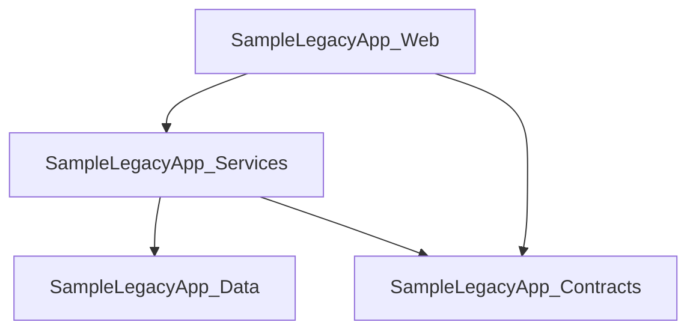

# LegacyLens.NET

LegacyLens.NET is a static discovery tool for unfamiliar, legacy, and modern .NET codebases.

It helps developers quickly understand the structure of a .NET solution by scanning project files and reporting useful information such as projects, target frameworks, project references, package references, WCF endpoint configuration, and service-related configuration.

The aim is to help a developer who is new to a codebase answer questions such as:

- What projects exist in this solution?
- Which target frameworks are being used?
- Which projects depend on each other?
- Which NuGet packages are referenced?
- Are there signs of legacy technologies such as WCF?
- Which WCF endpoints are configured?
- What diagrams or reports can help explain the system to others?

LegacyLens.NET is designed to work through static analysis, meaning it can provide useful information even when the target solution cannot currently be built.

---

## Current Status

LegacyLens.NET is currently in early MVP development.

The current implementation can scan a folder containing .NET projects and discover:

- `.csproj` files
- project names
- target frameworks
- project-to-project references
- NuGet package references
- WCF endpoints from `app.config` and `web.config` files

It can also generate a Markdown discovery report at:

```text
output/discovery-report.md
```

The generated report currently includes:

- a summary of discovered projects, references, packages, and WCF endpoints
- a project table
- a Mermaid project dependency diagram
- project reference information
- package reference information
- WCF endpoint information

Example console output:

```text
Projects discovered:
- SampleLegacyApp.Contracts
  Target framework: net48

- SampleLegacyApp.Data
  Target framework: net48
  Package reference: Dapper

- SampleLegacyApp.Services
  Target framework: net48
  Project reference: ..\SampleLegacyApp.Data\SampleLegacyApp.Data.csproj
  Project reference: ..\SampleLegacyApp.Contracts\SampleLegacyApp.Contracts.csproj

- SampleLegacyApp.Web
  Target framework: net48
  Project reference: ..\SampleLegacyApp.Services\SampleLegacyApp.Services.csproj
  Project reference: ..\SampleLegacyApp.Contracts\SampleLegacyApp.Contracts.csproj
  Package reference: System.ServiceModel.Http
  Package reference: Newtonsoft.Json

WCF endpoints discovered:
- SampleLegacyApp.Services.CustomerService
  Address:
  Binding: basicHttpBinding
  Contract: SampleLegacyApp.Contracts.ICustomerService
  Config file: C:\Path\To\LegacyLens.Net\samples\SampleLegacyApp\SampleLegacyApp.Web\Web.config

Markdown report generated: C:\Path\To\LegacyLens.Net\output\discovery-report.md
```

If no WCF endpoints are found, the console output shows:

```text
WCF endpoints discovered:
- None
```

---

## Why LegacyLens.NET?

Legacy .NET systems are often difficult to understand because the original developers may no longer be available, documentation may be missing, and the solution may not build cleanly on a modern machine.

LegacyLens.NET aims to make that first investigation easier by producing clear, structured information from the source code itself.

It is especially useful for:

- developers joining an unfamiliar codebase
- contractors starting a legacy .NET assignment
- teams planning modernisation work
- architects reviewing project dependencies
- developers preparing documentation or diagrams
- codebase discovery before refactoring or migration

---

## What LegacyLens.NET Can Do Without Building the Solution

LegacyLens.NET is designed to inspect source files directly.

Even if the solution does not build, it can still discover useful information from files such as:

- `.sln`
- `.csproj`
- `packages.config`
- `app.config`
- `web.config`
- C# source files
- WCF configuration files
- project references
- package references

This makes it useful for old or broken solutions where restoring packages, installing SDKs, or compiling the code may not be possible immediately.

---

## Repository Structure

```text
LegacyLens.Net/
├── artifacts/
├── docs/
│   └── mvp.md
├── output/
├── reports/
├── samples/
│   └── SampleLegacyApp/
├── src/
│   ├── LegacyLens.Cli/
│   ├── LegacyLens.Core/
│   └── LegacyLens.Reporting/
└── tests/
```

---

## Main Projects

| Project | Purpose |
|---|---|
| `LegacyLens.Cli` | Command-line entry point for running scans |
| `LegacyLens.Core` | Core discovery and analysis logic |
| `LegacyLens.Reporting` | Report generation functionality |
| `SampleLegacyApp` | Sample legacy-style .NET application used for testing discovery features |

---

## LegacyLens.Core Structure

The core project is organised around discovery and analysis concepts.

```text
LegacyLens.Core/
├── Abstractions/
├── Dependencies/
├── Discovery/
├── Models/
└── Wcf/
```

### Abstractions

Contains shared interfaces used by the core discovery and reporting components.

Examples:

- `IScanner`
- `IReportWriter`

### Discovery

Responsible for finding projects, solutions, and source files.

Current discovery work includes:

- project discovery
- solution discovery
- source file discovery
- discovered project modelling

### Dependencies

Responsible for scanning dependency information.

Current dependency work includes:

- project reference scanning
- package reference scanning
- assembly reference scanning

### Models

Contains shared models used to represent scan results, projects, solutions, and dependencies.

### WCF

Responsible for detecting WCF-related code and configuration.

Current WCF work includes:

- scanning `app.config` and `web.config` files
- detecting `<system.serviceModel>` configuration
- extracting configured WCF endpoints
- modelling WCF endpoint details such as service name, address, binding, contract, and config file path

Planned WCF work includes:

- WCF service contract scanning from C# source files
- richer WCF binding and endpoint analysis
- WCF-related risk and modernisation indicators

---

## LegacyLens.Reporting Structure

The reporting project is responsible for producing human-readable output from discovered codebase information.

Current reporting work includes:

```text
LegacyLens.Reporting/
├── Html/
├── Markdown/
└── Mermaid/
```

### Markdown

Currently implemented.

Generates:

```text
output/discovery-report.md
```

The Markdown report currently includes:

- summary counts
- discovered projects
- target frameworks
- project dependency diagram
- project references
- package references
- WCF endpoint details

### Mermaid

Currently implemented.

Generates a Mermaid project dependency diagram from discovered project references and includes it in the Markdown discovery report.

The diagram is generated from `<ProjectReference />` entries found in `.csproj` files.

Example:



Project names are sanitized for Mermaid output by replacing characters such as `.`, `-`, and spaces with `_`.

### HTML

Planned.

This may later be used to generate richer browser-based reports.

---

## Running the Tool

From the repository root, run:

```powershell
dotnet run --project src/LegacyLens.Cli -- .\samples\SampleLegacyApp\
```

Example:

```powershell
PS C:\Users\YourName\RiderProjects\LegacyLens.Net> dotnet run --project src/LegacyLens.Cli -- .\samples\SampleLegacyApp\
```

This scans the sample application, prints discovered project and WCF information to the console, and generates a Markdown report at:

```text
output/discovery-report.md
```

Example final console line:

```text
Markdown report generated: C:\Path\To\LegacyLens.Net\output\discovery-report.md
```

---

## Sample Console Output

```text
Projects discovered:
- SampleLegacyApp.Contracts
  Target framework: net48

- SampleLegacyApp.Data
  Target framework: net48
  Package reference: Dapper

- SampleLegacyApp.Services
  Target framework: net48
  Project reference: ..\SampleLegacyApp.Data\SampleLegacyApp.Data.csproj
  Project reference: ..\SampleLegacyApp.Contracts\SampleLegacyApp.Contracts.csproj

- SampleLegacyApp.Web
  Target framework: net48
  Project reference: ..\SampleLegacyApp.Services\SampleLegacyApp.Services.csproj
  Project reference: ..\SampleLegacyApp.Contracts\SampleLegacyApp.Contracts.csproj
  Package reference: System.ServiceModel.Http
  Package reference: Newtonsoft.Json

WCF endpoints discovered:
- SampleLegacyApp.Services.CustomerService
  Address:
  Binding: basicHttpBinding
  Contract: SampleLegacyApp.Contracts.ICustomerService
  Config file: C:\Path\To\LegacyLens.Net\samples\SampleLegacyApp\SampleLegacyApp.Web\Web.config

Markdown report generated: C:\Path\To\LegacyLens.Net\output\discovery-report.md
```

---

## Generated Report Output

LegacyLens.NET currently generates a Markdown report at:

```text
output/discovery-report.md
```

The current report sections are:

- Summary
- Projects
- Project Dependency Diagram
- Project References
- Package References
- WCF Endpoints

The report currently includes sections such as:

````markdown
# LegacyLens.NET Discovery Report

## Summary

- Projects discovered: 4
- Project references discovered: 4
- Package references discovered: 3
- WCF endpoints discovered: 1

## Projects

| Project | Target Framework | Project File |
|---|---|---|

## Project Dependency Diagram


## Project References

| From | To |
|---|---|

## Package References

| Project | Package |
|---|---|

## WCF Endpoints

| Service | Address | Binding | Contract | Config File |
|---|---|---|---|---|
| SampleLegacyApp.Services.CustomerService |  | basicHttpBinding | SampleLegacyApp.Contracts.ICustomerService | `C:\Path\To\LegacyLens.Net\samples\SampleLegacyApp\SampleLegacyApp.Web\Web.config` |
````

The generated report is intended to be readable in source control, Markdown preview tools, and documentation systems.

---

## Mermaid Dependency Diagram

LegacyLens.NET includes a Mermaid project dependency diagram in the generated Markdown report.

The diagram is created from discovered project-to-project references and is intended to make the structure of the solution easier to understand visually.

Example:


This makes it easier to visually understand project-to-project relationships.

---

## WCF Endpoint Discovery

LegacyLens.NET can detect basic WCF endpoint configuration from `app.config` and `web.config` files.

The current WCF scanner looks for `<system.serviceModel>` configuration and extracts endpoint details from configured services.

Example WCF configuration:

```xml
<configuration>
  <system.serviceModel>
    <services>
      <service name="SampleLegacyApp.Services.CustomerService">
        <endpoint
          address=""
          binding="basicHttpBinding"
          contract="SampleLegacyApp.Contracts.ICustomerService" />
      </service>
    </services>
  </system.serviceModel>
</configuration>
```

Example report output:

```markdown
## WCF Endpoints

| Service | Address | Binding | Contract | Config File |
|---|---|---|---|---|
| SampleLegacyApp.Services.CustomerService |  | basicHttpBinding | SampleLegacyApp.Contracts.ICustomerService | `...\SampleLegacyApp.Web\Web.config` |
```

This helps identify legacy service boundaries and integration points without needing to build or run the target application.

Current WCF discovery is configuration-based. WCF service contract scanning from C# source files is planned but not yet implemented.

---

## MVP Functionality

Current MVP functionality includes:

- static `.csproj` discovery
- project name discovery
- target framework discovery
- project-to-project reference discovery
- NuGet package reference discovery
- Markdown discovery report generation
- Mermaid project dependency diagram generation
- WCF endpoint discovery from configuration files
- WCF endpoint reporting
- output file generation under the `output/` directory

Planned MVP features include:

- solution-level summary
- package reference summary improvements
- target framework summary improvements
- WCF service contract detection from C# source files
- basic risk indicators

---

## Development Roadmap

### Step 1: Static project discovery

Status: Implemented

- Discover `.csproj` files
- Read project name
- Read target framework
- Read project references
- Read package references

### Step 2: Markdown report generation

Status: Implemented

- Generate `output/discovery-report.md`
- Include summary counts
- Include project table
- Include project references
- Include package references

### Step 3: Dependency diagram generation

Status: Implemented

- Generate Mermaid dependency graph
- Include graph in Markdown report

### Step 4: WCF configuration discovery

Status: Partially implemented

- Detect WCF configuration in `app.config` and `web.config`
- Detect configured WCF endpoints
- Report service name, address, binding, contract, and config file path

Remaining work:

- Detect WCF service contracts from C# source files
- Improve binding and endpoint analysis

### Step 5: Risk and modernisation hints

Status: Planned

- Identify old target frameworks
- Identify legacy packages
- Highlight tightly coupled project dependencies
- Highlight WCF usage
- Highlight config-heavy applications

---

## Example Use Cases

LegacyLens.NET can be used when:

- you have inherited a legacy .NET application
- you need to understand a codebase before making changes
- the solution does not build locally
- you need to document project dependencies
- you want to create diagrams for stakeholders
- you are assessing modernisation effort
- you are preparing for refactoring or migration
- you need to identify legacy WCF configuration and integration points

---

## Design Principles

LegacyLens.NET is intended to be:

- static-first
- useful without requiring a successful build
- simple to run from the command line
- focused on practical codebase understanding
- useful for both legacy and modern .NET solutions
- able to generate human-readable reports and diagrams
- honest about what has been discovered from source files and configuration

---

## License

This project is licensed under the Apache License, Version 2.0, January 2004.

See the `LICENSE` file for details.
