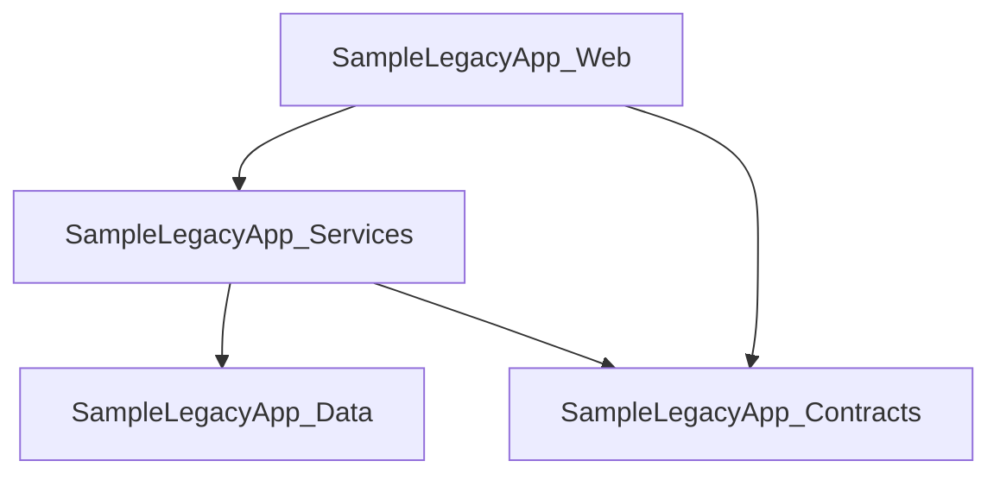

# LegacyLens.NET

LegacyLens.NET is a static discovery tool for unfamiliar, legacy, and modern .NET codebases.

It helps developers quickly understand the structure of a .NET solution by scanning project files, C# source files, and configuration files, then reporting useful information such as projects, target frameworks, project references, assembly references, package references, WCF endpoint configuration, WCF service contracts, service-related configuration, and basic modernisation hints.

The aim is to help a developer who is new to a codebase answer questions such as:

- What projects exist in this solution?
- Which target frameworks are being used?
- Which projects depend on each other?
- Which framework assembly references are used by each project?
- Which NuGet packages are referenced?
- Are there signs of legacy technologies such as WCF?
- Which WCF endpoints are configured?
- Which WCF service contracts and operations are defined in the source code?
- What modernisation risks or review areas should be looked at first?
- What diagrams or reports can help explain the system to others?

LegacyLens.NET is designed to work through static analysis, meaning it can provide useful information even when the target solution cannot currently be built.

---

## Current Status

LegacyLens.NET is currently in early MVP development.

The current implementation can scan a folder containing .NET projects and discover:

- `.csproj` files
- project names
- target frameworks
- project-to-project references
- assembly references from `<Reference />` entries in `.csproj` files
- NuGet package references from SDK-style `<PackageReference />` entries in `.csproj` files
- NuGet package references from legacy `packages.config` files located alongside project files
- WCF endpoints from `app.config` and `web.config` files
- WCF service contracts from C# source files
- WCF operations marked with `[OperationContract]`
- basic modernisation hints for legacy target frameworks, WCF usage, selected packages, legacy ASP.NET / `System.Web` usage, higher project coupling, and selected WCF binding types

Package discovery behaviour is covered by tests for `<PackageReference />`, `packages.config`, duplicate package handling, and invalid `packages.config` handling.

It can also generate a Markdown discovery report at:

```text
output/discovery-report.md
```

The generated report currently includes:

- a summary of discovered projects, project references, assembly references, package references, WCF endpoints, and WCF service contracts
- a project table
- a Mermaid project dependency diagram
- project reference information
- assembly reference information
- package reference information
- WCF endpoint information
- WCF service contract and operation information
- modernisation hints with severity, area, finding, and reason, including Legacy ASP.NET hints when `System.Web` assembly references are found

Example console output:

```text
Projects discovered:
- SampleLegacyApp.Contracts
  Target framework: net48

- SampleLegacyApp.Data
  Target framework: net48
  Package reference: Dapper
  Package reference: EntityFramework

- SampleLegacyApp.Services
  Target framework: net48
  Project reference: ..\SampleLegacyApp.Data\SampleLegacyApp.Data.csproj
  Project reference: ..\SampleLegacyApp.Contracts\SampleLegacyApp.Contracts.csproj

- SampleLegacyApp.Web
  Target framework: net48
  Project reference: ..\SampleLegacyApp.Services\SampleLegacyApp.Services.csproj
  Project reference: ..\SampleLegacyApp.Contracts\SampleLegacyApp.Contracts.csproj
  Assembly reference: System.Web
  Assembly reference: System.Web.Mvc
  Package reference: System.ServiceModel.Http
  Package reference: Newtonsoft.Json

WCF endpoints discovered:
- SampleLegacyApp.Services.CustomerService
  Address:
  Binding: basicHttpBinding
  Contract: SampleLegacyApp.Contracts.ICustomerService
  Config file: C:\Path\To\LegacyLens.Net\samples\SampleLegacyApp\SampleLegacyApp.Web\Web.config

WCF service contracts discovered:
- ICustomerService
  Source file: C:\Path\To\LegacyLens.Net\samples\SampleLegacyApp\SampleLegacyApp.Contracts\CustomerContracts.cs
  Operation: GetCustomer

Modernisation hints discovered:
- [Risk] Target Framework: SampleLegacyApp.Contracts targets net48
- [Risk] Target Framework: SampleLegacyApp.Data targets net48
- [Risk] Target Framework: SampleLegacyApp.Services targets net48
- [Risk] Target Framework: SampleLegacyApp.Web targets net48
- [Warning] Packages: SampleLegacyApp.Data references EntityFramework
- [Risk] Packages: SampleLegacyApp.Web references System.ServiceModel.Http
- [Info] Packages: SampleLegacyApp.Web references Newtonsoft.Json
- [Risk] WCF: 1 WCF endpoint(s) discovered
- [Warning] WCF Binding: basicHttpBinding endpoint discovered for SampleLegacyApp.Services.CustomerService
- [Risk] WCF: 1 WCF service contract(s) discovered
- [Risk] Legacy ASP.NET: SampleLegacyApp.Web references System.Web
- [Warning] Legacy ASP.NET: SampleLegacyApp.Web references System.Web.Mvc

Markdown report generated: C:\Path\To\LegacyLens.Net\output\discovery-report.md
```

If no WCF endpoints, WCF service contracts, or modernisation hints are found, the console output shows:

```text
WCF endpoints discovered:
- None

WCF service contracts discovered:
- None

Modernisation hints discovered:
- None
```

---

## Why LegacyLens.NET?

Legacy .NET systems are often difficult to understand because the original developers may no longer be available, documentation may be missing, and the solution may not build cleanly on a modern machine.

LegacyLens.NET aims to make that first investigation easier by producing clear, structured information from the source code itself.

It is especially useful for:

- developers joining an unfamiliar codebase
- contractors starting a legacy .NET assignment
- teams planning modernisation work
- architects reviewing project dependencies
- developers preparing documentation or diagrams
- codebase discovery before refactoring or migration

---

## What LegacyLens.NET Can Do Without Building the Solution

LegacyLens.NET is designed to inspect source files directly.

Even if the solution does not build, it can still discover useful information from files such as:

- `.sln`
- `.csproj`
- `packages.config`
- `app.config`
- `web.config`
- C# source files
- WCF configuration files
- WCF `[ServiceContract]` interfaces
- WCF `[OperationContract]` methods
- project references
- assembly references
- package references

This makes it useful for old or broken solutions where restoring packages, installing SDKs, or compiling the code may not be possible immediately.

> Note: package reference discovery currently supports both SDK-style `<PackageReference />` entries in `.csproj` files and legacy `packages.config` files located alongside project files. Invalid or unreadable `packages.config` files are ignored so discovery can continue.

> Note: assembly reference discovery currently supports `<Reference Include="..." />` entries in `.csproj` files. Version metadata is removed so references such as `System.Web.Mvc, Version=5.2.9.0` are reported as `System.Web.Mvc`.

---

## Package Reference Discovery

LegacyLens.NET can discover NuGet package references from both modern and legacy project styles.

Current package discovery supports:

- SDK-style `<PackageReference />` entries inside `.csproj` files
- legacy `packages.config` files located in the same folder as the project file

Example SDK-style package reference:

```xml
<ItemGroup>
  <PackageReference Include="Dapper" Version="2.1.66" />
</ItemGroup>
```

Example legacy `packages.config` file:

```xml
<?xml version="1.0" encoding="utf-8"?>
<packages>
  <package id="EntityFramework" version="6.4.4" targetFramework="net48" />
  <package id="Newtonsoft.Json" version="13.0.3" targetFramework="net48" />
</packages>
```

Package names discovered from both sources are merged into the project package reference list. Duplicate package names are removed case-insensitively.

This helps LegacyLens.NET identify important legacy dependencies even when older .NET Framework projects do not use SDK-style package references.

---


## Assembly Reference Discovery

LegacyLens.NET can discover framework assembly references from `.csproj` files.

This is useful for older .NET Framework projects where important dependencies may appear as assembly references rather than NuGet package references.

Current assembly reference discovery supports:

- `<Reference Include="..." />` entries inside `.csproj` files
- assembly reference names with version metadata, normalised to the assembly name
- duplicate assembly references removed case-insensitively

Example assembly references:

```xml
<ItemGroup>
  <Reference Include="System.Web" />
  <Reference Include="System.Web.Mvc, Version=5.2.9.0, Culture=neutral, PublicKeyToken=31bf3856ad364e35" />
</ItemGroup>
```

These are discovered as:

```text
System.Web
System.Web.Mvc
```

This helps LegacyLens.NET identify legacy ASP.NET indicators that may not appear as NuGet package references.

---

## Repository Structure

```text
LegacyLens.Net/
├── artifacts/
├── docs/
│   └── mvp.md
├── output/
├── reports/
├── samples/
│   └── SampleLegacyApp/
├── src/
│   ├── LegacyLens.Cli/
│   ├── LegacyLens.Core/
│   └── LegacyLens.Reporting/
└── tests/
```

---

## Main Projects

| Project | Purpose |
|---|---|
| `LegacyLens.Cli` | Command-line entry point for running scans |
| `LegacyLens.Core` | Core discovery and analysis logic |
| `LegacyLens.Reporting` | Report generation functionality |
| `SampleLegacyApp` | Sample legacy-style .NET application used for testing discovery features |

---

## LegacyLens.Core Structure

The core project is organised around discovery and analysis concepts.

```text
LegacyLens.Core/
├── Abstractions/
├── Analysis/
├── Dependencies/
├── Discovery/
├── Models/
└── Wcf/
```

### Abstractions

Contains shared interfaces used by the core discovery and reporting components.

Examples:

- `IScanner`
- `IReportWriter`

### Analysis

Responsible for turning discovered facts into basic review and modernisation hints.

Current analysis work includes:

- modelling modernisation hints
- classifying hints by severity: `Info`, `Warning`, and `Risk`
- identifying old .NET Framework target frameworks such as `net48`
- identifying missing target framework declarations
- identifying WCF-related package usage such as `System.ServiceModel.*`
- identifying classic Entity Framework package usage
- identifying `Newtonsoft.Json` usage as an informational review item
- identifying legacy ASP.NET indicators from `System.Web` assembly references
- identifying `System.Web.*` assembly references as legacy ASP.NET review items
- highlighting projects with several direct project references
- highlighting discovered WCF endpoints
- highlighting selected WCF binding types such as `basicHttpBinding`, `netTcpBinding`, `wsHttpBinding`, and `netMsmqBinding`
- highlighting WCF endpoints with missing binding information
- highlighting discovered WCF service contracts

### Discovery

Responsible for finding projects, solutions, and source files.

Current discovery work includes:

- project discovery
- solution discovery
- source file discovery
- discovered project modelling
- package reference discovery from `<PackageReference />` entries
- package reference discovery from legacy `packages.config` files
- assembly reference discovery from `<Reference />` entries

### Dependencies

Responsible for scanning dependency information.

Current dependency work includes:

- project reference scanning
- package reference scanning
- assembly reference scanning

### Models

Contains shared models used to represent scan results, projects, solutions, and dependencies.

### WCF

Responsible for detecting WCF-related code and configuration.

Current WCF work includes:

- scanning `app.config` and `web.config` files
- detecting `<system.serviceModel>` configuration
- extracting configured WCF endpoints
- modelling WCF endpoint details such as service name, address, binding, contract, and config file path
- scanning C# source files for WCF service contracts
- detecting interfaces marked with `[ServiceContract]`
- detecting operations marked with `[OperationContract]`
- modelling WCF service contract details such as contract name, source file path, and operation names

Planned WCF work includes:

- richer WCF endpoint analysis beyond the currently detected binding-level hints
- more detailed WCF-related risk and modernisation indicators
- improved service contract parsing for more complex C# syntax

---

## LegacyLens.Reporting Structure

The reporting project is responsible for producing human-readable output from discovered codebase information.

Current reporting work includes:

```text
LegacyLens.Reporting/
├── Html/
├── Markdown/
└── Mermaid/
```

### Markdown

Currently implemented.

Generates:

```text
output/discovery-report.md
```

The Markdown report currently includes:

- summary counts
- discovered projects
- target frameworks
- project dependency diagram
- project references
- assembly references
- package references
- WCF endpoint details
- WCF service contract details
- WCF operation names
- modernisation hints

### Mermaid

Currently implemented.

Generates a Mermaid project dependency diagram from discovered project references and includes it in the Markdown discovery report.

The diagram is generated from `<ProjectReference />` entries found in `.csproj` files.

Example:



Project names are sanitized for Mermaid output by replacing characters such as `.`, `-`, and spaces with `_`.

### HTML

Planned.

This may later be used to generate richer browser-based reports.

---

## Running the Tool

From the repository root, run:

```powershell
dotnet run --project src/LegacyLens.Cli -- .\samples\SampleLegacyApp\
```

Example:

```powershell
PS C:\Users\YourName\RiderProjects\LegacyLens.Net> dotnet run --project src/LegacyLens.Cli -- .\samples\SampleLegacyApp\
```

This scans the sample application, prints discovered project, assembly reference, WCF, and modernisation hint information to the console, and generates a Markdown report at:

```text
output/discovery-report.md
```

Example final console line:

```text
Markdown report generated: C:\Path\To\LegacyLens.Net\output\discovery-report.md
```

---

## Sample Console Output

```text
Projects discovered:
- SampleLegacyApp.Contracts
  Target framework: net48

- SampleLegacyApp.Data
  Target framework: net48
  Package reference: Dapper
  Package reference: EntityFramework

- SampleLegacyApp.Services
  Target framework: net48
  Project reference: ..\SampleLegacyApp.Data\SampleLegacyApp.Data.csproj
  Project reference: ..\SampleLegacyApp.Contracts\SampleLegacyApp.Contracts.csproj

- SampleLegacyApp.Web
  Target framework: net48
  Project reference: ..\SampleLegacyApp.Services\SampleLegacyApp.Services.csproj
  Project reference: ..\SampleLegacyApp.Contracts\SampleLegacyApp.Contracts.csproj
  Assembly reference: System.Web
  Assembly reference: System.Web.Mvc
  Package reference: System.ServiceModel.Http
  Package reference: Newtonsoft.Json

WCF endpoints discovered:
- SampleLegacyApp.Services.CustomerService
  Address:
  Binding: basicHttpBinding
  Contract: SampleLegacyApp.Contracts.ICustomerService
  Config file: C:\Path\To\LegacyLens.Net\samples\SampleLegacyApp\SampleLegacyApp.Web\Web.config

WCF service contracts discovered:
- ICustomerService
  Source file: C:\Path\To\LegacyLens.Net\samples\SampleLegacyApp\SampleLegacyApp.Contracts\CustomerContracts.cs
  Operation: GetCustomer

Modernisation hints discovered:
- [Risk] Target Framework: SampleLegacyApp.Contracts targets net48
- [Risk] Target Framework: SampleLegacyApp.Data targets net48
- [Risk] Target Framework: SampleLegacyApp.Services targets net48
- [Risk] Target Framework: SampleLegacyApp.Web targets net48
- [Warning] Packages: SampleLegacyApp.Data references EntityFramework
- [Risk] Packages: SampleLegacyApp.Web references System.ServiceModel.Http
- [Info] Packages: SampleLegacyApp.Web references Newtonsoft.Json
- [Risk] WCF: 1 WCF endpoint(s) discovered
- [Warning] WCF Binding: basicHttpBinding endpoint discovered for SampleLegacyApp.Services.CustomerService
- [Risk] WCF: 1 WCF service contract(s) discovered
- [Risk] Legacy ASP.NET: SampleLegacyApp.Web references System.Web
- [Warning] Legacy ASP.NET: SampleLegacyApp.Web references System.Web.Mvc

Markdown report generated: C:\Path\To\LegacyLens.Net\output\discovery-report.md
```

---

## Generated Report Output

LegacyLens.NET currently generates a Markdown report at:

```text
output/discovery-report.md
```

The current report sections are:

- Summary
- Projects
- Project Dependency Diagram
- Project References
- Assembly References
- Package References
- WCF Endpoints
- WCF Service Contracts
- Modernisation Hints

The report currently includes sections such as:

````markdown
# LegacyLens.NET Discovery Report

## Summary

- Projects discovered: 4
- Project references discovered: 4
- Package references discovered: 4
- WCF endpoints discovered: 1
- WCF service contracts discovered: 1
- Assembly references discovered: 2

## Projects

| Project | Target Framework | Project File |
|---|---|---|

## Project Dependency Diagram


## Project References

| From | To |
|---|---|

## Assembly References

| Project | Assembly |
|---|---|
| SampleLegacyApp.Web | `System.Web` |
| SampleLegacyApp.Web | `System.Web.Mvc` |

## Package References

| Project | Package |
|---|---|

## WCF Endpoints

| Service | Address | Binding | Contract | Config File |
|---|---|---|---|---|
| SampleLegacyApp.Services.CustomerService |  | basicHttpBinding | SampleLegacyApp.Contracts.ICustomerService | `C:\Path\To\LegacyLens.Net\samples\SampleLegacyApp\SampleLegacyApp.Web\Web.config` |

## WCF Service Contracts

| Contract | Operations | Source File |
|---|---|---|
| ICustomerService | GetCustomer | `C:\Path\To\LegacyLens.Net\samples\SampleLegacyApp\SampleLegacyApp.Contracts\CustomerContracts.cs` |

## Modernisation Hints

| Severity | Area | Finding | Reason |
|---|---|---|---|
| Risk | Packages | SampleLegacyApp.Web references System.ServiceModel.Http | System.ServiceModel packages indicate WCF-related usage, which is important for modernisation planning. |
| Risk | Target Framework | SampleLegacyApp.Web targets net48 | .NET Framework projects usually need extra assessment before migration to modern .NET. |
| Risk | WCF | 1 WCF endpoint(s) discovered | Configured WCF endpoints usually represent service boundaries or integration points that need migration assessment. |
| Risk | WCF | 1 WCF service contract(s) discovered | WCF service contracts identify service APIs that may need redesign, replacement, or compatibility planning. |
| Risk | Legacy ASP.NET | SampleLegacyApp.Web references System.Web | System.Web usually indicates classic ASP.NET, WebForms, MVC 5, ASMX, or ASP.NET-hosted legacy functionality that does not directly migrate to modern ASP.NET Core. |
| Warning | Legacy ASP.NET | SampleLegacyApp.Web references System.Web.Mvc | System.Web-related assemblies indicate legacy ASP.NET functionality that may need separate migration assessment. |
| Warning | Packages | SampleLegacyApp.Data references EntityFramework | Classic Entity Framework may require assessment before migration to EF Core or modern .NET. |
| Warning | WCF Binding | basicHttpBinding endpoint discovered for SampleLegacyApp.Services.CustomerService | basicHttpBinding commonly indicates SOAP interoperability that may need replacement or compatibility planning. |
| Info | Packages | SampleLegacyApp.Web references Newtonsoft.Json | This is common in legacy and modern projects, but may be reviewed during modernisation. |
````

The generated report is intended to be readable in source control, Markdown preview tools, and documentation systems.

---

## Mermaid Dependency Diagram

LegacyLens.NET includes a Mermaid project dependency diagram in the generated Markdown report.

The diagram is created from discovered project-to-project references and is intended to make the structure of the solution easier to understand visually.

Example:


This makes it easier to visually understand project-to-project relationships.

---

## WCF Endpoint Discovery

LegacyLens.NET can detect basic WCF endpoint configuration from `app.config` and `web.config` files.

The current WCF scanner looks for `<system.serviceModel>` configuration and extracts endpoint details from configured services.

Example WCF configuration:

```xml
<configuration>
  <system.serviceModel>
    <services>
      <service name="SampleLegacyApp.Services.CustomerService">
        <endpoint
          address=""
          binding="basicHttpBinding"
          contract="SampleLegacyApp.Contracts.ICustomerService" />
      </service>
    </services>
  </system.serviceModel>
</configuration>
```

Example report output:

```markdown
## WCF Endpoints

| Service | Address | Binding | Contract | Config File |
|---|---|---|---|---|
| SampleLegacyApp.Services.CustomerService |  | basicHttpBinding | SampleLegacyApp.Contracts.ICustomerService | `...\SampleLegacyApp.Web\Web.config` |
```

This helps identify legacy service boundaries and integration points without needing to build or run the target application.

Current WCF endpoint discovery is configuration-based.

---

## WCF Service Contract Discovery

LegacyLens.NET can also detect WCF service contracts from C# source files.

The current WCF service contract scanner looks for interfaces marked with `[ServiceContract]` and operations marked with `[OperationContract]`.

Example WCF service contract:

```csharp
using System.ServiceModel;

namespace SampleLegacyApp.Contracts;

[ServiceContract]
public interface ICustomerService
{
    [OperationContract]
    CustomerDto GetCustomer(int id);
}
```

Example report output:

```markdown
## WCF Service Contracts

| Contract | Operations | Source File |
|---|---|---|
| ICustomerService | GetCustomer | `...\SampleLegacyApp.Contracts\CustomerContracts.cs` |
```

This helps identify service boundaries defined in code, even when the target solution cannot be built or run.

Current service contract discovery is intentionally lightweight and static. It is based on source scanning rather than compilation.

---

## Modernisation Hint Analysis

LegacyLens.NET can produce basic modernisation hints from the information it discovers.

The current modernisation hint analysis is intentionally lightweight. It does not attempt to fully assess migration effort, but it highlights useful review areas for developers investigating a legacy or unfamiliar .NET codebase.

Current hint areas include:

- target framework review
- project dependency review
- package review
- legacy ASP.NET / `System.Web` review
- WCF endpoint review
- WCF binding review
- WCF service contract review

Current severity levels are:

| Severity | Meaning |
|---|---|
| `Info` | Useful information to review during discovery |
| `Warning` | Something that may need extra attention |
| `Risk` | Something likely to affect modernisation or migration planning |

Current WCF binding hints include:

| Binding | Severity | Meaning |
|---|---|---|
| Missing binding | `Warning` | The endpoint cannot be fully assessed because binding information is missing |
| `basicHttpBinding` | `Warning` | Commonly indicates SOAP interoperability that may need replacement or compatibility planning |
| `wsHttpBinding` | `Warning` | May indicate SOAP and WS-* features that need modernisation assessment |
| `netTcpBinding` | `Risk` | WCF-specific communication that usually needs careful migration or replacement planning |
| `netMsmqBinding` | `Risk` | Queue-based WCF integration that needs separate migration planning |


Current legacy ASP.NET hints include:

| Indicator | Severity | Meaning |
|---|---|---|
| `System.Web` assembly reference | `Risk` | Usually indicates classic ASP.NET, WebForms, MVC 5, ASMX, or ASP.NET-hosted legacy functionality that does not directly migrate to modern ASP.NET Core |
| `System.Web.*` assembly reference | `Warning` | Indicates legacy ASP.NET-related functionality that may need separate migration assessment |

Example report output:

```markdown
## Modernisation Hints

| Severity | Area | Finding | Reason |
|---|---|---|---|
| Risk | Target Framework | SampleLegacyApp.Web targets net48 | .NET Framework projects usually need extra assessment before migration to modern .NET. |
| Risk | Packages | SampleLegacyApp.Web references System.ServiceModel.Http | System.ServiceModel packages indicate WCF-related usage, which is important for modernisation planning. |
| Risk | WCF | 1 WCF endpoint(s) discovered | Configured WCF endpoints usually represent service boundaries or integration points that need migration assessment. |
| Risk | Legacy ASP.NET | SampleLegacyApp.Web references System.Web | System.Web usually indicates classic ASP.NET, WebForms, MVC 5, ASMX, or ASP.NET-hosted legacy functionality that does not directly migrate to modern ASP.NET Core. |
| Warning | Legacy ASP.NET | SampleLegacyApp.Web references System.Web.Mvc | System.Web-related assemblies indicate legacy ASP.NET functionality that may need separate migration assessment. |
```

These hints are intended to guide the first review of a codebase. They should be treated as discovery signals, not final migration advice.

---

## MVP Functionality

Current MVP functionality includes:

- static `.csproj` discovery
- project name discovery
- target framework discovery
- project-to-project reference discovery
- assembly reference discovery from `<Reference />` entries
- NuGet package reference discovery from `<PackageReference />` entries and legacy `packages.config` files
- Markdown discovery report generation
- Mermaid project dependency diagram generation
- WCF endpoint discovery from configuration files
- WCF endpoint reporting
- WCF service contract discovery from C# source files
- WCF operation discovery from `[OperationContract]` methods
- WCF service contract reporting
- basic modernisation hint analysis
- modernisation hints for old .NET Framework target frameworks
- modernisation hints for missing target framework declarations
- modernisation hints for selected legacy or review-worthy packages
- modernisation hints for legacy ASP.NET and `System.Web` assembly references
- modernisation hints for WCF endpoints, selected WCF binding types, and service contracts
- modernisation hint reporting in the generated Markdown report
- output file generation under the `output/` directory

Planned MVP features include:

- solution-level summary
- package reference summary improvements
- target framework summary improvements
- richer WCF endpoint analysis beyond the current binding-level hints
- richer risk and modernisation indicators

---

## Development Roadmap

### Step 1: Static project discovery

Status: Implemented

- Discover `.csproj` files
- Read project name
- Read target framework
- Read project references
- Read assembly references from `<Reference />` entries
- Read package references from `<PackageReference />` entries and legacy `packages.config` files

### Step 2: Markdown report generation

Status: Implemented

- Generate `output/discovery-report.md`
- Include summary counts
- Include project table
- Include project references
- Include assembly references
- Include package references

### Step 3: Dependency diagram generation

Status: Implemented

- Generate Mermaid dependency graph
- Include graph in Markdown report

### Step 4: WCF configuration and service contract discovery

Status: Partially implemented

Implemented:

- Detect WCF configuration in `app.config` and `web.config`
- Detect configured WCF endpoints
- Report service name, address, binding, contract, and config file path
- Detect WCF service contracts from C# source files
- Detect WCF operations marked with `[OperationContract]`
- Report contract name, operation names, and source file path

Remaining work:

- Improve endpoint analysis beyond the currently detected binding-level hints
- Improve service contract parsing for more complex C# syntax

### Step 5: Risk and modernisation hints

Status: Partially implemented

Implemented:

- Identify old .NET Framework target frameworks such as `net48`
- Identify missing target framework declarations
- Identify WCF-related packages such as `System.ServiceModel.*`
- Identify classic Entity Framework package usage
- Identify `Newtonsoft.Json` usage as an informational review item
- Highlight projects with several direct project references
- Highlight discovered WCF endpoints
- Highlight selected WCF binding types, including `basicHttpBinding`, `netTcpBinding`, `wsHttpBinding`, and `netMsmqBinding`
- Highlight WCF endpoints with missing binding information
- Highlight discovered WCF service contracts
- Identify legacy ASP.NET indicators from `System.Web` and `System.Web.*` assembly references
- Include modernisation hints in the generated Markdown report

Remaining work:

- Add more legacy ASP.NET indicators beyond the current `System.Web` and `System.Web.*` assembly reference hints
- Add config-heavy application indicators
- Add richer WCF endpoint risk analysis beyond the current binding-level hints
- Improve severity classification as more discovery signals are added

---

## Example Use Cases

LegacyLens.NET can be used when:

- you have inherited a legacy .NET application
- you need to understand a codebase before making changes
- the solution does not build locally
- you need to document project dependencies
- you want to create diagrams for stakeholders
- you are assessing modernisation effort
- you are preparing for refactoring or migration
- you need to identify legacy WCF configuration and integration points
- you need to identify WCF service contracts and operations defined in source code
- you want an initial list of modernisation review areas
- you need to identify likely migration risks before deeper analysis

---

## Design Principles

LegacyLens.NET is intended to be:

- static-first
- useful without requiring a successful build
- simple to run from the command line
- focused on practical codebase understanding
- useful for both legacy and modern .NET solutions
- able to generate human-readable reports and diagrams
- honest about what has been discovered from source files and configuration

---

## License

This project is licensed under the Apache License, Version 2.0, January 2004.

See the `LICENSE` file for details.
