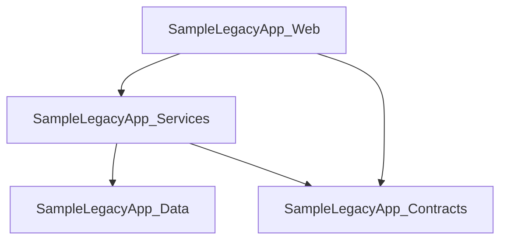

# Architecture

This document describes the repository and project structure for LegacyLens.NET.

## Repository Structure

```text
LegacyLens.Net/
├── docs/
│   └── mvp.md
├── samples/
│   └── SampleLegacyApp/
├── src/
│   ├── LegacyLens.Cli/
│   ├── LegacyLens.Core/
│   └── LegacyLens.Reporting/
└── tests/
```

The repository may also contain generated or local-only folders such as `artifacts/`, `output/`, and `reports/`, but these are ignored by Git and should not be treated as source-code folders.

### Gitignored folder names that should not be used for code

The `.gitignore` file intentionally ignores common build folders and LegacyLens.NET generated-output folders. Do not use these names for source, test, namespace, or feature folders inside `src/`, `tests/`, or `samples/`, because those folders may be ignored by Git and code may not be committed.

Reserved generated-output folder names:

* `artifacts/`
* `output/`
* `reports/`

Avoid using these as code folders even with different casing, for example `Artifacts/`, `Output/`, or `Reports/`.

Also avoid using common build/test-output folder names for source code, including:

* `bin/`
* `obj/`
* `Debug/`
* `Release/`
* `Log/`
* `Logs/`
* `TestResult*/`
* `CodeCoverage/`

For optional artifact-generation code, use `Commands/Runners/` with the namespace `LegacyLens.Cli.Commands.Runners`. Do not use `Commands/Artifacts/`, because `artifacts/` is a generated-output folder name ignored by Git.

---

## Main Projects

| Project                | Purpose                                                                                                                                                                   |
| ---------------------- | ------------------------------------------------------------------------------------------------------------------------------------------------------------------------- |
| `LegacyLens.Cli`       | Standalone command-line executable for running `legacylens scan <path>`, writing the main Markdown discovery report, and coordinating optional artifact report generation |
| `LegacyLens.Core`      | Core discovery and analysis logic                                                                                                                                         |
| `LegacyLens.Reporting` | Report generation functionality                                                                                                                                           |
| `SampleLegacyApp`      | Sample legacy-style .NET application used for testing discovery features                                                                                                  |

---

## LegacyLens.Cli Structure

The CLI project owns command-line parsing, scan orchestration, console output, output-path selection for the main discovery report, and artifact-runner coordination for optional artifact reports.

```text
LegacyLens.Cli/
├── Commands/
│   ├── Runners/
│   │   ├── ClassDependenciesArtifactRunner.cs
│   │   ├── InterfaceInventoryArtifactRunner.cs
│   │   ├── ConfigurationInventoryArtifactRunner.cs
│   │   ├── DataAccessArtifactRunner.cs
│   │   ├── EdmxAnalysisArtifactRunner.cs
│   │   ├── ExternalDependenciesArtifactRunner.cs
│   │   ├── IScanArtifactRunner.cs
│   │   ├── ScanArtifactResult.cs
│   │   ├── UpgradeBlockersArtifactRunner.cs
│   │   └── UpgradeReadinessArtifactRunner.cs
│   ├── ArtifactOutputPathResolver.cs
│   ├── ScanCommand.cs
│   ├── ScanContext.cs
│   ├── ScanOptions.cs
│   └── ScanResult.cs
├── Parsing/
├── Progress/
├── Writers/
└── Program.cs
```

### Commands

The `Commands` namespace contains the command model and scan orchestration types.

| Type                         | Purpose                                                                                                                                                                                                                                                                                                                       |
| ---------------------------- | ----------------------------------------------------------------------------------------------------------------------------------------------------------------------------------------------------------------------------------------------------------------------------------------------------------------------------- |
| `ScanCommand`                | Orchestrates static discovery, reports phase-based progress through a CLI progress abstraction, builds the shared file inventory once after project discovery, runs analysis, writes the main report, executes artifact runners, and creates the final `ScanResult` for `legacylens scan <path>`.                                                                                              |
| `ScanContext`                | Passive CLI data carrier created by `ScanCommand` after shared discovery and modernisation analysis have completed. It groups the scan path, main output path, options, discovered facts, modernisation hints, prioritised review areas, and the shared `ScanFileInventory` for report writing and optional artifact runners. |
| `ScanOptions`                | Represents validated scan options from the CLI parser, including output selection, console mode, parsed artifact selection, and optional upgrade report wording context.                                                                                                                                                                     |
| `ScanResult`                 | Carries discovered facts, analysis results, output paths, and optional artifact reports back to the console writer.                                                                                                                                                                                                           |
| `ArtifactOutputPathResolver` | Centralises optional artifact output-path resolution for generated artifact files such as `upgrade-readiness-report.md`, `upgrade-blockers.md`, `external-dependencies.md`, `configuration-inventory.md`, `data-access-inventory.md`, `edmx-analysis.md`, `class-dependencies.md`, `interface-inventory.md`, and `solution-topology.md`.                                                                      |


### Artifact Selection Model

`ScanOptions` should expose parsed artifact selection rather than treating `--artifacts` as only one raw artifact string. The selection model should support:

* no optional artifacts selected
* one selected artifact name
* a comma-separated set of selected artifact names
* the special `all` selection
* case-insensitive matching
* duplicate de-duplication
* a helper such as `ShouldWriteAllArtifacts`
* a helper such as `ShouldWriteArtifact(string artifactName)`

The normal `discovery-report.md` remains outside optional artifact selection and should always be generated for a successful scan.

`--upgrade-target <tfm>` validation should be based on the parsed selection. It is optional target-framework context for upgrade report wording only. It is valid when the selected artifacts include `upgrade-readiness`, `upgrade-blockers`, or `all`, and invalid when the selected artifacts contain no upgrade-related artifact. It must not change discovery scope, enable extra analysis, or imply compatibility checking.

`ScanContext` is intentionally not an artifact runner and should not contain discovery, analysis, report-writing, file-inventory-building, or output-path resolution behaviour. It exists to reduce long parameter lists inside `ScanCommand` and to provide a stable input object for artifact runners. `ScanCommand` still owns when shared discovery runs, when the shared file inventory is built, when shared analyzers run, when the main discovery report is written, which artifact runners are available, and how the final `ScanResult` is populated.

### Artifact Runners

The `Commands.Runners` namespace contains focused optional artifact-generation runners. Each runner decides whether it should run for the current parsed artifact selection on `ScanOptions`, consumes the shared `ScanContext`, performs only the analysis needed for its artifact, writes its Markdown report, and returns a `ScanArtifactResult`.

| Type                                 | Purpose                                                                                         |
| ------------------------------------ | ----------------------------------------------------------------------------------------------- |
| `IScanArtifactRunner`                | Common contract for optional artifact generation.                                               |
| `ScanArtifactResult`                 | Carries the artifact name, generated output path, and typed report object returned by a runner. |
| `UpgradeReadinessArtifactRunner`     | Produces `upgrade-readiness-report.md` when `--artifacts upgrade-readiness` is selected.        |
| `UpgradeBlockersArtifactRunner`      | Produces `upgrade-blockers.md` when `--artifacts upgrade-blockers` is selected.                 |
| `ExternalDependenciesArtifactRunner` | Produces `external-dependencies.md` when `--artifacts external-dependencies` is selected.       |
| `ConfigurationInventoryArtifactRunner` | Produces `configuration-inventory.md` when `--artifacts configuration-inventory` is selected.   |
| `DataAccessArtifactRunner`           | Produces `data-access-inventory.md` when `--artifacts data-access` is selected.                 |
| `EdmxAnalysisArtifactRunner`         | Produces `edmx-analysis.md` when `--artifacts edmx-analysis` is selected.                       |
| `ClassDependenciesArtifactRunner`    | Produces `class-dependencies.md` when `--artifacts class-dependencies` is selected.             |
| `InterfaceInventoryArtifactRunner`    | Produces `interface-inventory.md` when `--artifacts interface-inventory` is selected.           |
| `SolutionTopologyArtifactRunner`     | Produces `solution-topology.md` when `--artifacts solution-topology` is selected.               |

Artifact runner implementation rules:

* Keep optional artifact generation out of repeated `if` blocks inside `ScanCommand`.
* Runner `ShouldRun` methods should use the parsed artifact selection, for example `context.Options.ShouldWriteArtifact(ArtifactName)`, so single, multiple, and `all` selections behave consistently.
* Add a new runner when a new optional artifact is introduced.
* Keep shared scan data on `ScanContext`; do not rediscover common solution/project/configuration facts inside runners.
* Use `ScanContext.FileInventory` for artifact analyzers that need project-associated source/model files, such as class dependency, interface inventory, data-access, and EDMX analysis.
* Keep artifact-specific analyzer and Markdown writer calls inside the relevant runner.
* Use `ArtifactOutputPathResolver` for optional artifact output paths.
* Use `Commands/Runners/` rather than `Commands/Artifacts/`, because `artifacts/` is a gitignored generated-output folder name.

Optional artifact path resolution should use this precedence:

1. If `--output-dir` / `ScanOptions.OutputDirectory` is provided, write the artifact file into that directory.
2. Else if `--output` / `ScanOptions.Output` is provided, write the artifact file into the same directory as the main discovery report.
3. Else write the artifact file into `<scan-path>/output/<artifact-file-name>`.

The normal `discovery-report.md` output-path resolution currently remains inside `ScanCommand` because it has slightly different file-vs-directory semantics: `--output` selects the exact main report file, while `--output-dir` selects the directory for `discovery-report.md`. Keep this separate unless a later artifact-pipeline refactor deliberately generalises both main report and optional artifact path handling.

### Parsing

The `Parsing` namespace contains command-line parsing and validation. It should validate the public CLI contract before `ScanCommand` runs. Examples include required scan path validation, unsupported option handling, mutually exclusive `--output` and `--output-dir`, mutually exclusive `--quiet` and `--verbose`, supported artifact values, comma-separated artifact values, `all`, invalid combinations such as `all,data-access`, duplicate de-duplication, and valid use of `--upgrade-target` as upgrade report wording context only.

### Progress

The `Progress` namespace should contain the CLI-only progress reporting abstraction for phase-based visual scan feedback. Progress reporting belongs in `LegacyLens.Cli` because it is console UX and must not leak into `LegacyLens.Core` discovery or analysis code.

A small abstraction such as `IScanProgressReporter` should be preferred over scattering `Console.WriteLine` calls through `ScanCommand`. The reporter should support scan start, scoped phase operations, phase completion with optional counts/details, verbose details, artifact-generation progress, and completion duration. A scoped phase operation, for example an `IDisposable` returned from `BeginPhase(...)`, is preferred so active spinner cleanup is obvious on success and failure. Implementations may be split by console mode, for example normal, quiet, and verbose reporters, or a single reporter may take `ScanOptions` or a console mode enum.

The progress model should remain phase-based rather than percentage-based. In an interactive console, the currently running phase should use a real animated `| / - \` spinner that updates the same console line until completion. The spinner must stop cleanly, clear or replace the active line, and then write the completed phase message with useful counts. Spinner/progress output should be disabled for `--quiet`, and animation should be disabled when output is redirected or the console is non-interactive so logs remain stable. Verbose diagnostics should pause or clear the spinner, write a clean line, and resume the spinner when the phase is still active. Progress reporting should remain easy to test by isolating console writes, spinner frames, timing, or non-animated output paths.

### Writers

The CLI `Writers` namespace contains console output formatting. It should print concise default output, quiet output, verbose output, help text, version text, and error messages. Markdown and Mermaid report rendering should remain in `LegacyLens.Reporting`.

---

## LegacyLens.Core Structure

The core project is organised around discovery and analysis concepts.

```text
LegacyLens.Core/
├── Abstractions/
├── Analysis/
├── Configuration/
├── Dependencies/
├── Discovery/
├── Files/
├── LegacyAspNet/
├── Models/
└── Wcf/
```

### Abstractions

Contains shared interfaces used by the core discovery and reporting components.

Examples:

* `IScanner`
* `IReportWriter`

### Analysis

Responsible for turning discovered facts into basic review and modernisation hints.

Current analysis work includes:

* modelling modernisation hints
* modelling modernisation hint evidence, source path, and confidence metadata
* classifying hints by severity: `Info`, `Warning`, and `Risk`
* grouping detailed modernisation hints into prioritised review areas
* ranking review areas by highest discovered severity, review-area priority, and hint counts
* summarising review areas such as WCF migration, legacy ASP.NET migration, routing review, startup and request pipeline review, configuration review, dependency review, target framework review, and project dependency review
* identifying old .NET Framework target frameworks such as `net48`
* identifying missing target framework declarations
* identifying WCF-related package usage such as `System.ServiceModel.*`
* identifying classic Entity Framework package usage
* identifying `Newtonsoft.Json` usage as an informational review item
* identifying package compatibility review concerns for upgrade planning, including missing versions, legacy package formats, package target framework mismatches, and selected package-specific migration concerns
* producing upgrade-readiness analysis models for a separate `upgrade-readiness-report.md` artifact
* producing upgrade-blockers analysis models for a separate `upgrade-blockers.md` artifact
* producing external-dependencies analysis models for a separate `external-dependencies.md` artifact
* producing configuration-inventory analysis models for a separate `configuration-inventory.md` artifact
* producing data-access analysis models for a separate `data-access-inventory.md` artifact
* producing EDMX analysis models for a separate `edmx-analysis.md` artifact
* producing class dependency analysis models for a separate `class-dependencies.md` artifact
* identifying legacy ASP.NET indicators from `System.Web` assembly references
* identifying `System.Web.*` assembly references as legacy ASP.NET review items
* identifying WebForms pages as legacy ASP.NET migration risk indicators
* identifying ASMX web services as legacy ASP.NET migration risk indicators
* identifying WebForms user controls, master pages, and HTTP handlers as legacy ASP.NET review items
* identifying ASP.NET HTTP module registrations as warning-level request pipeline review items
* identifying ASP.NET HTTP handler registrations as warning-level request pipeline review items
* identifying `Global.asax` application files as ASP.NET lifecycle and startup review items
* identifying ASP.NET MVC controllers as legacy ASP.NET review items
* identifying ASP.NET MVC action methods as request-handling review items
* identifying ASP.NET MVC route attributes as endpoint routing review items
* identifying ASP.NET MVC action, filter, and security-related attributes as behaviour migration review items
* identifying ASP.NET MVC area registration classes as ASP.NET routing and feature-boundary review items
* identifying ASP.NET route configuration files as ASP.NET routing migration review items
* identifying ASP.NET MVC application startup methods as ASP.NET startup and hosting review items
* identifying ASP.NET MVC startup registration calls such as area, route, bundle, and filter registration
* identifying ASP.NET MVC bundle configuration and bundle registration as static asset migration review items
* identifying ASP.NET MVC filter configuration and global filter registration as cross-cutting request behaviour review items
* identifying ASP.NET Web API controllers as HTTP API migration review items
* identifying ASP.NET Web API actions as endpoint behaviour review items
* identifying ASP.NET Web API route attributes as endpoint routing review items
* identifying ASP.NET Web API action, filter, and security-related attributes as behaviour migration review items
* identifying ASP.NET Web API configuration files as API startup and routing review items
* identifying ASP.NET Web API route registration calls as conventional API routing review items
* identifying ASP.NET Web API startup registration calls as API startup and hosting review items
* highlighting projects with several direct project references
* highlighting discovered WCF endpoints
* highlighting selected WCF binding types such as `basicHttpBinding`, `netTcpBinding`, `wsHttpBinding`, and `netMsmqBinding`
* highlighting WCF endpoints with missing binding information
* highlighting WCF endpoints that use named binding configurations
* highlighting WCF endpoint security modes
* highlighting WCF transport credential types
* highlighting WCF timeout settings
* highlighting WCF message size and buffer limits
* highlighting WCF transfer modes, including streaming transfer modes
* highlighting WCF reader quota settings
* highlighting WCF metadata exchange endpoints
* highlighting discovered WCF service contracts
* highlighting discovered WCF service behaviours
* highlighting discovered WCF endpoint behaviours
* highlighting WCF service metadata publishing settings
* highlighting WCF debug exception detail settings
* highlighting WCF service throttling settings
* highlighting WCF REST-style `webHttp` endpoint behaviours
* identifying configuration-heavy applications from `app.config` and `web.config`
* identifying large `appSettings` usage
* identifying connection strings as external data dependency indicators
* identifying custom configuration sections as migration review items
* enriching modernisation hints with evidence metadata where a clear source can be matched
* mapping package hints to `PackageReference` evidence, package version metadata, package source format, package target framework where available, and source files
* mapping assembly-reference hints to `AssemblyReference` evidence and project files
* mapping project-level hints to `Project` evidence and project files
* mapping WCF endpoint hints to `WcfEndpoint` evidence and configuration files
* mapping WCF service contract hints to `WcfServiceContract` evidence and source files
* mapping WCF behaviour hints to `WcfBehaviour` evidence and configuration files
* mapping legacy ASP.NET artifact hints to `LegacyAspNetArtifact` evidence and source or artifact files
* mapping configuration hints to `ConfigurationFile` evidence and configuration files

### Analyzer Input Guidance

Analyzers should consume already-discovered facts rather than rediscovering common input. In particular, analyzers that inspect C# source files, EDMX files, DBML files, T4 files, or migration folders should consume `ScanFileInventory` supplied by `ScanCommand`/`ScanContext`. This keeps file enumeration and exclusion behaviour centralised and avoids repeated IO.

Tests should follow the same boundary as production code. If a refactor centralises input construction, tests should create that input explicitly rather than forcing analyzer overloads whose only purpose is to preserve an older test call shape.

### Upgrade Readiness

The upgrade-readiness MVP addition should fit the existing static-first architecture. A suitable implementation should add focused analysis models and a Markdown writer rather than duplicating discovery logic.

Likely core types:

| Type                           | Purpose                                                                                                                                                                                          |
| ------------------------------ | ------------------------------------------------------------------------------------------------------------------------------------------------------------------------------------------------ |
| `UpgradeReadinessAnalyzer`     | Consumes discovered projects, packages, assembly references, WCF findings, legacy ASP.NET artifacts, configuration files, and existing modernisation hints to produce upgrade-readiness findings |
| `UpgradeReadinessReport`       | Root model for `upgrade-readiness-report.md`                                                                                                                                                     |
| `ProjectUpgradeReadiness`      | Project-level readiness classification and reason                                                                                                                                                |
| `UpgradeConcern`               | Evidence-backed possible upgrade concern                                                                                                                                                         |
| `PackageUpgradeConsideration`  | Package-level upgrade planning row                                                                                                                                                               |
| `AssemblyUpgradeConsideration` | Assembly-reference upgrade planning row                                                                                                                                                          |

The analyzer should consume existing discovery results where possible. It should not run builds, execute code, restore packages, resolve transitive dependencies, inspect NuGet package assets, or guarantee compatibility with a destination target framework.

### Upgrade Blockers

The upgrade-blockers MVP addition should fit the existing static-first architecture. A suitable implementation should add focused analysis models and a Markdown writer rather than duplicating discovery logic. It should share existing discovery inputs with upgrade-readiness where useful, but the output should be more focused, direct, and decision-oriented.

Likely core types:

| Type                      | Purpose                                                                                                                                                                                                                                                                                            |
| ------------------------- | -------------------------------------------------------------------------------------------------------------------------------------------------------------------------------------------------------------------------------------------------------------------------------------------------- |
| `UpgradeBlockersAnalyzer` | Consumes discovered projects, packages, assembly references, direct DLL or `HintPath` evidence where available, WCF findings, legacy ASP.NET artifacts, configuration files, existing modernisation hints, and package compatibility/static package review information to produce blocker findings |
| `UpgradeBlockersReport`   | Root model for `upgrade-blockers.md`                                                                                                                                                                                                                                                               |
| `UpgradeBlocker`          | Grouped blocker category with impact, title, why-it-matters text, evidence, and decisions required                                                                                                                                                                                                 |
| `UpgradeBlockerEvidence`  | Evidence row containing project name, file path, reference, and finding where available                                                                                                                                                                                                            |
| `UpgradeBlockerCategory`  | Category such as Legacy ASP.NET/System.Web, WCF/ServiceModel, EF6/EDMX/Data Access, Package Management, Direct Assembly References, Configuration/Runtime Coupling, Windows-only/Platform-specific APIs, Custom Build/MSBuild Behaviour, or Unknown/Requires Manual Review                         |
| `UpgradeBlockerImpact`    | Impact label such as High, Medium, Low, or Unknown                                                                                                                                                                                                                                                 |

The analyzer should consume existing discovery results where possible. It should not run builds, execute code, restore packages, resolve transitive dependencies, inspect NuGet package assets, prove that migration is impossible, recommend rewrites without evidence, or guarantee compatibility with a destination target framework.

### External Dependencies

The external-dependencies MVP addition should fit the existing static-first architecture. A suitable implementation should add focused analysis models and a Markdown writer rather than duplicating discovery logic. It should consume existing project, package, assembly, WCF, configuration, and modernisation evidence where useful.

Likely core types:

| Type                           | Purpose                                                                                                                                                                                                                                                                     |
| ------------------------------ | --------------------------------------------------------------------------------------------------------------------------------------------------------------------------------------------------------------------------------------------------------------------------- |
| `ExternalDependenciesAnalyzer` | Consumes discovered projects, packages, assembly references, WCF findings, configuration files, known infrastructure package/reference signals, optional source string evidence, and private feed evidence where available to produce possible external dependency findings |
| `ExternalDependenciesReport`   | Root model for `external-dependencies.md`                                                                                                                                                                                                                                   |
| `ExternalDependency`           | Evidence-backed dependency finding with category, name, source, evidence, project/file path, notes, confirmation flag, and optional confidence                                                                                                                              |
| `ExternalDependencyEvidence`   | Evidence row containing source type, project name, file path, evidence summary, and masked value where applicable                                                                                                                                                           |
| `ExternalDependencyCategory`   | Category such as Database, HTTP/API, WCF/Service Endpoint, Messaging/Queue, File System/File Share, Email/SMTP, Cache/Distributed State, Authentication/Identity Provider, Cloud Service, Private Package Feed, External Assembly/Vendor DLL, or Unknown/Requires Review    |
| `ExternalDependencySourceType` | Source type such as Configuration, PackageReference, AssemblyReference, WcfEndpoint, NuGetConfig, SourceCode, ProjectFile, or Unknown                                                                                                                                       |
| `ExternalDependencyConfidence` | Optional confidence label such as High, Medium, or Low                                                                                                                                                                                                                      |

The analyzer should not connect to databases, call HTTP APIs, validate URLs, validate credentials, check server reachability, inspect production infrastructure, run the application, execute code, prove production usage, prove unused dependencies, expose secrets, or guarantee completeness.

For MVP, it is acceptable to start with connection strings, app settings with URL/path/queue/cache/email-like keys, WCF endpoint configuration, known infrastructure packages, direct assembly references, and `NuGet.config` package sources if easy to scan. If a scanner is not yet available or would require deeper parsing, the implementation should skip that rule rather than inventing evidence.

### Configuration Inventory

The configuration-inventory analysis area supports the optional `configuration-inventory.md` artifact. It should use shared project discovery, configuration discovery, and file inventory data where possible rather than rediscovering common scan facts.

Expected implementation shape:

```text
LegacyLens.Core/Analysis/
├── ConfigurationInventoryAnalyzer.cs
└── ConfigurationInventoryReport.cs

LegacyLens.Reporting/Markdown/
└── ConfigurationInventoryMarkdownReportWriter.cs

LegacyLens.Cli/Commands/Runners/
└── ConfigurationInventoryArtifactRunner.cs
```

The analyzer should remain static and evidence-backed. It may inspect visible configuration files and source files for configuration API usage, but it must not run the application, apply transforms, validate credentials, connect to external systems, prove production usage, prove setting usage or non-usage, resolve deployment-time substitutions, or expose secrets.

The enhanced configuration-inventory analyzer should use the shared `ScanFileInventory.CSharpFiles` collection for source-code configuration usage discovery. The `ConfigurationInventoryArtifactRunner` should continue to pass `context.Projects`, `context.ConfigFiles`, and `context.FileInventory` into `ConfigurationInventoryAnalyzer`; it should not rediscover source files or project files inside the runner.

Source-code usage mapping belongs in `ConfigurationInventoryAnalyzer` and the resulting `ConfigurationInventoryReport` model. Prefer Roslyn syntax analysis over broad full-file regular expressions where practical, using syntax nodes such as element access and invocation expressions to detect literal `ConfigurationManager.AppSettings[...]`, `ConfigurationManager.AppSettings.Get(...)`, `ConfigurationManager.ConnectionStrings[...]`, `ConfigurationManager.ConnectionStrings.Get(...)`, and fully qualified `System.Configuration.ConfigurationManager` variants. Literal keys should be recorded with project name, source path, line number, concise evidence, usage kind, resolution, and review status. Dynamic, computed, interpolated, variable-based, method-call-based, or concatenated key access should be recorded as requiring review without inventing a key.

The report model should be able to represent source-code usage separately from configured values, for example with records similar to `ConfigurationUsageFinding`, `ConfigurationUsageKind`, and `ConfigurationUsageKeyResolution`, or equivalent categories/source types that fit the existing model. The analyzer should reconcile literal source-used keys against visible configured keys case-insensitively, including XML `appSettings` keys, XML `connectionStrings` names, and flattened JSON keys where feasible. The Markdown writer should render both source usage and key reconciliation sections while preserving the existing grouped configuration value tables.

Sensitive configuration values should be masked or redacted before they reach Markdown output. This applies to passwords, API keys, tokens, client secrets, SAS tokens, storage account keys, private feed credentials, and connection string secrets.


### Data Access

The data-access MVP addition should fit the existing static-first architecture. It uses focused analysis models and a Markdown writer rather than duplicating discovery logic. It should consume discovered project/package/assembly metadata, configuration evidence, and the shared `ScanFileInventory` for source-file, EDMX/T4/DBML, and migration-folder evidence.

Likely core types:

| Type                        | Purpose                                                                                                                                                                                                                                                                                  |
| --------------------------- | ---------------------------------------------------------------------------------------------------------------------------------------------------------------------------------------------------------------------------------------------------------------------------------------- |
| `DataAccessAnalyzer`        | Consumes discovered projects, package references, assembly references, configuration files, and shared `ScanFileInventory` evidence to produce data access findings.                                                                                                                     |
| `DataAccessInventoryReport` | Root model for `data-access-inventory.md`.                                                                                                                                                                                                                                               |
| `DataAccessFinding`         | Evidence-backed data access finding with category, project, source path, evidence, confidence, and migration consideration.                                                                                                                                                              |
| `DataAccessEvidence`        | Evidence row containing source type, project name, file path, finding, and masked value where applicable.                                                                                                                                                                                |
| `DataAccessCategory`        | Category such as Connection String, Entity Framework 6, Entity Framework Core, EDMX / ObjectContext, ADO.NET, Dapper, NHibernate, LINQ to SQL, Raw SQL, Stored Procedure, Repository Pattern, Unit of Work Pattern, Database Provider, Migration Artifact, or Unknown / Requires Review. |
| `DataAccessSourceType`      | Source type such as Configuration, PackageReference, AssemblyReference, ProjectFile, SourceCode, EdmxFile, T4Template, DbmlFile, AppSettingsJson, or Unknown.                                                                                                                            |
| `DataAccessConfidence`      | Optional confidence label such as High, Medium, or Low.                                                                                                                                                                                                                                  |

The analyzer should not connect to databases, validate credentials or connection strings, execute SQL, parse or validate full SQL syntax, inspect live schemas, compare schemas, run EF migrations, scaffold EF Core models, reverse-engineer databases, prove runtime usage, prove unused queries or stored procedures, automatically migrate data access code, or guarantee EF6-to-EF Core or package compatibility. Sensitive values in connection strings and settings should be masked or redacted.

For MVP, data-access source/model evidence should come from the shared file inventory: connection strings and provider names come from configuration discovery, package and assembly signals come from project discovery, and EDMX/T4/DBML/source/migration-folder evidence comes from `ScanFileInventory`. If a rule cannot produce clear static evidence, it should be skipped rather than inventing evidence.

### Class Dependencies

The class-dependencies MVP addition should fit the existing static-first architecture. It uses focused source-analysis models, an analyzer, a Mermaid writer/helper, and a Markdown writer rather than changing the normal project dependency report.

Likely core types:

| Type                                    | Purpose                                                                                                                                                                                                                          |
| --------------------------------------- | -------------------------------------------------------------------------------------------------------------------------------------------------------------------------------------------------------------------------------- |
| `ClassDependencyAnalyzer`               | Consumes shared `ScanFileInventory` C# source-file evidence and produces source-level type relationship findings.                                                                                                                |
| `ClassDependencyReport`                 | Root model for `class-dependencies.md`.                                                                                                                                                                                          |
| `DiscoveredType`                        | Source-defined type with name, full name, kind, project name, and source path.                                                                                                                                                   |
| `ClassDependency`                       | Evidence-backed source-to-target type relationship with dependency kind, project, source path, line number, and evidence.                                                                                                        |
| `ClassDependencyKind`                   | Dependency kind such as constructor parameter, field, property, method parameter, return type, local variable, object creation, static member access, base class, interface implementation, attribute, or generic type argument. |
| `ClassDependencyConcern`                | Coupling concern derived from a dependency, including severity, evidence, why-it-matters text, and recommendation.                                                                                                               |
| `ClassDependencyConcernSeverity`        | Severity label such as `High`, `Medium`, or `Low`.                                                                                                                                                                               |
| `ClassCouplingHotspot`                  | Summary row for types with high outgoing dependencies, incoming dependencies, or concern counts.                                                                                                                                 |
| `ClassDependenciesMarkdownReportWriter` | Writes the `class-dependencies.md` artifact.                                                                                                                                                                                     |
| `ClassDependencyMermaidDiagramWriter`   | Writes focused Mermaid edges with dependency-kind labels where useful.                                                                                                                                                           |

The analyzer should consume `ScanFileInventory` so each source file is already associated with a project and central exclusion rules have already been applied. It should not independently walk project directories or maintain separate build-output exclusion rules.

`ClassDependencyAnalyzer` parses C# source files from `ScanFileInventory.CSharpFiles` using Roslyn syntax trees. This improves source-structure accuracy while preserving LegacyLens.NET's static/no-build model. It does not use MSBuild compilation, NuGet restore, semantic models, runtime dependency injection resolution, or runtime call graph analysis.

The implementation should remain static and evidence-backed. It should not run MSBuild, require NuGet restore, execute code, resolve runtime dependency injection, understand reflection or dynamic loading, guarantee generated code behaviour, or claim to produce a runtime call graph.

For MVP, the report should favour useful review output over exhaustive semantic correctness. If a rule cannot produce clear source evidence, it should be skipped rather than inventing a relationship.

### Interface Inventory

The interface-inventory MVP addition should fit the existing static-first architecture. It uses focused source/configuration analysis models, an analyzer, and a Markdown writer rather than changing the normal discovery report or the class-dependencies report.

Likely core types:

| Type | Purpose |
| --- | --- |
| `InterfaceInventoryAnalyzer` | Consumes shared `ScanFileInventory` C# and XML/configuration evidence, plus discovered projects/config files where useful, and produces interface definitions, implementations, consumers, registrations, likely roles, and review findings. |
| `InterfaceInventoryReport` | Root model for `interface-inventory.md`. |
| `InterfaceDefinition` | Source-defined interface with name, full name, namespace, project, source path, line number, member counts, generic signature, inherited interfaces, marker attributes, visibility, and evidence. |
| `InterfaceImplementation` | Static implementation evidence linking an interface to a class, record, or struct with project, path, line, implementation traits, and evidence. |
| `InterfaceConsumer` | Static consumer evidence such as constructor parameter, field, property, method parameter, return type, local variable, generic type argument, collection consumption, inherited interface, endpoint delegate parameter, or service-locator usage. |
| `InterfaceRegistrationEvidence` | DI/IoC or XML/configuration registration evidence with container kind, lifetime where extractable, interface, implementation, source path, line, evidence, and requires-review flag. |
| `InterfaceInventoryFinding` | Review finding for multiple implementations, no static implementation found, no static consumer found, dynamic wiring, configuration-driven wiring, possible extension point, or other static analysis concern. |
| `InterfaceInventoryMarkdownReportWriter` | Writes the `interface-inventory.md` artifact. |

The analyzer should use Roslyn syntax parsing where useful and follow the static/no-build approach already used by class-dependencies. It should also inspect visible configuration/XML files defensively for Spring.NET, Castle Windsor XML, Unity XML, Enterprise Library/ObjectBuilder-style configuration, and custom object factory evidence where feasible. Spring.NET XML discovery belongs in `InterfaceInventoryAnalyzer` rather than the Markdown writer: the analyzer should iterate over meaningful `<object>` and related wiring elements, build concise evidence from executable/configuration-bearing attributes and immediate relevant child elements, and avoid broad `element.ToString()` or descendant-text matching. XML comments, `<description>` text, root `<objects>` text, and arbitrary descendant text must not influence interface matching, implementation extraction, findings, or evidence.

`InterfaceInventoryArtifactRunner` should live in `LegacyLens.Cli.Commands.Runners`, use `context.Options.ShouldWriteArtifact("interface-inventory")`, consume `ScanContext` and `ScanContext.FileInventory`, resolve its output path through `ArtifactOutputPathResolver`, write `interface-inventory.md`, and return a `ScanArtifactResult`. `ScanOptions.SupportedArtifactNames`, parser validation, `ScanResult`, and `ScanConsoleWriter` should be updated so single, comma-separated, and `all` artifact selections behave consistently.

The implementation should remain static and evidence-backed. It should not build the solution, restore NuGet packages, execute container bootstrap code, load assemblies, apply transforms, resolve runtime dependency injection, prove runtime usage, prove that an interface is unused, prove a registration is active, or guarantee completeness. Factory, reflection, assembly scanning, XML/configuration-driven, alias, parent/child-object, profile-based, service-locator, and similar dynamic patterns should be marked as requiring review. Assembly-qualified XML type values should be simplified from the type name before the assembly comma, so interface and implementation names are reported as useful type names such as `ICustomerService` and `CustomerService` rather than assembly-name fragments.

### EDMX Analysis

The edmx-analysis MVP addition should fit the existing static-first architecture. It uses focused analysis models and a Markdown writer rather than duplicating broader data-access discovery logic. It should consume discovered projects for nearest-project association and the shared `ScanFileInventory` for `.edmx` and companion-file evidence.

Likely core types:

| Type                   | Purpose                                                                                                                                                                                    |
| ---------------------- | ------------------------------------------------------------------------------------------------------------------------------------------------------------------------------------------ |
| `EdmxAnalyzer`         | Consumes shared `ScanFileInventory` EDMX evidence, associates EDMX files with the nearest discovered project where possible, parses EDMX XML safely, and produces an `EdmxAnalysisReport`. |
| `EdmxAnalysisReport`   | Root model for `edmx-analysis.md`.                                                                                                                                                         |
| `DiscoveredEdmxModel`  | Represents one EDMX file and its conceptual, storage, mapping, designer, companion-file, and concern evidence.                                                                             |
| `EdmxConceptualEntity` | Conceptual model entity details such as entity name, entity set, key properties, property count, and navigation-property count.                                                            |
| `EdmxStorageEntity`    | Storage model entity details such as store entity set, schema, table/view, column count, and defining-query indicator.                                                                     |
| `EdmxAssociation`      | Association or relationship details such as name, roles, and multiplicities.                                                                                                               |
| `EdmxFunctionImport`   | Conceptual function import details and mapped store function where available.                                                                                                              |
| `EdmxStoreFunction`    | Storage function or stored procedure details such as name, schema, composability, and parameter count.                                                                                     |
| `EdmxMappingFragment`  | Mapping details such as entity set, entity type, store entity set, and scalar property mapping count.                                                                                      |
| `EdmxCompanionFile`    | Nearby generated or design-time files such as T4 templates, `.Designer.cs`, generated context files, or unknown companions.                                                                |
| `EdmxUpgradeConcern`   | Evidence-backed concern with severity, concern text, evidence, and recommendation.                                                                                                         |

The analyzer should use `System.Xml.Linq`, parse defensively, avoid failing the whole scan when one EDMX file is malformed, prefer namespace-agnostic `LocalName` matching, and capture namespace URIs for reporting where useful. Malformed or unreadable EDMX files should produce a cautious parse concern rather than invented model details.

The analyzer should not connect to databases, validate EDMX against a live database, generate EF Core models, convert EDMX to EF Core, run NuGet restore, build the solution, guarantee migration compatibility, claim full semantic understanding of custom T4 templates, or claim that every EF Core equivalent is a direct one-to-one replacement.

### Configuration

Responsible for detecting useful information from `.config` files.

Current configuration work includes:

* scanning `app.config` and `web.config` files
* counting `appSettings` entries
* counting `connectionStrings` entries
* counting custom configuration sections from `configSections`
* modelling discovered configuration file details such as file path, app setting count, connection string count, and custom section count

### Discovery

Responsible for finding projects, solutions, and source files.

Current discovery work includes:

* solution discovery from `.sln` files
* discovered solution modelling
* project discovery from `.csproj` files
* source file discovery
* discovered project modelling
* package reference discovery from `<PackageReference />` entries
* package version discovery from `<PackageReference Version="..." />` attributes and nested `<Version>` elements where available
* package reference discovery from legacy `packages.config` files
* package version and package target framework discovery from legacy `packages.config` files
* package source format and source path tracking for package compatibility review
* assembly reference discovery from `<Reference />` entries

### Files

The `Files` namespace centralises shared project-associated file discovery for analyzers that need to inspect source or model files. It prevents each analyzer from repeatedly walking project folders, re-reading the same files, and maintaining separate exclusion rules.

Current file-inventory work includes:

* building a `ScanFileInventory` once from discovered projects
* representing project-associated files with `ScanFile`, including project name, project file path, project directory, full path, relative path, extension, and content
* grouping discovered `.cs`, `.edmx`, `.dbml`, and `.tt` files
* grouping discovered migration directories
* using `SafeFileSystem` for safe file enumeration, safe directory enumeration, safe text reads, and generated-output/build-output path exclusion
* consistently excluding source-irrelevant folders such as `bin`, `obj`, `output`, `reports`, `artifacts`, `Debug`, `Release`, `Log`, `Logs`, `TestResult*`, and `CodeCoverage`
* returning empty collections rather than failing the scan when individual project directories or files cannot be read

Likely core types:

| Type                       | Purpose                                                                                                           |
| -------------------------- | ----------------------------------------------------------------------------------------------------------------- |
| `ScanFileInventoryBuilder` | Builds the shared inventory of project-associated files once from discovered projects.                            |
| `ScanFileInventory`        | Passive model grouping discovered `.cs`, `.edmx`, `.dbml`, `.tt`, and migration-folder evidence.                  |
| `ScanFile`                 | Represents a project-associated file with project metadata, full path, relative path, extension, and content.     |
| `SafeFileSystem`           | Internal helper for safe enumeration, safe text reads, and central generated-output/build-output exclusion rules. |

`ScanCommand` should build `ScanFileInventory` once after project discovery and place it on `ScanContext`. Artifact runners and analyzers should consume that prepared inventory instead of rebuilding file discovery themselves.

Analyzer methods that require source/model files should prefer inventory-based inputs. Avoid adding convenience overloads that rebuild `ScanFileInventory` internally merely to satisfy older tests; tests should be updated to build or pass the inventory explicitly when the refactored design requires it.

### LegacyAspNet

Responsible for detecting selected classic ASP.NET artifacts from the source tree.

Current legacy ASP.NET artifact discovery work includes:

* modelling discovered legacy ASP.NET artifacts
* classifying artifact kinds such as WebForms pages, WebForms user controls, master pages, ASMX web services, HTTP handlers, `Global.asax`, MVC controllers, MVC actions, MVC route attributes, MVC action attributes, MVC area registrations, route configuration, MVC application startup, MVC startup registration calls, MVC bundle configuration, MVC filter configuration, MVC dependency resolver registration, MVC controller factory registration, MVC global filter registration, MVC model binder registration, MVC value provider factory registration, Web API controllers, Web API actions, Web API route attributes, Web API action attributes, Web API configuration, Web API route registration calls, Web API startup registration calls, Web API dependency resolver configuration, Web API formatter configuration, Web API message handler registration, Web API filter registration, Web API CORS registration, HTTP module registrations, and HTTP handler registrations
* scanning files such as `.aspx`, `.ascx`, `.master`, `.asmx`, `.ashx`, and `Global.asax`
* scanning C# source files for ASP.NET MVC controller classes inheriting from `Controller` or `System.Web.Mvc.Controller`
* scanning C# source files for ASP.NET MVC action methods returning common MVC result types
* scanning C# source files for ASP.NET MVC route attributes such as `[Route]` and `[RoutePrefix]`
* scanning C# source files for ASP.NET MVC action, filter, and security-related attributes such as `[HttpGet]`, `[HttpPost]`, `[Authorize]`, `[AllowAnonymous]`, `[ValidateAntiForgeryToken]`, and `[OutputCache]`
* scanning C# source files for ASP.NET Web API controller classes inheriting from `ApiController` or `System.Web.Http.ApiController`
* scanning C# source files for ASP.NET Web API action methods returning common Web API result types such as `IHttpActionResult` and `HttpResponseMessage`
* scanning C# source files for ASP.NET Web API route attributes such as `[Route]` and `[RoutePrefix]`
* scanning C# source files for ASP.NET Web API action, filter, and security-related attributes such as `[HttpGet]`, `[HttpPost]`, `[Authorize]`, and `[AllowAnonymous]`
* scanning C# source files for ASP.NET MVC area registration classes inheriting from `AreaRegistration` or `System.Web.Mvc.AreaRegistration`
* detecting ASP.NET route configuration files such as `RouteConfig.cs`
* detecting ASP.NET MVC application startup methods such as `Application_Start`
* detecting ASP.NET MVC startup registration calls such as `AreaRegistration.RegisterAllAreas()`, `RouteConfig.RegisterRoutes(...)`, `BundleConfig.RegisterBundles(...)`, and `FilterConfig.RegisterGlobalFilters(...)`
* detecting ASP.NET Web API configuration files such as `WebApiConfig.cs`
* detecting ASP.NET Web API route registration calls such as `MapHttpRoute(...)`
* detecting ASP.NET Web API startup registration calls such as `GlobalConfiguration.Configure(...)` and `WebApiConfig.Register(...)`
* detecting ASP.NET MVC bundle configuration files such as `BundleConfig.cs`
* detecting ASP.NET MVC filter configuration files such as `FilterConfig.cs`
* detecting ASP.NET MVC dependency resolver registration calls such as `DependencyResolver.SetResolver(...)`
* detecting ASP.NET MVC custom controller factory registration calls such as `ControllerBuilder.Current.SetControllerFactory(...)`
* detecting ASP.NET MVC global filter registrations such as `GlobalFilters.Filters.Add(...)`
* detecting ASP.NET MVC model binder registrations such as `ModelBinders.Binders`
* detecting ASP.NET MVC value provider factory registrations such as `ValueProviderFactories.Factories`
* detecting ASP.NET Web API dependency resolver configuration
* detecting ASP.NET Web API formatter configuration
* detecting ASP.NET Web API message handler registration
* detecting ASP.NET Web API filter registration
* detecting ASP.NET Web API CORS registration
* scanning `web.config` for ASP.NET HTTP module registrations under `system.web/httpModules` and `system.webServer/modules`
* scanning `web.config` for ASP.NET HTTP handler registrations under `system.web/httpHandlers` and `system.webServer/handlers`
* reporting config-based HTTP module and handler registrations as legacy ASP.NET artifacts
* feeding config-based HTTP module and handler registrations into request pipeline modernisation hint analysis
* reporting discovered legacy ASP.NET artifacts in the Markdown discovery report
* feeding discovered legacy ASP.NET artifacts into modernisation hint analysis

### Dependencies

Responsible for scanning dependency information.

Current dependency work includes:

* project reference scanning
* package reference scanning
* package compatibility review metadata extraction, including package id, version, source format, source path, and package target framework where available
* assembly reference scanning

### Models

Contains shared models used to represent scan results, projects, solutions, and dependencies.

The package compatibility review requires the package model to become richer than a package-name-only string. A suitable MVP model should capture at least:

| Property                 | Purpose                                                                          |
| ------------------------ | -------------------------------------------------------------------------------- |
| `Name`                   | NuGet package id                                                                 |
| `Version`                | Version discovered from `PackageReference` or `packages.config`, where available |
| `Source`                 | `PackageReference` or `packages.config`                                          |
| `SourcePath`             | `.csproj` or `packages.config` file containing the package reference             |
| `PackageTargetFramework` | `packages.config` `targetFramework`, where available                             |
| `ProjectTargetFramework` | Target framework or target frameworks declared by the containing project         |

`DiscoveredProject.PackageReferences` may need to become a collection of richer package reference objects, or a new package compatibility collection can be added while preserving the existing package-name summary behaviour.

### WCF

Responsible for detecting WCF-related code and configuration.

Current WCF work includes:

* scanning `app.config` and `web.config` files
* detecting `<system.serviceModel>` configuration
* extracting configured WCF endpoints
* modelling WCF endpoint details such as service name, address, binding, binding configuration, behaviour configuration, security mode, transport credential type, message credential type, timeout settings, message size limits, buffer limits, transfer mode, reader quota settings, metadata exchange endpoint indicator, contract, and config file path
* scanning WCF service behaviours from `<serviceBehaviors>`
* scanning WCF endpoint behaviours from `<endpointBehaviors>`
* modelling WCF behaviour details such as behaviour kind, name, metadata publishing flags, debug flags, throttling values, `webHttp` indicator, and config file path
* detecting service metadata settings such as `httpGetEnabled` and `httpsGetEnabled`
* detecting service debug settings such as `includeExceptionDetailInFaults`
* detecting service throttling settings such as `maxConcurrentCalls`, `maxConcurrentSessions`, and `maxConcurrentInstances`
* detecting endpoint `webHttp` behaviour indicators
* scanning C# source files for WCF service contracts
* detecting interfaces marked with `[ServiceContract]`, `[ServiceContract(...)]`, or `[ServiceContractAttribute]`
* detecting operations marked with `[OperationContract]`, `[OperationContract(...)]`, or `[OperationContractAttribute]`
* scoping discovered operations to their containing service contract interface
* modelling WCF service contract details such as contract name, source file path, and operation names

Post-MVP WCF discovery ideas include:

* deeper WCF endpoint and behaviour analysis beyond the currently detected endpoint, binding, security, credential, timeout, size, transfer mode, reader quota, metadata exchange, service behaviour, endpoint behaviour, metadata publishing, debug, throttling, and `webHttp` hints
* optional discovery of WCF diagnostics, custom bindings, client endpoint configuration, hosting activation details, credential behaviours, authorization behaviours, message inspectors, and custom behaviour extension details
* service contract parsing improvements beyond the current static interface and operation contract patterns where real-world samples justify the extra complexity

---

## LegacyLens.Reporting Structure

The reporting project is responsible for producing human-readable output from discovered codebase information.

### Reporting Naming Conventions

Reporting classes should be named after the thing they render, not only the output format they render to. This keeps class names understandable at a glance as more Markdown reports and Mermaid diagrams are added.

Use this general pattern for report writers:

`{ThingBeingRendered}{OutputFormat}Writer`

Examples:

* `DiscoveryMarkdownReportWriter`
* `UpgradeReadinessMarkdownReportWriter`
* `UpgradeBlockersMarkdownReportWriter`
* `ExternalDependenciesMarkdownReportWriter`
* `DataAccessInventoryMarkdownReportWriter`
* `EdmxAnalysisMarkdownReportWriter`
* `ClassDependenciesMarkdownReportWriter`
* `InterfaceInventoryMarkdownReportWriter`
* `SolutionTopologyMarkdownReportWriter`

Avoid generic names such as `MarkdownReportWriter` when the writer only renders one specific report. For example, the writer for the main `discovery-report.md` artifact should be named `DiscoveryMarkdownReportWriter` rather than `MarkdownReportWriter`.

For Mermaid diagram writers, use this more specific pattern:

`{ThingBeingDiagrammed}MermaidDiagramWriter`

Examples:

* `ProjectDependencyMermaidDiagramWriter`
* `ClassDependencyMermaidDiagramWriter`

Avoid generic names such as `MermaidDiagramWriter` when the writer only renders one specific diagram type.

Mermaid writers should live in the `LegacyLens.Reporting.Mermaid` namespace. Markdown report writers should live in the `LegacyLens.Reporting.Markdown` namespace. If a Mermaid diagram is embedded in a Markdown report, the Mermaid writer should still remain in the Mermaid namespace because it produces Mermaid syntax, not Markdown.

Current reporting work includes:

```text
LegacyLens.Reporting/
├── Html/
├── Markdown/
└── Mermaid/
```


### Shared Markdown Table-Cell Formatting

Markdown table-cell safety is a shared reporting concern and should live in `LegacyLens.Reporting`, preferably under the Markdown reporting namespace alongside the Markdown writers. Avoid solving this separately inside each artifact writer. A small helper such as `MarkdownTableCell` can centralise behaviour for prose cells, code-like cells, and evidence cells.

Suggested responsibilities:

* `Escape(...)` for prose table cells: preserve empty/null fallback behaviour, normalize newlines into single-line table content, collapse repeated whitespace where appropriate, and escape table separators such as `|` so rows remain structurally valid.
* `Code(...)` for code-like values: render safe inline code, handle embedded backticks without breaking Markdown, normalize multi-line values, and protect pipe characters.
* `Evidence(...)` for evidence values: treat evidence as code-like by default so XML/configuration snippets such as `<object ... />`, WCF `<endpoint ... />`, configuration `<add ... />`, C# snippets, and other raw evidence remain visible in rendered Markdown previews.

This helper should be used by Markdown writers such as `DiscoveryMarkdownReportWriter`, `UpgradeReadinessMarkdownReportWriter`, `UpgradeBlockersMarkdownReportWriter`, `ExternalDependenciesMarkdownReportWriter`, `DataAccessInventoryMarkdownReportWriter`, `EdmxAnalysisMarkdownReportWriter`, `ClassDependenciesMarkdownReportWriter`, `ConfigurationInventoryMarkdownReportWriter`, `InterfaceInventoryMarkdownReportWriter`, and `SolutionTopologyMarkdownReportWriter` wherever values are written into Markdown tables. Mermaid diagram writers should not use Markdown table-cell helpers unless they are writing Markdown table content.

The formatter must not change analyzer models, discovery behaviour, masking decisions, or raw evidence values. It is responsible only for safe Markdown rendering. Tests should cover the helper directly and generated Markdown from representative writers, especially XML-like evidence, pipe characters, newlines, backticks, Spring.NET XML registration evidence in `interface-inventory.md`, and at least one non-interface artifact writer to prove the helper is shared.

### Markdown

Currently implemented.

Generates:

```text
output/discovery-report.md
```

The Markdown report currently includes:

* summary counts
* discovered solutions
* discovered projects
* target frameworks
* target framework summary grouped by discovered target framework
* package reference summary grouped by discovered package
* package compatibility review section for upgrade planning
* project dependency diagram
* project references
* assembly references
* package references
* WCF endpoint details, including binding configuration, security mode, transport credential type, message credential type, metadata exchange indicator, contract, and config file path
* WCF binding details, including timeout settings, message size limits, buffer limits, and transfer mode
* WCF reader quota details
* WCF behaviour details, including service behaviours, endpoint behaviours, metadata publishing flags, debug flags, throttling values, and `webHttp` indicators
* WCF service contract details
* WCF operation names
* legacy ASP.NET artifact details, including file-based artifacts, config-based HTTP module and handler registrations, MVC controllers, MVC actions, MVC route attributes, MVC action attributes, MVC area registrations, Web API controllers, Web API actions, Web API route attributes, Web API action attributes, Web API configuration, route configuration, startup registration, artifact kind, name, and file path
* configuration file details
* `appSettings`, `connectionStrings`, and custom configuration section counts
* modernisation review summary
* modernisation hints with severity, area, finding, evidence, confidence, source, and reason

Dedicated writers may be added for `upgrade-readiness-report.md` and `upgrade-blockers.md`. The upgrade-readiness writer should keep the report separate from the main discovery report and should include Summary, Target, Current Project Targets, Upgrade Readiness Overview, Project Upgrade Candidates, Possible Upgrade Concerns, Package Upgrade Considerations, Assembly Reference Considerations, Configuration and Runtime Considerations, Suggested Review Order, and Notes and Limitations sections.

The upgrade-blockers writer should keep the report separate from the main discovery report and should include Summary, Target, Blocker Overview, Upgrade Blockers and Decisions, Blocker Details, category-specific evidence tables, decisions required, Suggested Review Order, and Notes and Limitations sections.

The external-dependencies writer should keep the report separate from the main discovery report and should include Summary, Analysis Scope, Dependency Overview, Dependencies, category-specific dependency sections, Suggested Questions to Ask the Team, and Notes and Limitations sections. It should mask sensitive values and avoid printing full secrets or raw credentials.

The data-access writer should keep the report separate from the main discovery report and should include Summary, Analysis Scope, Data Access Overview, Projects with Data Access Indicators, Connection Strings, ORM and Data Access Technologies, EF/EDMX Details, DbContext/ObjectContext Candidates, Repository and Unit-of-Work Candidates, Raw SQL and Stored Procedure Indicators, Database Provider Indicators, Suggested Files to Review First, Migration Considerations, Suggested Questions, and Notes and Limitations sections.

The edmx-analysis writer should keep the report separate from the main discovery report and should include Summary, EDMX Files, Upgrade Concerns, Conceptual Model, Storage Model, Associations, Function Imports and Store Functions, Mapping Details, Companion Generated Files, and Notes sections. If no EDMX files are discovered, it should still write a valid `edmx-analysis.md` report that clearly states that no EDMX files were found.

The class-dependencies writer should keep the report separate from the main discovery report and should include Summary, Analysis Scope, Top Coupled Types, Coupling Concerns, Hardcoded Concrete Dependencies, Static Dependency Hotspots, Dependency Diagram, Type Dependency Inventory, Type Details, and Notes and Limitations sections. It should use cautious static-analysis wording and should not imply runtime usage, runtime dependency injection resolution, or runtime call graph generation.

The interface-inventory writer should keep the report separate from the main discovery report and should include Summary, Analysis Scope, Review Summary, Possible Extension Points, Interfaces by Likely Role, Registration Evidence, Dynamic and Configuration-Driven Wiring Requiring Review, Interface Details, and Notes and Limitations sections. It should use cautious static-analysis wording and should not imply runtime usage, active runtime registration, unused interfaces, or completeness.

### Mermaid

Currently implemented.

Generates a Mermaid project dependency diagram from discovered project references and includes it in the Markdown discovery report.

The diagram is generated from `<ProjectReference />` entries found in `.csproj` files.

Example:



Project names are sanitized for Mermaid output by replacing characters such as `.`, `-`, and spaces with `_`.

Class dependency Mermaid diagrams should be generated separately by `ClassDependencyMermaidDiagramWriter` for the `class-dependencies.md` artifact. They should show focused source-level type relationships and label edges by dependency kind where useful. If multiple dependency kinds exist between the same source and target, they may be grouped into a single Mermaid edge label to keep the diagram readable.

### HTML

Planned.

This may later be used to generate richer browser-based reports.

---

## SampleLegacyApp Structure

The sample application is intentionally small but should contain enough legacy-style evidence to exercise the main discovery capabilities.

Representative structure:

```text
samples/
└── SampleLegacyApp/
    ├── SampleLegacyApp.Contracts/
    ├── SampleLegacyApp.Data/
    ├── SampleLegacyApp.Services/
    ├── SampleLegacyApp.Web/
    └── SampleLegacyApp.sln
```

The sample should include:

* multiple projects
* project references between projects
* package references
* assembly references
* WCF configuration
* WCF service contract source
* legacy ASP.NET artifacts
* `Web.config`
* configuration values
* data-access evidence
* EDMX sample files where needed
* class dependency examples where needed
* interface inventory examples where needed

The sample exists to validate report usefulness and regression-test the static discovery baseline. It should remain intentionally small enough for tests and documentation examples to stay readable.

---

## Development Guidance

LegacyLens.NET should favour practical static discovery over deep semantic certainty.

General rules:

* Prefer static source/configuration evidence over assumptions.
* Avoid claiming runtime behaviour unless the tool has actually executed or observed it.
* Avoid introducing build, restore, or runtime requirements into the MVP discovery path.
* Prefer focused analyzers and report writers over large orchestration methods.
* Keep CLI parsing and console output in `LegacyLens.Cli`.
* Keep discovery and analysis in `LegacyLens.Core`.
* Keep Markdown and Mermaid rendering in `LegacyLens.Reporting`.
* Keep generated report files out of source code folders.
* Keep optional artifact generation behind artifact runners.
* Reuse `ScanContext` and `ScanFileInventory` rather than rediscovering the same inputs.
* Update tests when architecture boundaries change, rather than preserving outdated test-only call patterns.
* Use cautious wording such as `Evidence found`, `Possible concern`, `Requires review`, `May indicate`, and `Should be verified`.
* Do not describe static findings as proof of runtime usage.
* Do not introduce broad new artifact-selection semantics unless deliberately scoped.
* Do not introduce a DI container merely to manage the current small set of analyzers and writers.

## Documentation Guidance

Documentation should distinguish between:

* implemented behaviour
* MVP-scope additions
* intended command shape
* post-MVP ideas
* explicit limitations

When a change affects code structure, update `architecture.md`.

When a change affects user-facing command usage, update `usage.md`.

When a change affects generated report shape or console output, update `report-output.md`.

When a change affects capability scope, update `discovery-capabilities.md` and `mvp.md`.

When a change affects future planning, update `roadmap.md`.

When a change affects public positioning or quick-start information, update `README.md`.

Do not update usage documentation for internal refactors that do not change the CLI contract.
