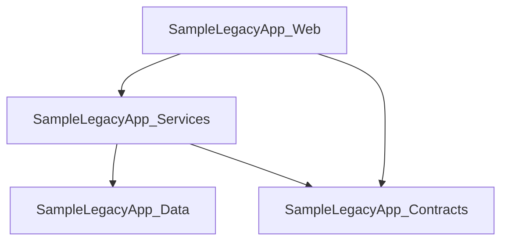

# Architecture

This document describes the repository and project structure for LegacyLens.NET.

## Repository Structure

```text
LegacyLens.Net/
├── artifacts/
├── docs/
│   └── mvp.md
├── output/
├── reports/
├── samples/
│   └── SampleLegacyApp/
├── src/
│   ├── LegacyLens.Cli/
│   ├── LegacyLens.Core/
│   └── LegacyLens.Reporting/
└── tests/
```

---

## Main Projects

| Project | Purpose |
|---|---|
| `LegacyLens.Cli` | Standalone command-line executable for running `legacylens scan <path>` and writing the Markdown discovery report |
| `LegacyLens.Core` | Core discovery and analysis logic |
| `LegacyLens.Reporting` | Report generation functionality |
| `SampleLegacyApp` | Sample legacy-style .NET application used for testing discovery features |

---

## LegacyLens.Core Structure

The core project is organised around discovery and analysis concepts.

```text
LegacyLens.Core/
├── Abstractions/
├── Analysis/
├── Configuration/
├── Dependencies/
├── Discovery/
├── LegacyAspNet/
├── Models/
└── Wcf/
```

### Abstractions

Contains shared interfaces used by the core discovery and reporting components.

Examples:

- `IScanner`
- `IReportWriter`

### Analysis

Responsible for turning discovered facts into basic review and modernisation hints.

Current analysis work includes:

- modelling modernisation hints
- modelling modernisation hint evidence, source path, and confidence metadata
- classifying hints by severity: `Info`, `Warning`, and `Risk`
- grouping detailed modernisation hints into prioritised review areas
- ranking review areas by highest discovered severity, review-area priority, and hint counts
- summarising review areas such as WCF migration, legacy ASP.NET migration, routing review, startup and request pipeline review, configuration review, dependency review, target framework review, and project dependency review
- identifying old .NET Framework target frameworks such as `net48`
- identifying missing target framework declarations
- identifying WCF-related package usage such as `System.ServiceModel.*`
- identifying classic Entity Framework package usage
- identifying `Newtonsoft.Json` usage as an informational review item
- identifying package compatibility review concerns for upgrade planning, including missing versions, legacy package formats, package target framework mismatches, and selected package-specific migration concerns
- identifying legacy ASP.NET indicators from `System.Web` assembly references
- identifying `System.Web.*` assembly references as legacy ASP.NET review items
- identifying WebForms pages as legacy ASP.NET migration risk indicators
- identifying ASMX web services as legacy ASP.NET migration risk indicators
- identifying WebForms user controls, master pages, and HTTP handlers as legacy ASP.NET review items
- identifying ASP.NET HTTP module registrations as warning-level request pipeline review items
- identifying ASP.NET HTTP handler registrations as warning-level request pipeline review items
- identifying `Global.asax` application files as ASP.NET lifecycle and startup review items
- identifying ASP.NET MVC controllers as legacy ASP.NET review items
- identifying ASP.NET MVC action methods as request-handling review items
- identifying ASP.NET MVC route attributes as endpoint routing review items
- identifying ASP.NET MVC action, filter, and security-related attributes as behaviour migration review items
- identifying ASP.NET MVC area registration classes as ASP.NET routing and feature-boundary review items
- identifying ASP.NET route configuration files as ASP.NET routing migration review items
- identifying ASP.NET MVC application startup methods as ASP.NET startup and hosting review items
- identifying ASP.NET MVC startup registration calls such as area, route, bundle, and filter registration
- identifying ASP.NET MVC bundle configuration and bundle registration as static asset migration review items
- identifying ASP.NET MVC filter configuration and global filter registration as cross-cutting request behaviour review items
- identifying ASP.NET Web API controllers as HTTP API migration review items
- identifying ASP.NET Web API actions as endpoint behaviour review items
- identifying ASP.NET Web API route attributes as endpoint routing review items
- identifying ASP.NET Web API action, filter, and security-related attributes as behaviour migration review items
- identifying ASP.NET Web API configuration files as API startup and routing review items
- identifying ASP.NET Web API route registration calls as conventional API routing review items
- identifying ASP.NET Web API startup registration calls as API startup and hosting review items
- highlighting projects with several direct project references
- highlighting discovered WCF endpoints
- highlighting selected WCF binding types such as `basicHttpBinding`, `netTcpBinding`, `wsHttpBinding`, and `netMsmqBinding`
- highlighting WCF endpoints with missing binding information
- highlighting WCF endpoints that use named binding configurations
- highlighting WCF endpoint security modes
- highlighting WCF transport credential types
- highlighting WCF timeout settings
- highlighting WCF message size and buffer limits
- highlighting WCF transfer modes, including streaming transfer modes
- highlighting WCF reader quota settings
- highlighting WCF metadata exchange endpoints
- highlighting discovered WCF service contracts
- highlighting discovered WCF service behaviours
- highlighting discovered WCF endpoint behaviours
- highlighting WCF service metadata publishing settings
- highlighting WCF debug exception detail settings
- highlighting WCF service throttling settings
- highlighting WCF REST-style `webHttp` endpoint behaviours
- identifying configuration-heavy applications from `app.config` and `web.config`
- identifying large `appSettings` usage
- identifying connection strings as external data dependency indicators
- identifying custom configuration sections as migration review items
- enriching modernisation hints with evidence metadata where a clear source can be matched
- mapping package hints to `PackageReference` evidence, package version metadata, package source format, package target framework where available, and source files
- mapping assembly-reference hints to `AssemblyReference` evidence and project files
- mapping project-level hints to `Project` evidence and project files
- mapping WCF endpoint hints to `WcfEndpoint` evidence and configuration files
- mapping WCF service contract hints to `WcfServiceContract` evidence and source files
- mapping WCF behaviour hints to `WcfBehaviour` evidence and configuration files
- mapping legacy ASP.NET artifact hints to `LegacyAspNetArtifact` evidence and source or artifact files
- mapping configuration hints to `ConfigurationFile` evidence and configuration files

### Configuration

Responsible for detecting useful information from `.config` files.

Current configuration work includes:

- scanning `app.config` and `web.config` files
- counting `appSettings` entries
- counting `connectionStrings` entries
- counting custom configuration sections from `configSections`
- modelling discovered configuration file details such as file path, app setting count, connection string count, and custom section count

### Discovery

Responsible for finding projects, solutions, and source files.

Current discovery work includes:

- solution discovery from `.sln` files
- discovered solution modelling
- project discovery from `.csproj` files
- source file discovery
- discovered project modelling
- package reference discovery from `<PackageReference />` entries
- package version discovery from `<PackageReference Version="..." />` attributes and nested `<Version>` elements where available
- package reference discovery from legacy `packages.config` files
- package version and package target framework discovery from legacy `packages.config` files
- package source format and source path tracking for package compatibility review
- assembly reference discovery from `<Reference />` entries

### LegacyAspNet

Responsible for detecting selected classic ASP.NET artifacts from the source tree.

Current legacy ASP.NET artifact discovery work includes:

- modelling discovered legacy ASP.NET artifacts
- classifying artifact kinds such as WebForms pages, WebForms user controls, master pages, ASMX web services, HTTP handlers, `Global.asax`, MVC controllers, MVC actions, MVC route attributes, MVC action attributes, MVC area registrations, route configuration, MVC application startup, MVC startup registration calls, MVC bundle configuration, MVC filter configuration, MVC dependency resolver registration, MVC controller factory registration, MVC global filter registration, MVC model binder registration, MVC value provider factory registration, Web API controllers, Web API actions, Web API route attributes, Web API action attributes, Web API configuration, Web API route registration calls, Web API startup registration calls, Web API dependency resolver configuration, Web API formatter configuration, Web API message handler registration, Web API filter registration, Web API CORS registration, HTTP module registrations, and HTTP handler registrations
- scanning files such as `.aspx`, `.ascx`, `.master`, `.asmx`, `.ashx`, and `Global.asax`
- scanning C# source files for ASP.NET MVC controller classes inheriting from `Controller` or `System.Web.Mvc.Controller`
- scanning C# source files for ASP.NET MVC action methods returning common MVC result types
- scanning C# source files for ASP.NET MVC route attributes such as `[Route]` and `[RoutePrefix]`
- scanning C# source files for ASP.NET MVC action, filter, and security-related attributes such as `[HttpGet]`, `[HttpPost]`, `[Authorize]`, `[AllowAnonymous]`, `[ValidateAntiForgeryToken]`, and `[OutputCache]`
- scanning C# source files for ASP.NET Web API controller classes inheriting from `ApiController` or `System.Web.Http.ApiController`
- scanning C# source files for ASP.NET Web API action methods returning common Web API result types such as `IHttpActionResult` and `HttpResponseMessage`
- scanning C# source files for ASP.NET Web API route attributes such as `[Route]` and `[RoutePrefix]`
- scanning C# source files for ASP.NET Web API action, filter, and security-related attributes such as `[HttpGet]`, `[HttpPost]`, `[Authorize]`, and `[AllowAnonymous]`
- scanning C# source files for ASP.NET MVC area registration classes inheriting from `AreaRegistration` or `System.Web.Mvc.AreaRegistration`
- detecting ASP.NET route configuration files such as `RouteConfig.cs`
- detecting ASP.NET MVC application startup methods such as `Application_Start`
- detecting ASP.NET MVC startup registration calls such as `AreaRegistration.RegisterAllAreas()`, `RouteConfig.RegisterRoutes(...)`, `BundleConfig.RegisterBundles(...)`, and `FilterConfig.RegisterGlobalFilters(...)`
- detecting ASP.NET Web API configuration files such as `WebApiConfig.cs`
- detecting ASP.NET Web API route registration calls such as `MapHttpRoute(...)`
- detecting ASP.NET Web API startup registration calls such as `GlobalConfiguration.Configure(...)` and `WebApiConfig.Register(...)`
- detecting ASP.NET MVC bundle configuration files such as `BundleConfig.cs`
- detecting ASP.NET MVC filter configuration files such as `FilterConfig.cs`
- detecting ASP.NET MVC dependency resolver registration calls such as `DependencyResolver.SetResolver(...)`
- detecting ASP.NET MVC custom controller factory registration calls such as `ControllerBuilder.Current.SetControllerFactory(...)`
- detecting ASP.NET MVC global filter registrations such as `GlobalFilters.Filters.Add(...)`
- detecting ASP.NET MVC model binder registrations such as `ModelBinders.Binders`
- detecting ASP.NET MVC value provider factory registrations such as `ValueProviderFactories.Factories`
- detecting ASP.NET Web API dependency resolver configuration
- detecting ASP.NET Web API formatter configuration
- detecting ASP.NET Web API message handler registration
- detecting ASP.NET Web API filter registration
- detecting ASP.NET Web API CORS registration
- scanning `web.config` for ASP.NET HTTP module registrations under `system.web/httpModules` and `system.webServer/modules`
- scanning `web.config` for ASP.NET HTTP handler registrations under `system.web/httpHandlers` and `system.webServer/handlers`
- reporting config-based HTTP module and handler registrations as legacy ASP.NET artifacts
- feeding config-based HTTP module and handler registrations into request pipeline modernisation hint analysis
- reporting discovered legacy ASP.NET artifacts in the Markdown discovery report
- feeding discovered legacy ASP.NET artifacts into modernisation hint analysis

### Dependencies

Responsible for scanning dependency information.

Current dependency work includes:

- project reference scanning
- package reference scanning
- package compatibility review metadata extraction, including package id, version, source format, source path, and package target framework where available
- assembly reference scanning

### Models

Contains shared models used to represent scan results, projects, solutions, and dependencies.

The package compatibility review requires the package model to become richer than a package-name-only string. A suitable MVP model should capture at least:

| Property | Purpose |
|---|---|
| `Name` | NuGet package id |
| `Version` | Version discovered from `PackageReference` or `packages.config`, where available |
| `Source` | `PackageReference` or `packages.config` |
| `SourcePath` | `.csproj` or `packages.config` file containing the package reference |
| `PackageTargetFramework` | `packages.config` `targetFramework`, where available |
| `ProjectTargetFramework` | Target framework or target frameworks declared by the containing project |

`DiscoveredProject.PackageReferences` may need to become a collection of richer package reference objects, or a new package compatibility collection can be added while preserving the existing package-name summary behaviour.

### WCF

Responsible for detecting WCF-related code and configuration.

Current WCF work includes:

- scanning `app.config` and `web.config` files
- detecting `<system.serviceModel>` configuration
- extracting configured WCF endpoints
- modelling WCF endpoint details such as service name, address, binding, binding configuration, behaviour configuration, security mode, transport credential type, message credential type, timeout settings, message size limits, buffer limits, transfer mode, reader quota settings, metadata exchange endpoint indicator, contract, and config file path
- scanning WCF service behaviours from `<serviceBehaviors>`
- scanning WCF endpoint behaviours from `<endpointBehaviors>`
- modelling WCF behaviour details such as behaviour kind, name, metadata publishing flags, debug flags, throttling values, `webHttp` indicator, and config file path
- detecting service metadata settings such as `httpGetEnabled` and `httpsGetEnabled`
- detecting service debug settings such as `includeExceptionDetailInFaults`
- detecting service throttling settings such as `maxConcurrentCalls`, `maxConcurrentSessions`, and `maxConcurrentInstances`
- detecting endpoint `webHttp` behaviour indicators
- scanning C# source files for WCF service contracts
- detecting interfaces marked with `[ServiceContract]`, `[ServiceContract(...)]`, or `[ServiceContractAttribute]`
- detecting operations marked with `[OperationContract]`, `[OperationContract(...)]`, or `[OperationContractAttribute]`
- scoping discovered operations to their containing service contract interface
- modelling WCF service contract details such as contract name, source file path, and operation names

Post-MVP WCF discovery ideas include:

- deeper WCF endpoint and behaviour analysis beyond the currently detected endpoint, binding, security, credential, timeout, size, transfer mode, reader quota, metadata exchange, service behaviour, endpoint behaviour, metadata publishing, debug, throttling, and `webHttp` hints
- optional discovery of WCF diagnostics, custom bindings, client endpoint configuration, hosting activation details, credential behaviours, authorization behaviours, message inspectors, and custom behaviour extension details
- service contract parsing improvements beyond the current static interface and operation contract patterns where real-world samples justify the extra complexity

---

## LegacyLens.Reporting Structure

The reporting project is responsible for producing human-readable output from discovered codebase information.

Current reporting work includes:

```text
LegacyLens.Reporting/
├── Html/
├── Markdown/
└── Mermaid/
```

### Markdown

Currently implemented.

Generates:

```text
output/discovery-report.md
```

The Markdown report currently includes:

- summary counts
- discovered solutions
- discovered projects
- target frameworks
- target framework summary grouped by discovered target framework
- package reference summary grouped by discovered package
- package compatibility review section for upgrade planning
- project dependency diagram
- project references
- assembly references
- package references
- WCF endpoint details, including binding configuration, security mode, transport credential type, message credential type, metadata exchange indicator, contract, and config file path
- WCF binding details, including timeout settings, message size limits, buffer limits, and transfer mode
- WCF reader quota details
- WCF behaviour details, including service behaviours, endpoint behaviours, metadata publishing flags, debug flags, throttling values, and `webHttp` indicators
- WCF service contract details
- WCF operation names
- legacy ASP.NET artifact details, including file-based artifacts, config-based HTTP module and handler registrations, MVC controllers, MVC actions, MVC route attributes, MVC action attributes, MVC area registrations, Web API controllers, Web API actions, Web API route attributes, Web API action attributes, Web API configuration, route configuration, startup registration, artifact kind, name, and file path
- configuration file details
- `appSettings`, `connectionStrings`, and custom configuration section counts
- modernisation review summary
- modernisation hints with severity, area, finding, evidence, confidence, source, and reason

### Mermaid

Currently implemented.

Generates a Mermaid project dependency diagram from discovered project references and includes it in the Markdown discovery report.

The diagram is generated from `<ProjectReference />` entries found in `.csproj` files.

Example:



Project names are sanitized for Mermaid output by replacing characters such as `.`, `-`, and spaces with `_`.

### HTML

Planned.

This may later be used to generate richer browser-based reports.

---
