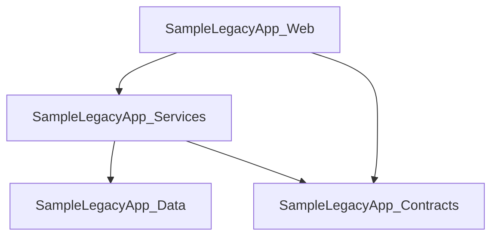

# Report Output

This document describes the console output and generated Markdown report produced by LegacyLens.NET.

## Sample Console Output

The normal `legacylens scan <path>` output is intentionally concise.

Example default console output:

```text
LegacyLens.NET

Scan path: C:\Path\To\LegacyApp
Report: C:\Path\To\LegacyApp\output\discovery-report.md

Summary:
- Solutions discovered: 1
- Projects discovered: 4
- Project references discovered: 4
- Package references discovered: 5
- Assembly references discovered: 2
- WCF endpoints discovered: 3
- WCF service contracts discovered: 1
- WCF behaviours discovered: 2
- Legacy ASP.NET artifacts discovered: 50
- Configuration files discovered: 1
- Modernisation hints discovered: 77

Top review areas:
1. WCF migration
2. Legacy ASP.NET migration
3. Target framework review

Markdown report generated:
C:\Path\To\LegacyApp\output\discovery-report.md
```

The latest sample report confirms the current sample output shape: 1 solution, 4 projects, 4 project references, 5 package references, 2 assembly references, 3 WCF endpoints, 1 WCF service contract, 2 WCF behaviours, 50 legacy ASP.NET artifacts, and 1 configuration file. The modernisation review summary currently totals 77 modernisation hints across the prioritised review areas.

For detailed discovery output, use:

```bash
legacylens scan <path> --verbose
```

The following verbose console output is a representative excerpt. Exact counts, paths, and findings may change as the sample application evolves. The `Modernisation hints discovered` section is intentionally short and does not attempt to duplicate every row from the generated report.

```text
Projects discovered:
- SampleLegacyApp.Contracts
  Target framework: net48
- SampleLegacyApp.Data
  Target framework: net48
  Package reference: Dapper 2.1.66 (source: PackageReference)
  Package reference: EntityFramework 6.4.4 (source: packages.config, package target framework: net48)
  Package reference: Newtonsoft.Json 13.0.3 (source: packages.config, package target framework: net48)
- SampleLegacyApp.Services
  Target framework: net48
  Project reference: ..\SampleLegacyApp.Contracts\SampleLegacyApp.Contracts.csproj
  Project reference: ..\SampleLegacyApp.Data\SampleLegacyApp.Data.csproj
  Assembly reference: System.ServiceModel
- SampleLegacyApp.Web
  Target framework: net48
  Project reference: ..\SampleLegacyApp.Contracts\SampleLegacyApp.Contracts.csproj
  Project reference: ..\SampleLegacyApp.Services\SampleLegacyApp.Services.csproj
  Package reference: Newtonsoft.Json 13.0.3 (source: PackageReference)
  Package reference: System.ServiceModel.Http unknown (source: PackageReference)

WCF endpoints discovered:
- SampleLegacyApp.Services.CustomerService
  Address: mex
  Binding: mexHttpBinding
  Contract: IMetadataExchange
  Config file: C:\Path\To\LegacyLens.Net\samples\SampleLegacyApp\SampleLegacyApp.Web\Web.config
- SampleLegacyApp.Services.CustomerService
  Address:
  Binding: basicHttpBinding
  Contract: SampleLegacyApp.Contracts.ICustomerContract
  Config file: C:\Path\To\LegacyLens.Net\samples\SampleLegacyApp\SampleLegacyApp.Web\Web.config
- SampleLegacyApp.Services.CustomerService
  Address:
  Binding: basicHttpBinding
  Contract: SampleLegacyApp.Contracts.ICustomerService
  Config file: C:\Path\To\LegacyLens.Net\samples\SampleLegacyApp\SampleLegacyApp.Web\Web.config

WCF service contracts discovered:
- ICustomerContract
  Source file: C:\Path\To\LegacyLens.Net\samples\SampleLegacyApp\SampleLegacyApp.Contracts\CustomerContracts.cs
  Operation: GetCustomer

WCF behaviours discovered:
- ServiceBehaviour: CustomerServiceBehaviour
  Service metadata: True
  Service debug: True
  Service throttling: True
- EndpointBehaviour: JsonEndpointBehaviour
  Web HTTP: True

Configuration files discovered:
- C:\Path\To\LegacyLens.Net\samples\SampleLegacyApp\SampleLegacyApp.Web\Web.config
  App settings: 2
  Connection strings: 1
  Custom sections: 1

Legacy ASP.NET artifacts discovered:
- WebFormsPage: Default.aspx
- AsmxWebService: CustomerService.asmx
- HttpHandler: Download.ashx
- GlobalAsax: Global.asax
- MvcController: HomeController
- WebApiController: CustomersApiController
- WebApiConfig: WebApiConfig.cs
- WebApiCorsRegistration: config.EnableCors
- HttpModuleRegistration: IntegratedLegacyModule
- HttpModuleRegistration: LegacyAuthModule
- HttpHandlerRegistration: *.legacy
- HttpHandlerRegistration: IntegratedLegacyHandler

Modernisation hints discovered:
- [Risk] Target Framework: SampleLegacyApp.Contracts targets net48
- [Risk] Target Framework: SampleLegacyApp.Data targets net48
- [Risk] Target Framework: SampleLegacyApp.Services targets net48
- [Risk] Target Framework: SampleLegacyApp.Web targets net48
- [Risk] WCF: 3 WCF endpoint(s) discovered
- [Risk] WCF: 1 WCF service contract(s) discovered
- [Warning] WCF Binding: basicHttpBinding endpoint discovered for SampleLegacyApp.Services.CustomerService contract SampleLegacyApp.Contracts.ICustomerContract
- [Warning] WCF Reader Quotas: SampleLegacyApp.Services.CustomerService has explicit WCF reader quota settings
- [Warning] WCF Transfer Mode: SampleLegacyApp.Services.CustomerService uses WCF transfer mode Streamed
- [Risk] Legacy ASP.NET: Default.aspx is a WebForms page
- [Risk] Legacy ASP.NET: CustomerService.asmx is an ASMX web service
- [Warning] Legacy ASP.NET Web API Pipeline: config.EnableCors enables ASP.NET Web API CORS configuration
- [Warning] Configuration: Web.config contains 1 custom configuration section(s)
- [Info] Configuration: Web.config contains 1 connection string(s)
- [Warning] Legacy ASP.NET Request Pipeline: LegacyAuthModule registers an ASP.NET HTTP module
- [Warning] Legacy ASP.NET Request Pipeline: IntegratedLegacyHandler registers an ASP.NET HTTP handler
- [Warning] Packages: SampleLegacyApp.Data references EntityFramework 6.4.4

Modernisation review summary:
- 1. WCF migration
  Highest severity: Risk
  Risks: 3
  Warnings: 7
  Info: 8
  Summary: 3 risk, 7 warning, 8 info hint(s). Review service boundaries, bindings, security, timeout, payload, metadata, contract, and WCF package usage before choosing a migration approach.
- 2. Legacy ASP.NET migration
  Highest severity: Risk
  Risks: 2
  Warnings: 3
  Info: 8
  Summary: 2 risk, 3 warning, 8 info hint(s). Review classic ASP.NET, System.Web, WebForms, ASMX, handlers, MVC, or Web API usage before planning an ASP.NET Core migration.
- 3. Target framework review
  Highest severity: Risk
  Risks: 4
  Warnings: 0
  Info: 0
  Summary: 4 risk, 0 warning, 0 info hint(s). Review target frameworks to understand upgrade paths, .NET Framework dependencies, and modern .NET migration constraints.
- 4. Startup and request pipeline review
  Highest severity: Warning
  Risks: 0
  Warnings: 24
  Info: 3
  Summary: 0 risk, 24 warning, 3 info hint(s). Review application startup, dependency resolver setup, controller factories, global filters, action attributes, formatters, message handlers, CORS, model binding, value providers, bundling, and cross-cutting request behaviour that may need ASP.NET Core equivalents.
- 5. Configuration review
  Highest severity: Warning
  Risks: 0
  Warnings: 1
  Info: 1
  Summary: 0 risk, 1 warning, 1 info hint(s). Review appSettings, connection strings, and custom configuration sections for runtime behaviour and external dependencies.
- 6. Dependency review
  Highest severity: Warning
  Risks: 0
  Warnings: 1
  Info: 2
  Summary: 0 risk, 1 warning, 2 info hint(s). Review package dependencies that may affect migration, replacement, compatibility, or framework upgrade planning.
- 7. Routing review
  Highest severity: Info
  Risks: 0
  Warnings: 0
  Info: 10
  Summary: 0 risk, 0 warning, 10 info hint(s). Review conventional routes, attribute routes, area routes, and Web API route registrations to preserve URL and client compatibility.

Solutions discovered:
- SampleLegacyApp
  Projects: 4

Markdown report generated: C:\Path\To\LegacyLens.Net\samples\SampleLegacyApp\output\discovery-report.md
```

---

## Generated Report Output

LegacyLens.NET currently generates a Markdown report at:

```text
output/discovery-report.md
```

The following generated report excerpt is illustrative. Exact counts and findings may change as the sample application evolves.

Package compatibility review is an MVP-scope addition. Until implemented in code, examples for that section should be treated as the intended report shape rather than the current generated output.

The current report sections include:

- Summary
- Solutions
- Projects
- Target Framework Summary
- Package Reference Summary
- Project Dependency Diagram
- Project References
- Assembly References
- Package References
- Package Compatibility Review, once the MVP package compatibility review addition is implemented
- WCF Endpoints
- WCF Binding Details
- WCF Reader Quotas
- WCF Behaviours
- WCF Service Contracts
- Legacy ASP.NET Artifacts
- Configuration Files
- Modernisation Review Summary
- Modernisation Hints, including evidence, confidence, source, and reason

Representative excerpt:

````markdown
# LegacyLens.NET Discovery Report

## Summary

- Solutions discovered: 1
- Projects discovered: 4
- Project references discovered: 4
- Package references discovered: 5
- WCF endpoints discovered: 3
- WCF service contracts discovered: 1
- WCF behaviours discovered: 2
- Legacy ASP.NET artifacts discovered: 50
- Assembly references discovered: 2

## Package Compatibility Review

| Project | Project Target Framework | Package | Version | Package Target Framework | Source | Source File | Concern |
|---|---|---|---|---|---|---|---|
| SampleLegacyApp.Data | net48 | Dapper | 2.1.66 |  | PackageReference | `...\SampleLegacyApp.Data\SampleLegacyApp.Data.csproj` | No specific compatibility concern detected by the static MVP rules. |
| SampleLegacyApp.Data | net48 | EntityFramework | 6.4.4 | net48 | packages.config | `...\SampleLegacyApp.Data\packages.config` | Classic Entity Framework should be reviewed before migration to EF Core or modern .NET. |
| SampleLegacyApp.Data | net48 | Newtonsoft.Json | 13.0.3 | net48 | packages.config | `...\SampleLegacyApp.Data\packages.config` | Common package, but serialization behaviour may need review during ASP.NET Core migration. |
| SampleLegacyApp.Web | net48 | System.ServiceModel.Http | unknown |  | PackageReference | `...\SampleLegacyApp.Web\SampleLegacyApp.Web.csproj` | WCF-related package. Review WCF usage and replacement strategy before upgrading. |

## WCF Endpoints

| Service | Address | Binding | Binding Configuration | Metadata Exchange | Contract | Config File |
|---|---|---|---|---|---|---|
| SampleLegacyApp.Services.CustomerService | mex | mexHttpBinding |  | True | IMetadataExchange | `...\SampleLegacyApp.Web\Web.config` |
| SampleLegacyApp.Services.CustomerService |  | basicHttpBinding |  | False | SampleLegacyApp.Contracts.ICustomerContract | `...\SampleLegacyApp.Web\Web.config` |
| SampleLegacyApp.Services.CustomerService |  | basicHttpBinding | CustomerBinding | False | SampleLegacyApp.Contracts.ICustomerService | `...\SampleLegacyApp.Web\Web.config` |

## Legacy ASP.NET Artifacts

| Kind | Name | File |
|---|---|---|
| WebFormsPage | Default.aspx | `...\SampleLegacyApp.Web\Default.aspx` |
| AsmxWebService | CustomerService.asmx | `...\SampleLegacyApp.Web\CustomerService.asmx` |
| MvcController | HomeController | `...\SampleLegacyApp.Web\Controllers\HomeController.cs` |
| MvcDependencyResolverRegistration | DependencyResolver.SetResolver | `...\SampleLegacyApp.Web\Global.asax.cs` |
| MvcControllerFactoryRegistration | ControllerBuilder.Current.SetControllerFactory | `...\SampleLegacyApp.Web\Global.asax.cs` |
| MvcModelBinderRegistration | ModelBinders.Binders | `...\SampleLegacyApp.Web\Global.asax.cs` |
| MvcValueProviderFactoryRegistration | ValueProviderFactories.Factories | `...\SampleLegacyApp.Web\Global.asax.cs` |
| WebApiFormatterConfiguration | config.Formatters | `...\SampleLegacyApp.Web\App_Start\WebApiConfig.cs` |
| WebApiMessageHandlerRegistration | config.MessageHandlers.Add | `...\SampleLegacyApp.Web\App_Start\WebApiConfig.cs` |
| WebApiCorsRegistration | config.EnableCors | `...\SampleLegacyApp.Web\App_Start\WebApiConfig.cs` |
| HttpModuleRegistration | IntegratedLegacyModule | `...\SampleLegacyApp.Web\Web.config` |
| HttpModuleRegistration | LegacyAuthModule | `...\SampleLegacyApp.Web\Web.config` |
| HttpHandlerRegistration | *.legacy | `...\SampleLegacyApp.Web\Web.config` |
| HttpHandlerRegistration | IntegratedLegacyHandler | `...\SampleLegacyApp.Web\Web.config` |

## Configuration Files

| Config File | App Settings | Connection Strings | Custom Sections |
|---|---:|---:|---:|
| `...\SampleLegacyApp.Web\Web.config` | 2 | 1 | 1 |

## Modernisation Review Summary

| Priority | Review Area | Highest Severity | Risks | Warnings | Info | Summary |
|---:|---|---|---:|---:|---:|---|
| 1 | WCF migration | Risk | 3 | 7 | 8 | 3 risk, 7 warning, 8 info hint(s). Review service boundaries, bindings, security, timeout, payload, metadata, contract, and WCF package usage before choosing a migration approach. |
| 2 | Legacy ASP.NET migration | Risk | 2 | 3 | 8 | 2 risk, 3 warning, 8 info hint(s). Review classic ASP.NET, System.Web, WebForms, ASMX, handlers, MVC, or Web API usage before planning an ASP.NET Core migration. |
| 3 | Target framework review | Risk | 4 | 0 | 0 | 4 risk, 0 warning, 0 info hint(s). Review target frameworks to understand upgrade paths, .NET Framework dependencies, and modern .NET migration constraints. |
| 4 | Startup and request pipeline review | Warning | 0 | 24 | 3 | 0 risk, 24 warning, 3 info hint(s). Review application startup, dependency resolver setup, controller factories, global filters, action attributes, formatters, message handlers, CORS, model binding, value providers, bundling, and cross-cutting request behaviour that may need ASP.NET Core equivalents. |
| 5 | Configuration review | Warning | 0 | 1 | 1 | 0 risk, 1 warning, 1 info hint(s). Review appSettings, connection strings, and custom configuration sections for runtime behaviour and external dependencies. |
| 6 | Dependency review | Warning | 0 | 1 | 2 | 0 risk, 1 warning, 2 info hint(s). Review package dependencies that may affect migration, replacement, compatibility, or framework upgrade planning. |
| 7 | Routing review | Info | 0 | 0 | 10 | 0 risk, 0 warning, 10 info hint(s). Review conventional routes, attribute routes, area routes, and Web API route registrations to preserve URL and client compatibility. |

## Modernisation Hints

| Severity | Area | Finding | Evidence | Confidence | Source | Reason |
|---|---|---|---|---|---|---|
| Risk | Legacy ASP.NET | CustomerService.asmx is an ASMX web service | LegacyAspNetArtifact: CustomerService.asmx | High | `...\SampleLegacyApp.Web\CustomerService.asmx` | ASMX web services are legacy SOAP-style ASP.NET endpoints that usually need replacement or compatibility planning during modernisation. |
| Warning | Legacy ASP.NET Dependency Resolution | DependencyResolver.SetResolver configures ASP.NET MVC dependency resolution | LegacyAspNetArtifact: DependencyResolver.SetResolver | High | `...\SampleLegacyApp.Web\Global.asax.cs` | MVC dependency resolver registration can affect controller activation, service lifetimes, filters, model binders, and other application services that need explicit mapping during ASP.NET Core migration. |
| Warning | Legacy ASP.NET Web API Pipeline | config.EnableCors enables ASP.NET Web API CORS configuration | LegacyAspNetArtifact: config.EnableCors | High | `...\SampleLegacyApp.Web\App_Start\WebApiConfig.cs` | CORS configuration affects browser clients and cross-origin API access and should be mapped explicitly when migrating to ASP.NET Core. |
| Warning | Legacy ASP.NET Request Pipeline | LegacyAuthModule registers an ASP.NET HTTP module | LegacyAspNetArtifact: LegacyAuthModule | High | `...\SampleLegacyApp.Web\Web.config` | HTTP modules can affect authentication, authorization, logging, headers, errors, or request lifecycle behaviour and may need mapping to ASP.NET Core middleware. |
| Warning | Configuration | Web.config contains 1 custom configuration section(s) | ConfigurationFile: Web.config | High | `...\SampleLegacyApp.Web\Web.config` | Custom configuration sections may indicate framework-specific or application-specific behaviour that needs migration assessment. |
| Info | Configuration | Web.config contains 1 connection string(s) | ConfigurationFile: Web.config | High | `...\SampleLegacyApp.Web\Web.config` | Connection strings identify external data dependencies that should be reviewed during migration planning. |
| Risk | WCF | 3 WCF endpoint(s) discovered | WcfEndpointSummary: 3 WCF endpoint(s) | Medium | None | Configured WCF endpoints usually represent service boundaries or integration points that need migration assessment. |
````

The full generated report may contain additional rows depending on the scanned solution and sample application content.

The generated report is intended to be readable in source control, Markdown preview tools, and documentation systems.

---

## Mermaid Dependency Diagram

LegacyLens.NET includes a Mermaid project dependency diagram in the generated Markdown report.

The diagram is created from discovered project-to-project references and is intended to make the structure of the solution easier to understand visually.

Example:



This makes it easier to visually understand project-to-project relationships.

---
