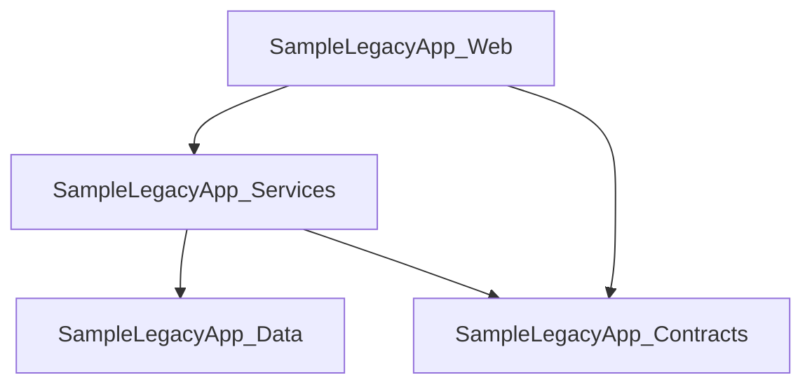

# Report Output

This document describes the console output and generated Markdown report produced by LegacyLens.NET.

## Sample Console Output

The normal `legacylens scan <path>` output is intentionally concise.

Example default console output:

```text
LegacyLens.NET

Scan path: C:\Path\To\LegacyApp
Report: C:\Path\To\LegacyApp\output\discovery-report.md

Summary:
- Solutions discovered: 1
- Projects discovered: 4
- Project references discovered: 4
- Package references discovered: 5
- Assembly references discovered: 2
- WCF endpoints discovered: 3
- WCF service contracts discovered: 1
- WCF behaviours discovered: 2
- Legacy ASP.NET artifacts discovered: 50
- Configuration files discovered: 1
- Modernisation hints discovered: 77

Top review areas:
1. WCF migration
2. Legacy ASP.NET migration
3. Target framework review

Markdown report generated:
C:\Path\To\LegacyApp\output\discovery-report.md
```

The latest sample report confirms the current sample output shape: 1 solution, 4 projects, 4 project references, 5 package references, 2 assembly references, 3 WCF endpoints, 1 WCF service contract, 2 WCF behaviours, 50 legacy ASP.NET artifacts, and 1 configuration file. The modernisation review summary currently totals 77 modernisation hints across the prioritised review areas.

For detailed discovery output, use:

```bash
legacylens scan <path> --verbose
```

The following verbose console output is a representative excerpt. Exact counts, paths, and findings may change as the sample application evolves. The `Modernisation hints discovered` section is intentionally short and does not attempt to duplicate every row from the generated report.

```text
Projects discovered:
- SampleLegacyApp.Contracts
  Target framework: net48
- SampleLegacyApp.Data
  Target framework: net48
  Package reference: Dapper 2.1.35 (source: PackageReference)
  Package reference: EntityFramework 6.4.4 (source: packages.config, package target framework: net48)
  Package reference: Newtonsoft.Json 13.0.3 (source: packages.config, package target framework: net48)
- SampleLegacyApp.Services
  Target framework: net48
  Project reference: ..\SampleLegacyApp.Contracts\SampleLegacyApp.Contracts.csproj
  Project reference: ..\SampleLegacyApp.Data\SampleLegacyApp.Data.csproj
  Assembly reference: System.ServiceModel
- SampleLegacyApp.Web
  Target framework: net48
  Project reference: ..\SampleLegacyApp.Contracts\SampleLegacyApp.Contracts.csproj
  Project reference: ..\SampleLegacyApp.Services\SampleLegacyApp.Services.csproj
  Package reference: Newtonsoft.Json 13.0.3 (source: PackageReference)
  Package reference: System.ServiceModel.Http unknown (source: PackageReference)

WCF endpoints discovered:
- SampleLegacyApp.Services.CustomerService
  Address: mex
  Binding: mexHttpBinding
  Contract: IMetadataExchange
  Config file: C:\Path\To\LegacyLens.Net\samples\SampleLegacyApp\SampleLegacyApp.Web\Web.config
- SampleLegacyApp.Services.CustomerService
  Address:
  Binding: basicHttpBinding
  Contract: SampleLegacyApp.Contracts.ICustomerContract
  Config file: C:\Path\To\LegacyLens.Net\samples\SampleLegacyApp\SampleLegacyApp.Web\Web.config
- SampleLegacyApp.Services.CustomerService
  Address:
  Binding: basicHttpBinding
  Contract: SampleLegacyApp.Contracts.ICustomerService
  Config file: C:\Path\To\LegacyLens.Net\samples\SampleLegacyApp\SampleLegacyApp.Web\Web.config

WCF service contracts discovered:
- ICustomerContract
  Source file: C:\Path\To\LegacyLens.Net\samples\SampleLegacyApp\SampleLegacyApp.Contracts\CustomerContracts.cs
  Operation: GetCustomer

WCF behaviours discovered:
- ServiceBehaviour: CustomerServiceBehaviour
  Service metadata: True
  Service debug: True
  Service throttling: True
- EndpointBehaviour: JsonEndpointBehaviour
  Web HTTP: True

Configuration files discovered:
- C:\Path\To\LegacyLens.Net\samples\SampleLegacyApp\SampleLegacyApp.Web\Web.config
  App settings: 2
  Connection strings: 1
  Custom sections: 1

Legacy ASP.NET artifacts discovered:
- WebFormsPage: Default.aspx
- AsmxWebService: CustomerService.asmx
- HttpHandler: Download.ashx
- GlobalAsax: Global.asax
- MvcController: HomeController
- WebApiController: CustomersApiController
- WebApiConfig: WebApiConfig.cs
- WebApiCorsRegistration: config.EnableCors
- HttpModuleRegistration: IntegratedLegacyModule
- HttpModuleRegistration: LegacyAuthModule
- HttpHandlerRegistration: *.legacy
- HttpHandlerRegistration: IntegratedLegacyHandler

Modernisation hints discovered:
- [Risk] Target Framework: SampleLegacyApp.Contracts targets net48
- [Risk] Target Framework: SampleLegacyApp.Data targets net48
- [Risk] Target Framework: SampleLegacyApp.Services targets net48
- [Risk] Target Framework: SampleLegacyApp.Web targets net48
- [Risk] WCF: 3 WCF endpoint(s) discovered
- [Risk] WCF: 1 WCF service contract(s) discovered
- [Warning] WCF Binding: basicHttpBinding endpoint discovered for SampleLegacyApp.Services.CustomerService contract SampleLegacyApp.Contracts.ICustomerContract
- [Warning] WCF Reader Quotas: SampleLegacyApp.Services.CustomerService has explicit WCF reader quota settings
- [Warning] WCF Transfer Mode: SampleLegacyApp.Services.CustomerService uses WCF transfer mode Streamed
- [Risk] Legacy ASP.NET: Default.aspx is a WebForms page
- [Risk] Legacy ASP.NET: CustomerService.asmx is an ASMX web service
- [Warning] Legacy ASP.NET Web API Pipeline: config.EnableCors enables ASP.NET Web API CORS configuration
- [Warning] Configuration: Web.config contains 1 custom configuration section(s)
- [Info] Configuration: Web.config contains 1 connection string(s)
- [Warning] Legacy ASP.NET Request Pipeline: LegacyAuthModule registers an ASP.NET HTTP module
- [Warning] Legacy ASP.NET Request Pipeline: IntegratedLegacyHandler registers an ASP.NET HTTP handler
- [Warning] Packages: SampleLegacyApp.Data references EntityFramework 6.4.4

Modernisation review summary:
- 1. WCF migration
  Highest severity: Risk
  Risks: 3
  Warnings: 7
  Info: 8
  Summary: 3 risk, 7 warning, 8 info hint(s). Review service boundaries, bindings, security, timeout, payload, metadata, contract, and WCF package usage before choosing a migration approach.
- 2. Legacy ASP.NET migration
  Highest severity: Risk
  Risks: 2
  Warnings: 3
  Info: 8
  Summary: 2 risk, 3 warning, 8 info hint(s). Review classic ASP.NET, System.Web, WebForms, ASMX, handlers, MVC, or Web API usage before planning an ASP.NET Core migration.
- 3. Target framework review
  Highest severity: Risk
  Risks: 4
  Warnings: 0
  Info: 0
  Summary: 4 risk, 0 warning, 0 info hint(s). Review target frameworks to understand upgrade paths, .NET Framework dependencies, and modern .NET migration constraints.
- 4. Startup and request pipeline review
  Highest severity: Warning
  Risks: 0
  Warnings: 24
  Info: 3
  Summary: 0 risk, 24 warning, 3 info hint(s). Review application startup, dependency resolver setup, controller factories, global filters, action attributes, formatters, message handlers, CORS, model binding, value providers, bundling, and cross-cutting request behaviour that may need ASP.NET Core equivalents.
- 5. Configuration review
  Highest severity: Warning
  Risks: 0
  Warnings: 1
  Info: 1
  Summary: 0 risk, 1 warning, 1 info hint(s). Review appSettings, connection strings, and custom configuration sections for runtime behaviour and external dependencies.
- 6. Dependency review
  Highest severity: Warning
  Risks: 0
  Warnings: 1
  Info: 2
  Summary: 0 risk, 1 warning, 2 info hint(s). Review package dependencies that may affect migration, replacement, compatibility, or framework upgrade planning.
- 7. Routing review
  Highest severity: Info
  Risks: 0
  Warnings: 0
  Info: 10
  Summary: 0 risk, 0 warning, 10 info hint(s). Review conventional routes, attribute routes, area routes, and Web API route registrations to preserve URL and client compatibility.

Solutions discovered:
- SampleLegacyApp
  Projects: 4

Markdown report generated: C:\Path\To\LegacyLens.Net\samples\SampleLegacyApp\output\discovery-report.md
```

---

## Upgrade Readiness Report Output

The MVP scope now includes a separate upgrade-readiness Markdown artifact:

```text
output/upgrade-readiness-report.md
```

The upgrade-readiness report should be static and evidence-backed. It should help a developer decide what to review before attempting a migration, but it should not present a pass/fail compatibility result or claim that LegacyLens.NET built the solution, restored packages, resolved transitive dependencies, inspected NuGet package assets, or guaranteed compatibility with a requested target framework.

Representative structure:

```markdown
# Upgrade Readiness Report

## Summary

This report is based on static source and configuration discovery. It highlights upgrade planning signals that may need review before migration. It does not prove compatibility with the requested target framework.

## Target

| Item | Value |
|---|---|
| Requested upgrade target | net8.0 |
| Analysis mode | Static / no-build |
| Compatibility guarantee | No |

## Current Project Targets

| Project | Target Framework | Project File |
|---|---|---|
| SampleLegacyApp.Contracts | net48 | `...\SampleLegacyApp.Contracts.csproj` |
| SampleLegacyApp.Data | net48 | `...\SampleLegacyApp.Data.csproj` |
| SampleLegacyApp.Services | net48 | `...\SampleLegacyApp.Services.csproj` |
| SampleLegacyApp.Web | net48 | `...\SampleLegacyApp.Web.csproj` |

## Upgrade Readiness Overview

| Area | Status | Evidence |
|---|---|---|
| Target frameworks | Requires review | .NET Framework projects detected |
| Package management | Requires review | packages.config detected |
| Legacy ASP.NET | Possible blocker | Web.config / Global.asax / legacy ASP.NET artifacts detected |
| WCF | Requires review | System.ServiceModel / WCF endpoint evidence detected |
| Data access | Requires review | EntityFramework package detected |
| Direct assemblies | Requires review | direct assembly references detected |
| Configuration | Requires review | Web.config detected |

## Project Upgrade Candidates

| Project | Current Target | Readiness | Reason |
|---|---|---|---|
| SampleLegacyApp.Contracts | net48 | Moderate review required | Class library, but targets .NET Framework and references System.ServiceModel. |
| SampleLegacyApp.Web | net48 | Higher risk / review first | Legacy ASP.NET, Web.config, WCF, MVC/Web API, and startup/configuration evidence detected. |

## Possible Upgrade Concerns

| Concern | Evidence | Why It Matters |
|---|---|---|
| .NET Framework target framework | net48 projects detected | Requires review before moving to modern .NET. |
| Legacy ASP.NET runtime | WebForms, ASMX, Global.asax, MVC/Web API artifacts | ASP.NET Core does not use the System.Web request pipeline. |
| WCF usage | System.ServiceModel references and WCF endpoint configuration | WCF service boundaries, bindings, metadata, and clients need migration decisions. |

## Package Upgrade Considerations

| Project | Package | Version | Source Format | Possible Concern |
|---|---|---|---|---|
| SampleLegacyApp.Data | EntityFramework | 6.4.4 | packages.config | EF6 migration or isolation decision required. |
| SampleLegacyApp.Web | System.ServiceModel.Http | 4.10.3 | PackageReference | WCF-related package requires review. |

## Assembly Reference Considerations

| Project | Assembly | Possible Concern |
|---|---|---|
| SampleLegacyApp.Services | System.ServiceModel | WCF migration decision required. |

## Configuration and Runtime Considerations

| Project/File | Finding | Possible Upgrade Concern |
|---|---|---|
| Web.config | appSettings, connection strings, custom sections, WCF, HTTP modules/handlers | Runtime configuration and request pipeline behaviour may need migration. |

## Suggested Review Order

1. Review projects with no legacy web/data/service dependencies.
2. Review package management style.
3. Review data access projects.
4. Review WCF/service boundaries.
5. Review web host/startup/configuration last.

## Notes and Limitations

- This report is based on static discovery only.
- LegacyLens.NET did not build the solution.
- LegacyLens.NET did not restore NuGet packages.
- LegacyLens.NET did not resolve transitive dependencies.
- Findings should be verified by the development team before migration decisions are made.
```

---

## Upgrade Blockers Report Output

The MVP scope now includes a separate upgrade-blockers Markdown artifact:

```text
output/upgrade-blockers.md
```

The upgrade-blockers report should be a static, evidence-backed blocker and decision report for .NET upgrade planning. It should help a developer identify visible technical blockers, migration decisions, and higher-risk areas that may complicate an upgrade, but it should not present a pass/fail compatibility result or claim that LegacyLens.NET built the solution, restored packages, resolved transitive dependencies, inspected NuGet package assets, proved that migration is impossible, or guaranteed compatibility with a requested target framework.

Representative structure:

```markdown
# Upgrade Blockers

## Summary

This report is based on static source and configuration discovery. It highlights visible blockers and migration decisions that may need review before upgrade work begins. A blocker means “requires review”, not “cannot be upgraded”.

## Target

| Item | Value |
|---|---|
| Requested upgrade target | net8.0 |
| Analysis mode | Static / no-build |
| Compatibility guarantee | No |

## Blocker Overview

| Priority | Blocker | Impact | Evidence Count |
|---:|---|---|---:|
| 1 | Legacy ASP.NET / System.Web | High | 4 |
| 2 | WCF / ServiceModel | High | 3 |
| 3 | EF6 / EDMX / Data Access | High | 2 |
| 4 | Package Management | Medium | 5 |
| 5 | Configuration / Runtime Coupling | Medium | 1 |

## Upgrade Blockers and Decisions

| Priority | Area | Blocker / Decision | Impact | Evidence |
|---:|---|---|---|---|
| 1 | Legacy ASP.NET / System.Web | Migration decision required for classic ASP.NET request pipeline usage. | High | System.Web, WebForms, ASMX, Global.asax, HTTP modules, or HTTP handlers detected. |
| 2 | WCF / ServiceModel | Migration decision required for WCF service boundaries and bindings. | High | System.ServiceModel, WCF endpoints, behaviours, or service contracts detected. |
| 3 | EF6 / EDMX / Data Access | Data access migration or isolation decision required. | High | EntityFramework package, EDMX, ObjectContext, or DbContext evidence detected. |

## Blocker Details

### Legacy ASP.NET / System.Web

Why this matters:
Modern ASP.NET Core uses a different hosting model and request pipeline. Legacy `System.Web`, WebForms, ASMX, ASHX, `Global.asax`, HTTP modules, and HTTP handlers may require redesign, replacement, or staged migration.

Evidence:

| Project | File / Reference | Finding |
|---|---|---|
| SampleLegacyApp.Web | System.Web | Possible blocker: classic ASP.NET pipeline reference requires review. |
| SampleLegacyApp.Web | `Default.aspx` | Possible blocker: WebForms page may require replacement or redesign. |
| SampleLegacyApp.Web | `CustomerService.asmx` | Possible blocker: ASMX service surface may require replacement or compatibility planning. |

Decision required:

- Can the existing web host remain temporarily on .NET Framework?
- Should endpoints be migrated gradually to ASP.NET Core?
- Are there WebForms, ASMX, ASHX, module, or handler artifacts that need replacement?

### WCF / ServiceModel

Why this matters:
WCF service hosting, bindings, behaviours, security settings, and `system.serviceModel` configuration may not map directly to modern .NET hosting choices.

Evidence:

| Project | File / Reference | Finding |
|---|---|---|
| SampleLegacyApp.Services | System.ServiceModel | Migration decision required for WCF usage. |
| SampleLegacyApp.Web | `Web.config` | WCF endpoint, binding, behaviour, or service model configuration detected. |

Decision required:

- Keep WCF temporarily?
- Use CoreWCF?
- Replace with ASP.NET Core Web API?
- Replace with gRPC?
- Replace with messaging?

### EF6 / EDMX / Data Access

Why this matters:
EF6 and EF Core are different products. EDMX/ObjectContext-based models are not simple package upgrades to EF Core.

Evidence:

| Project | File / Reference | Finding |
|---|---|---|
| SampleLegacyApp.Data | EntityFramework 6.4.4 | Classic Entity Framework should be reviewed before EF Core or modern .NET migration. |

Decision required:

- Keep EF6 temporarily?
- Move to EF Core?
- Reverse-engineer the database?
- Isolate the data access layer first?
- Preserve stored procedure behaviour?

### Package Management and Package Age

Why this matters:
`packages.config`, old package versions, and legacy package layouts may complicate restore, SDK-style project migration, and upgrade planning.

Evidence:

| Project | Package | Version | Source Format | Finding |
|---|---|---|---|---|
| SampleLegacyApp.Data | EntityFramework | 6.4.4 | packages.config | Package management and EF6 usage require review. |

Decision required:

- Migrate from `packages.config` to `PackageReference`?
- Upgrade packages before target framework migration?
- Leave risky packages until after behaviour is covered by tests?

### Direct Assembly / Local DLL References

Why this matters:
Direct DLL references, vendor binaries, GAC-style references, and `HintPath` references may not have modern equivalents or may block clean SDK-style migration.

Evidence:

| Project | Assembly | Hint Path | Finding |
|---|---|---|---|
| SampleLegacyApp.Services | System.ServiceModel |  | Direct framework assembly reference requires review. |

Decision required:

- Is there a NuGet replacement?
- Is the source available?
- Is the DLL compatible with the destination runtime?
- Is it still used at runtime?

### Configuration and Runtime Coupling

Why this matters:
Heavy `App.config` / `Web.config` usage, custom sections, binding redirects, connection strings, and environment transforms often need careful migration to modern configuration patterns.

Evidence:

| File | Finding | Possible Concern |
|---|---|---|
| `Web.config` | appSettings, connection strings, custom sections, WCF, HTTP modules/handlers | Runtime configuration and request pipeline behaviour may need migration planning. |

Decision required:

- How will settings move to `appsettings.json`, environment variables, secret stores, or deployment variables?
- Are config transforms still needed?
- Are there custom config sections that need replacement?

## Suggested Review Order

1. Review high-impact web host blockers first.
2. Review WCF/service boundaries.
3. Review data access and EF/EDMX usage.
4. Review package management and direct assembly references.
5. Review configuration and runtime coupling.
6. Confirm blocker findings with the development team before planning migration work.

## Notes and Limitations

- This report is based on static discovery only.
- LegacyLens.NET did not build the solution.
- LegacyLens.NET did not restore NuGet packages.
- LegacyLens.NET did not resolve transitive dependencies.
- LegacyLens.NET did not inspect NuGet package assets.
- A blocker means “requires review”, not “cannot be upgraded”.
- Findings should be verified before migration decisions are made.
```

---


## External Dependencies Report Output

The MVP scope now includes a separate external-dependencies Markdown artifact:

```text
output/external-dependencies.md
```

The external-dependencies report should be a static, evidence-backed inventory of possible external runtime and build-time dependencies used by the scanned codebase. It should help a developer identify systems, services, infrastructure, files, databases, queues, APIs, package feeds, vendor assemblies, or operational resources that may need confirmation before migration, testing, deployment, onboarding, or local development.

It should not claim that LegacyLens.NET connected to any external system, validated credentials, verified URLs or servers, inspected production infrastructure, proved production usage, proved that a dependency is unused, or produced a complete dependency map. Sensitive values should be masked or redacted.

Representative structure:

```markdown
# External Dependencies

## Summary

This report is based on static source and configuration discovery. It identifies possible external dependencies and the evidence found for them. A finding means “requires confirmation”, not “verified production dependency”.

## Analysis Scope

| Item | Value |
|---|---|
| Analysis mode | Static / no-build |
| Runtime verification | No |
| Secret values printed | No |
| Completeness guarantee | No |

## Dependency Overview

| Category | Count | Examples |
|---|---:|---|
| Databases | 1 | MainDatabase |
| HTTP services / URLs | 2 | PaymentApiBaseUrl, CustomerApiUrl |
| WCF/service endpoints | 3 | basicHttpBinding endpoint |
| File system / file shares | 1 | ExportPath |
| Email / SMTP | 1 | smtp settings |
| Caching | 1 | StackExchange.Redis |
| Private package feeds | 1 | NuGet.config source |

## Dependencies

| Category | Name / Identifier | Source | Evidence | Requires Confirmation |
|---|---|---|---|---|
| Database | MainDatabase | Web.config | Connection string configured; password masked if present. | Yes |
| HTTP / API | PaymentApiBaseUrl | Web.config | URL-like app setting value found. | Yes |
| WCF / Service Endpoint | SampleLegacyApp.Services.CustomerService | Web.config | basicHttpBinding endpoint configured. | Yes |

## Database Dependencies

| Name | Source File | Provider | Evidence | Notes |
|---|---|---|---|---|
| MainDatabase | `...\Web.config` | System.Data.SqlClient | Connection string configured. | Credentials are not printed. |

## HTTP / Service Dependencies

| Name / Key | Source File | Value Type | Evidence | Notes |
|---|---|---|---|---|
| PaymentApiBaseUrl | `...\Web.config` | URL | `https://...` value detected and masked if needed. | Requires confirmation. |

## WCF Dependencies

| Service / Endpoint | Source File | Binding | Contract | Notes |
|---|---|---|---|---|
| SampleLegacyApp.Services.CustomerService | `...\Web.config` | basicHttpBinding | SampleLegacyApp.Contracts.ICustomerService | Configured service endpoint; runtime usage not verified. |

## Messaging Dependencies

| Technology | Source | Evidence | Notes |
|---|---|---|---|
| RabbitMQ | PackageReference | RabbitMQ.Client package found. | May indicate message broker dependency. |

## File System Dependencies

| Path Type | Source File | Evidence | Notes |
|---|---|---|---|
| UNC path | `...\Web.config` | `\\server\share` | Network share dependency may exist. |

## Email Dependencies

| Source | Evidence | Notes |
|---|---|---|
| Web.config | SMTP settings detected. | SMTP server and credentials require confirmation. |

## Cache / Distributed State Dependencies

| Technology | Source | Evidence | Notes |
|---|---|---|---|
| Redis | PackageReference | StackExchange.Redis package found. | Redis/cache dependency may exist. |

## Build-Time / Package Feed Dependencies

| Source | Evidence | Notes |
|---|---|---|
| NuGet.config | Non-nuget.org package source found. | Private feed availability and credentials require confirmation. |

## Suggested Questions to Ask the Team

- Which of these dependencies are still used in production?
- Which databases are shared with other applications?
- Are any service URLs environment-specific?
- Are WCF endpoints internal only or consumed by third parties?
- Are queues/topics/subscriptions created manually or by infrastructure automation?
- Are file shares still required?
- Where are secrets stored outside this repository?
- Which dependencies are required for local development?
- Which dependencies are required for CI builds?
- Which dependencies are required for production deployment?

## Notes and Limitations

- This report is based on static discovery only.
- LegacyLens.NET did not run the application.
- LegacyLens.NET did not connect to any external system.
- LegacyLens.NET did not validate credentials, URLs, database servers, queues, or file shares.
- Values that look sensitive should be masked or redacted.
- A dependency listed here means evidence was found, not that the dependency is confirmed active in production.
```

---


## Data Access Inventory Report Output

The MVP scope now includes a separate data-access Markdown artifact:

```text
output/data-access-inventory.md
```

The data-access inventory should be a static, evidence-backed report for understanding how the application appears to access databases and persistence infrastructure. It should help a developer identify visible data access technologies, patterns, files, and migration concerns, but it should not claim that LegacyLens.NET connected to databases, validated credentials or connection strings, executed SQL, inspected schemas, ran migrations, reverse-engineered databases, proved runtime usage, or guaranteed compatibility.

Representative structure:

```markdown
# Data Access Inventory

## Summary

This report is based on static source and configuration discovery. It identifies visible data access technologies, patterns, and migration concerns. A finding means evidence was found and should be reviewed; it does not prove runtime usage.

## Analysis Scope

| Item | Value |
|---|---|
| Analysis mode | Static / no-build |
| Database connection attempted | No |
| SQL executed | No |
| Schema inspection | No |
| Secret values printed | No |
| Completeness guarantee | No |

## Data Access Overview

| Category | Count | Examples |
|---|---:|---|
| Connection strings | 2 | DefaultConnection, ReportingDb |
| Entity Framework 6 | 1 | EntityFramework package |
| EDMX models | 1 | Model.edmx |
| EF Core | 0 |  |
| ADO.NET | 3 | SqlConnection, SqlCommand |
| Dapper | 1 | Dapper package |
| NHibernate | 0 |  |
| Stored procedures | 4 | dbo.GetCustomer, dbo.SaveOrder |
| Raw SQL | 5 | SELECT, INSERT, EXEC |
| Repositories / Unit of Work | 3 | CustomerRepository, UnitOfWork |

## Projects with Data Access Indicators

| Project | Target Framework | Indicators | Possible Concern |
|---|---|---|---|

## Connection Strings

| Name | Source File | Provider | Credentials Embedded | Notes |
|---|---|---|---|---|

## ORM and Data Access Technologies

| Project | Technology | Evidence | Source |
|---|---|---|---|

## Entity Framework / EDMX Details

| Project | Finding | Source File | Migration Consideration |
|---|---|---|---|

## DbContext / ObjectContext Candidates

| Project | Class | Type | Source File |
|---|---|---|---|

## Repository and Unit of Work Candidates

| Project | Class | Pattern | Source File |
|---|---|---|---|

## Raw SQL and Stored Procedure Indicators

| Project | Finding | Source File | Evidence Type |
|---|---|---|---|

## Database Provider Indicators

| Project | Provider / Package / Reference | Evidence | Notes |
|---|---|---|---|

## Suggested Files to Review First

| Priority | File / Project | Reason |
|---:|---|---|

## Migration Considerations

| Area | Consideration |
|---|---|
| EF6 | Review whether to keep EF6 temporarily, migrate to EF Core, or isolate data access first. |
| EDMX | EDMX/ObjectContext migration is likely non-mechanical. |
| Raw SQL | Preserve query behaviour and stored procedure contracts during migration. |
| Connection strings | Move secrets and environment-specific settings to modern configuration. |
| Repositories | Review whether repositories hide or expose ORM-specific behaviour. |

## Suggested Questions to Ask the Team

- Which database is production?
- Are any databases shared with other applications?
- Are stored procedures part of the business logic?
- Are stored procedures version-controlled elsewhere?
- Are EF migrations used, or is the database managed manually?
- Are EDMX models generated from the database?
- Are connection strings transformed per environment?
- Which data access paths are business-critical?
- Are there database integration tests?
- Is database access expected to move to EF Core, remain EF6, or be isolated behind services?

## Notes and Limitations

- This report is based on static discovery only.
- LegacyLens.NET did not connect to any database.
- LegacyLens.NET did not execute SQL.
- LegacyLens.NET did not validate SQL syntax.
- LegacyLens.NET did not inspect database schemas.
- LegacyLens.NET did not run EF migrations.
- Values that look sensitive should be masked or redacted.
- A finding means evidence was found, not that the code path is confirmed active in production.
```

## Generated Report Output

LegacyLens.NET currently generates a Markdown report at:

```text
output/discovery-report.md
```

The following generated report excerpt is illustrative. Exact counts and findings may change as the sample application evolves.

Package compatibility review is included in the current generated discovery report. Examples for that section should remain representative because exact versions, paths, and findings may change as the sample application evolves.

The current report sections include:

- Summary
- Solutions
- Projects
- Target Framework Summary
- Package Reference Summary
- Project Dependency Diagram
- Project References
- Assembly References
- Package References
- Package Compatibility Review, once the MVP package compatibility review addition is implemented
- WCF Endpoints
- WCF Binding Details
- WCF Reader Quotas
- WCF Behaviours
- WCF Service Contracts
- Legacy ASP.NET Artifacts
- Configuration Files
- Modernisation Review Summary
- Modernisation Hints, including evidence, confidence, source, and reason

Representative excerpt:

````markdown
# LegacyLens.NET Discovery Report

## Summary

- Solutions discovered: 1
- Projects discovered: 4
- Project references discovered: 4
- Package references discovered: 5
- WCF endpoints discovered: 3
- WCF service contracts discovered: 1
- WCF behaviours discovered: 2
- Legacy ASP.NET artifacts discovered: 50
- Assembly references discovered: 2

## Package Compatibility Review

| Project | Project Target Framework | Package | Version | Package Target Framework | Source | Source File | Concern |
|---|---|---|---|---|---|---|---|
| SampleLegacyApp.Data | net48 | Dapper | 2.1.35 |  | PackageReference | `...\SampleLegacyApp.Data\SampleLegacyApp.Data.csproj` | No specific compatibility concern detected by the static MVP rules. |
| SampleLegacyApp.Data | net48 | EntityFramework | 6.4.4 | net48 | packages.config | `...\SampleLegacyApp.Data\packages.config` | Classic Entity Framework should be reviewed before migration to EF Core or modern .NET. |
| SampleLegacyApp.Data | net48 | Newtonsoft.Json | 13.0.3 | net48 | packages.config | `...\SampleLegacyApp.Data\packages.config` | Common package, but serialization behaviour may need review during ASP.NET Core migration. |
| SampleLegacyApp.Web | net48 | System.ServiceModel.Http | unknown |  | PackageReference | `...\SampleLegacyApp.Web\SampleLegacyApp.Web.csproj` | WCF-related package. Review WCF usage and replacement strategy before upgrading. |

## WCF Endpoints

| Service | Address | Binding | Binding Configuration | Metadata Exchange | Contract | Config File |
|---|---|---|---|---|---|---|
| SampleLegacyApp.Services.CustomerService | mex | mexHttpBinding |  | True | IMetadataExchange | `...\SampleLegacyApp.Web\Web.config` |
| SampleLegacyApp.Services.CustomerService |  | basicHttpBinding |  | False | SampleLegacyApp.Contracts.ICustomerContract | `...\SampleLegacyApp.Web\Web.config` |
| SampleLegacyApp.Services.CustomerService |  | basicHttpBinding | CustomerBinding | False | SampleLegacyApp.Contracts.ICustomerService | `...\SampleLegacyApp.Web\Web.config` |

## Legacy ASP.NET Artifacts

| Kind | Name | File |
|---|---|---|
| WebFormsPage | Default.aspx | `...\SampleLegacyApp.Web\Default.aspx` |
| AsmxWebService | CustomerService.asmx | `...\SampleLegacyApp.Web\CustomerService.asmx` |
| MvcController | HomeController | `...\SampleLegacyApp.Web\Controllers\HomeController.cs` |
| MvcDependencyResolverRegistration | DependencyResolver.SetResolver | `...\SampleLegacyApp.Web\Global.asax.cs` |
| MvcControllerFactoryRegistration | ControllerBuilder.Current.SetControllerFactory | `...\SampleLegacyApp.Web\Global.asax.cs` |
| MvcModelBinderRegistration | ModelBinders.Binders | `...\SampleLegacyApp.Web\Global.asax.cs` |
| MvcValueProviderFactoryRegistration | ValueProviderFactories.Factories | `...\SampleLegacyApp.Web\Global.asax.cs` |
| WebApiFormatterConfiguration | config.Formatters | `...\SampleLegacyApp.Web\App_Start\WebApiConfig.cs` |
| WebApiMessageHandlerRegistration | config.MessageHandlers.Add | `...\SampleLegacyApp.Web\App_Start\WebApiConfig.cs` |
| WebApiCorsRegistration | config.EnableCors | `...\SampleLegacyApp.Web\App_Start\WebApiConfig.cs` |
| HttpModuleRegistration | IntegratedLegacyModule | `...\SampleLegacyApp.Web\Web.config` |
| HttpModuleRegistration | LegacyAuthModule | `...\SampleLegacyApp.Web\Web.config` |
| HttpHandlerRegistration | *.legacy | `...\SampleLegacyApp.Web\Web.config` |
| HttpHandlerRegistration | IntegratedLegacyHandler | `...\SampleLegacyApp.Web\Web.config` |

## Configuration Files

| Config File | App Settings | Connection Strings | Custom Sections |
|---|---:|---:|---:|
| `...\SampleLegacyApp.Web\Web.config` | 2 | 1 | 1 |

## Modernisation Review Summary

| Priority | Review Area | Highest Severity | Risks | Warnings | Info | Summary |
|---:|---|---|---:|---:|---:|---|
| 1 | WCF migration | Risk | 3 | 7 | 8 | 3 risk, 7 warning, 8 info hint(s). Review service boundaries, bindings, security, timeout, payload, metadata, contract, and WCF package usage before choosing a migration approach. |
| 2 | Legacy ASP.NET migration | Risk | 2 | 3 | 8 | 2 risk, 3 warning, 8 info hint(s). Review classic ASP.NET, System.Web, WebForms, ASMX, handlers, MVC, or Web API usage before planning an ASP.NET Core migration. |
| 3 | Target framework review | Risk | 4 | 0 | 0 | 4 risk, 0 warning, 0 info hint(s). Review target frameworks to understand upgrade paths, .NET Framework dependencies, and modern .NET migration constraints. |
| 4 | Startup and request pipeline review | Warning | 0 | 24 | 3 | 0 risk, 24 warning, 3 info hint(s). Review application startup, dependency resolver setup, controller factories, global filters, action attributes, formatters, message handlers, CORS, model binding, value providers, bundling, and cross-cutting request behaviour that may need ASP.NET Core equivalents. |
| 5 | Configuration review | Warning | 0 | 1 | 1 | 0 risk, 1 warning, 1 info hint(s). Review appSettings, connection strings, and custom configuration sections for runtime behaviour and external dependencies. |
| 6 | Dependency review | Warning | 0 | 1 | 2 | 0 risk, 1 warning, 2 info hint(s). Review package dependencies that may affect migration, replacement, compatibility, or framework upgrade planning. |
| 7 | Routing review | Info | 0 | 0 | 10 | 0 risk, 0 warning, 10 info hint(s). Review conventional routes, attribute routes, area routes, and Web API route registrations to preserve URL and client compatibility. |

## Modernisation Hints

| Severity | Area | Finding | Evidence | Confidence | Source | Reason |
|---|---|---|---|---|---|---|
| Risk | Legacy ASP.NET | CustomerService.asmx is an ASMX web service | LegacyAspNetArtifact: CustomerService.asmx | High | `...\SampleLegacyApp.Web\CustomerService.asmx` | ASMX web services are legacy SOAP-style ASP.NET endpoints that usually need replacement or compatibility planning during modernisation. |
| Warning | Legacy ASP.NET Dependency Resolution | DependencyResolver.SetResolver configures ASP.NET MVC dependency resolution | LegacyAspNetArtifact: DependencyResolver.SetResolver | High | `...\SampleLegacyApp.Web\Global.asax.cs` | MVC dependency resolver registration can affect controller activation, service lifetimes, filters, model binders, and other application services that need explicit mapping during ASP.NET Core migration. |
| Warning | Legacy ASP.NET Web API Pipeline | config.EnableCors enables ASP.NET Web API CORS configuration | LegacyAspNetArtifact: config.EnableCors | High | `...\SampleLegacyApp.Web\App_Start\WebApiConfig.cs` | CORS configuration affects browser clients and cross-origin API access and should be mapped explicitly when migrating to ASP.NET Core. |
| Warning | Legacy ASP.NET Request Pipeline | LegacyAuthModule registers an ASP.NET HTTP module | LegacyAspNetArtifact: LegacyAuthModule | High | `...\SampleLegacyApp.Web\Web.config` | HTTP modules can affect authentication, authorization, logging, headers, errors, or request lifecycle behaviour and may need mapping to ASP.NET Core middleware. |
| Warning | Configuration | Web.config contains 1 custom configuration section(s) | ConfigurationFile: Web.config | High | `...\SampleLegacyApp.Web\Web.config` | Custom configuration sections may indicate framework-specific or application-specific behaviour that needs migration assessment. |
| Info | Configuration | Web.config contains 1 connection string(s) | ConfigurationFile: Web.config | High | `...\SampleLegacyApp.Web\Web.config` | Connection strings identify external data dependencies that should be reviewed during migration planning. |
| Risk | WCF | 3 WCF endpoint(s) discovered | WcfEndpointSummary: 3 WCF endpoint(s) | Medium | None | Configured WCF endpoints usually represent service boundaries or integration points that need migration assessment. |
````

The full generated report may contain additional rows depending on the scanned solution and sample application content.

The generated report is intended to be readable in source control, Markdown preview tools, and documentation systems.

---

## EDMX Analysis Report Output

The MVP scope now includes a separate EDMX analysis Markdown artifact:

```text
output/edmx-analysis.md
```

The EDMX analysis report should be a static, evidence-backed report for understanding Entity Framework `.edmx` files before EF Core migration planning. It should inspect EDMX XML only and should not connect to the database, build the project, validate mappings against a live schema, generate EF Core code, or automatically convert EDMX models.

Representative structure:

```markdown
# EDMX Analysis

## Summary

| Metric | Count |
|---|---:|
| EDMX files discovered | 1 |
| Conceptual entity types | 4 |
| Conceptual entity sets | 4 |
| Storage entity sets | 4 |
| Associations | 3 |
| Navigation properties | 6 |
| Complex types | 1 |
| Function imports | 2 |
| Store functions | 2 |
| Modification function mappings | 1 |
| Query views | 1 |
| Defining queries | 1 |

## EDMX Files

| Project | EDMX File | Conceptual Model | Storage Model | Mapping Model | Designer Metadata |
|---|---|---|---|---|---|
| SampleLegacyApp.Data | `...\LegacyModel.edmx` | Yes | Yes | Yes | Yes |

## Upgrade Concerns

| Severity | Concern | Evidence | Recommendation |
|---|---|---|---|
| High | EDMX model requires migration decision | `LegacyModel.edmx` contains CSDL, SSDL, and MSL sections. | Review whether to scaffold a new EF Core model from the database, keep EF6 isolated, or manually map equivalent entities and relationships. |
| Medium | Stored procedure or function mapping requires review | Function imports or modification function mappings were found. | Review stored procedure usage and decide whether to use EF Core stored procedure support, raw SQL, or explicit repository methods. |
| Medium | Query-backed model requires review | DefiningQuery or QueryView evidence was found. | Review whether keyless entity types, database views, raw SQL, or rewritten queries are needed. |

## Conceptual Model

| Project | EDMX File | Entity | Entity Set | Key | Properties | Navigation Properties |
|---|---|---|---|---|---:|---:|
| SampleLegacyApp.Data | `...\LegacyModel.edmx` | Customer | Customers | Id | 6 | 2 |

## Storage Model

| Project | EDMX File | Store Entity Set | Schema | Table/View | Columns |
|---|---|---|---|---|---:|
| SampleLegacyApp.Data | `...\LegacyModel.edmx` | Customers | dbo | Customers | 6 |

## Associations

| Project | EDMX File | Association | From | To | Multiplicity |
|---|---|---|---|---|---|
| SampleLegacyApp.Data | `...\LegacyModel.edmx` | FK_Orders_Customers | Customer | Order | 1 to * |

## Function Imports and Store Functions

| Project | EDMX File | Function Import | Return Type | Store Function |
|---|---|---|---|---|
| SampleLegacyApp.Data | `...\LegacyModel.edmx` | GetCustomerOrders | Collection(Order) | GetCustomerOrders |

## Mapping Details

| Project | EDMX File | Entity Set | Store Entity Set | Mapped Properties |
|---|---|---|---|---:|
| SampleLegacyApp.Data | `...\LegacyModel.edmx` | Customers | Customers | 6 |

## Companion Generated Files

| Project | EDMX File | Companion File | Type |
|---|---|---|---|
| SampleLegacyApp.Data | `...\LegacyModel.Context.tt` | T4Template |
| SampleLegacyApp.Data | `...\LegacyModel.Designer.cs` | DesignerCode |

## Notes

This report is based on static EDMX XML inspection only. LegacyLens.NET did not connect to the database, build the project, validate mappings, run EF migrations, scaffold EF Core models, or convert the EDMX file.
```

If no EDMX files are found, the report should still be valid and should clearly state that no EDMX files were discovered.

---


## Mermaid Dependency Diagram

LegacyLens.NET includes a Mermaid project dependency diagram in the generated Markdown report.

The diagram is created from discovered project-to-project references and is intended to make the structure of the solution easier to understand visually.

Example:



This makes it easier to visually understand project-to-project relationships.

---
